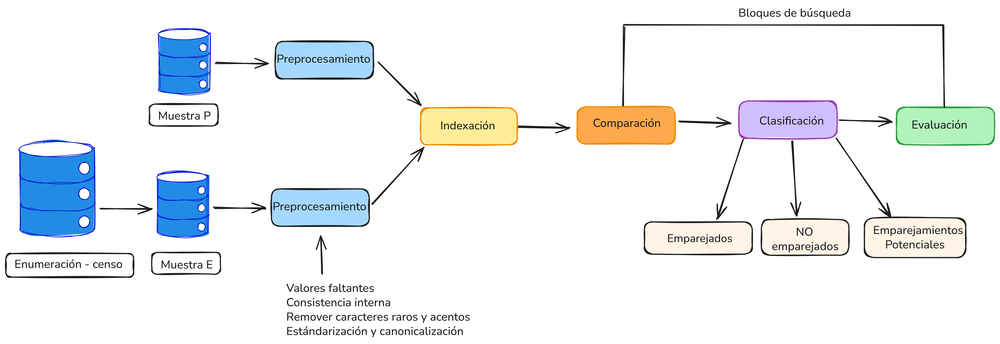

knitr::opts_chunk$set(warning = FALSE, 
                      message = FALSE,
                      cache = TRUE)
                      
# Evaluación de la cobertura censal

Como se ha mencionado en los capítulos anteriores, la encuesta postcensal (PES) es un estudio complementario al censo cuyo propósito principal es evaluar la cobertura y calidad de la información recolectada sobre unidades de vivienda y personas. Su implementación permite identificar posibles errores en la enumeración —como omisiones, duplicados o clasificaciones incorrectas— lo que contribuye a mejorar la precisión de los datos censales y proporciona insumos fundamentales para el diseño de futuras operaciones estadísticas.

Más allá de la evaluación general, la PES también permite analizar el impacto de factores que pueden afectar la calidad del censo, como la movilidad poblacional, las estrategias de recolección de datos, y el desempeño de los enumeradores en el campo.
 

## Objetivos de la encuesta postcensal

- **Medir el error neto de la cobertura**, comparando los datos del censo con los de la encuesta para cuantificar las diferencias.
- **Identificar y analizar los componentes de cobertura**, incluyendo errores de duplicación, omisiones y otras clasificaciones incorrectas.
- **Evaluar la cobertura por grupos demográficos**, como edad, sexo, etnia, región y condición socioeconómica.

El éxito de la encuesta depende de un diseño muestral probabilístico sólido, una logística eficiente de recolección de datos, un sistema robusto de emparejamiento de registros censales y métodos de estimación estadística apropiados. Estos elementos aseguran que la encuesta sea confiable, representativa y útil para la planificación de futuros censos.

## Componentes de la cobertura censal

La clasificación de registros en la encuesta se fundamenta en la comparación entre el universo censal y el universo observado por la encuesta. Los cuatro componentes fundamentales de cobertura, a nivel de personas, son:


### Enumeraciones correctas

Una enumeración se considera correcta si una persona que debió ser contada fue incluida efectivamente en el censo. A nivel nacional, esto se cumple incluso si la persona fue ubicada en una dirección o vivienda distinta a la correcta, es decir, si una persona debió ser enumerada en una unidad de vivienda y fue incluida en una unidad de vivienda en cualquier otro lugar del país, entonces la enumeración se debe considerar como correcta, a pesar de que la persona esta enumerada en la ubicación incorrecta. Sin embargo, a nivel de área (región, departamento, municipio), la ubicación geográfica debe coincidir para que sea considerada como una enumeración correcta a ese nivel.

Cuando una persona fue contada múltiples veces, solo una de las enumeraciones se clasifica como correcta; las demás son duplicados erróneos. Esto se formaliza con la siguiente función indicadora:

$$I_k^{d} = \begin{cases} 
1 \ \ \ \text{si el elemento } k \ \text{fue enumerado en el área } d \\
0 \ \ \ \text{si el elemento } k \ \text{fue enumerado fuera del área } d \\
\end{cases} $$


### Enumeraciones erróneas


Desde la PES también se debe estimar el número de enumeraciones erróneas, existen varias razones por las cuales una enumeración se considera de este tipo. En general se clasifican en dos categorías: erróneas debido a duplicación y erróneas por otras razones. La Tabla \@ref(tab:t1) describe los principales motivos de clasificación como errónea. 
   

<table class="table" style="width: auto !important; margin-left: auto; margin-right: auto;">
<caption>(\#tab:t1)(\#tab:t1)Tipos de enumeraciones erróneas</caption>
 <thead>
  <tr>
   <th style="text-align:left;"> **Tipo** </th>
   <th style="text-align:left;"> **Descripción** </th>
  </tr>
 </thead>
<tbody>
  <tr>
   <td style="text-align:left;width: 30%; "> Erróneo por duplicación </td>
   <td style="text-align:left;width: 70%; "> La enumeración es un duplicado de una persona que fue contada correctamente en una unidad de vivienda o en el universo de viviendas colectivas en el censo. </td>
  </tr>
  <tr>
   <td style="text-align:left;width: 30%; "> Erróneo por otras razones </td>
   <td style="text-align:left;width: 70%; "> El registro es ficticio y no corresponde a una persona real. </td>
  </tr>
  <tr>
   <td style="text-align:left;width: 30%; ">  </td>
   <td style="text-align:left;width: 70%; "> La persona fue enumerada en el universo de unidades de vivienda, pero debería haber sido enumerada en el universo de viviendas colectivas o estaba en situación de calle el día del censo. </td>
  </tr>
  <tr>
   <td style="text-align:left;width: 30%; ">  </td>
   <td style="text-align:left;width: 70%; "> La persona nació después del día del censo. </td>
  </tr>
  <tr>
   <td style="text-align:left;width: 30%; ">  </td>
   <td style="text-align:left;width: 70%; "> La persona falleció antes del día del censo. </td>
  </tr>
  <tr>
   <td style="text-align:left;width: 30%; ">  </td>
   <td style="text-align:left;width: 70%; "> La persona estaba trabajando, estudiando o viviendo fuera del país el día del censo. </td>
  </tr>
  <tr>
   <td style="text-align:left;width: 30%; ">  </td>
   <td style="text-align:left;width: 70%; "> La persona es un visitante con residencia habitual en el extranjero que estaba temporalmente en el país el día del censo. </td>
  </tr>
</tbody>
</table>

### Omisiones

Las omisiones corresponden a personas que debieron ser incluidas en el censo pero no aparecen en ningún registro censal emparejado con la encuesta. Estas ocurren por diversas razones: errores de cobertura, dificultades en la enumeración de poblaciones móviles, desconfianza o rechazo en la participación, o errores operacionales.

La identificación de omisiones es uno de los objetivos más importantes de la PES. Para determinar que un individuo fue omitido, es necesario que cumpla con los siguientes criterios:

- Debe residir en el país al momento del censo.
- Debe estar correctamente vinculado a una unidad censal en la encuesta.
- No debe haber sido emparejado con ningún registro censal, incluso después del emparejamiento ampliado y la revisión clerical.

Las omisiones se cuantifican usando los factores de expansión de la PES y se incorporan en el cálculo del error neto de cobertura mediante alguno de los estimadores presentados en el capítulo anterior. Su impacto se analiza por grupos demográficos, lo que permite evaluar la cobertura diferencial del censo [@wolter1986coverage; @USCensusBureau_2022].


### Imputación

En los censos se realizan imputaciones cuando no se logra recolectar información completa de una persona o un hogar, para esto se pueden usar diferentes enfoques, la literatura sobre los modelos de imputación es extensa y definir el modelo apropiado depende en gran medida del patrón de la ausencia de respuesta [@van2012flexible]. 

La PES permite evaluar cuántos registros en el censo fueron imputados y en qué medida esas imputaciones representan correctamente a personas reales. En particular:

- Se estima la proporción de registros imputados que coinciden con la PES.
- Se identifica si hay sesgos sistemáticos en los registros imputados, como sobrerepresentación de ciertos grupos.
- Se analizan imputaciones completas (sin nombre ni edad) frente a parciales.

Estas evaluaciones ayudan a medir la calidad de la información censal y a mejorar las reglas futuras de imputación [@biemer2003introduction; @USCensusBureau_2022].


## Protocolo de clasificación

El protocolo operativo para clasificar registros como correctos o incorrectos implica tres grandes fases: preprocesamiento de datos, emparejamiento de registros, y evaluación de coincidencias.

### Preprocesamiento de datos

Esta fase estandariza y valida la información recolectada, y prepara las bases para el emparejamiento:

- **Geocodificación**: Consiste en validar que las direcciones estén en los segmentos de la muestra.
- **Consistencia Lógica**: Busca asegurar que los datos tengan una consistencia desde la lógica de la composición del hogar, edades y relaciones. por ejemplo, verificar que las relaciones de parentesco sean coherentes un hijo/a no puede ser mayor que el jefe de hogar, validar que las edades sean consistentes con las fechas de nacimiento, revisar inconsistencias en la estructura del hogar como que un hogar no puede tener más de un jefe de hogar.
- **Normalización de nombres**: Se establecen reglas para que los nombres y los apellidos sea válidos. Por ejemplo, que mínimo el primer nombre y primer apellido tengan al menos dos caracteres, eliminar caracteres especiales, espacios innecesarios y normalizar formatos como convertir todo a mayúsculas o minúsculas. 
- **Estandarización**: Consiste en verificar y ajustar los formatos de fechas, sexo, edad y las demás variables que se usarán en el emparejamiento. Por ejemplo, los formatos de fechas deben estar en formato DD/MM/AAAA, unificar categorías de variables categóricas que puedan originar errores (sexo: "M" para masculino, "F" para femenino), revisar y ajustar errores tipográficos o de codificación en variables clave como edad, sexo y relación de parentesco.
- **Identificación de duplicados**: Detectar registros múltiples del mismo individuo.
- **Casos no válidos**: Busca identificar individuos ficticios o registros que no corresponden a personas (mascotas, errores de registro, etc).
- **Análisis descriptivo**: Presentar los resultados del preprocesamiento con el fin de establecer las frecuencias de los valores faltantes. Por ejemplo, porcentaje de registros sin fecha de nacimiento, sin primer nombre, sin segundo nombre, sin departamento, etc.
- **Tratamiento de datos faltantes**:  Imputar datos faltantes o excluir registros no recuperables. Estos corresponden a registros donde no se puede determinar si la enumeración es correcta o incorrecta debido a falta de información. Es importante que exista la evidencia de la decisión, esto se obtiene al marcar los registros con un estado de "imputado" o "excluido".
   

### Emparejamiento de registros

Esta etapa inicia con la muestra E y muestra P. Si al final del proceso existen registros que no se han logrado emparejar, entonces la muestra E se amplia a otras áreas para identificar si la persona encontrada en la muestra P si fue censada pero en un segmento diferente. A continuación se enuncian las etapas del proceso.

 - **Determinístico (exacto)**: Establecer las variables que se usarán para establecer las coincidencias exactas. Es recomendable que el censo y la PES levanten información sobre el tipo de documento y número de documento de identidad, esto ayuda a que el proceso de emparejamiento sea más efectivo.
 - **Probabilístico**: Usar técnicas de vinculación para los registros (record linkage), para los registros que no tuvieron una coincidencia exacta.
 - **Áreas o bloques de búsqueda**: Establecer reglas para limitar el emparejamiento a segmentos censales y áreas adyacentes.
 - **Definición del umbral**: Definir el umbral para establecer las coincidencias es un aspecto relevante, el propósito es minimizar la probabilidad de que un emparejamiento erróneo. En este caso se pueden establecer algunas reglas, si la probabilidad de emparejamiento es superior al 99% se considera "emparejado", si está entre el 90% y 99% se considera "emparejamiento potencial" y si está por debajo del 90% se considera "no emparejado".
 - **Revisión clerical y clasificación**: Los registros marcados como "emparejamiento potencial" son revisadas por personal capacitado.

La Figura \@ref(fig:match) presenta una ilustración general de las fases del proceso de emparejamiento y revisión clerical.

<div class="figure" style="text-align: center">

<p class="caption">(\#fig:match)Flujo general del proceso de emparejamiento en la PES</p>
</div>


Para los registros que tienen estado "no emparejado" se amplia el área de búsqueda hasta llegar al nivel nacional. Como las probabilidades de error de emparejamiento se incrementan cuando se aumenta el área de búsqueda, es recomendable que se haga una revisión clerical de estos registros luego de ser emparejados, incluso si su probabilidad es alta.
 
Si no hay coincidencia tras ampliar el área de búsqueda, el caso se clasifica como omisión, es decir, personas que no estuvieron enumeradas en el censo.
 

## Flujo general del procedimiento
 


```{=html}
<div id="htmlwidget-eb479ec333bd63996a67" style="width:100%;height:100%;" class="DiagrammeR html-widget"></div>
<script type="application/json" data-for="htmlwidget-eb479ec333bd63996a67">{"x":{"diagram":"\ngraph TD;\n    A[Inicio del Proceso] --> B[Establecer la muestra E y P];\n    B --> C[Preprocesamiento de Datos];\n    C --> D[Emparejamiento Deterministico];\n    D -- Match --> J[Estimación de Omisiones];\n    D -- No Match --> E[Emparejamiento Probabilístico];\n    E --> F[Evaluación del Umbral];\n    F --> H{Tipo de coincidencia?};\n    H -- Emperejados --> J;\n    H -- Potenciales --> I[Revisión clerical];\n    H -- No emparejados --> K[Aumentar el área de búsqueda];\n    K --> X[Ampliar muestra E];\n    X --> E;\n    I --> L{Emparejado?};\n    L -- Sí --> M[Clasificacion Final];\n    L -- No --> K;\n    M --> J;\n    J --> N[Ajustes y Calibraciones];\n    N --> O[Validacion de Resultados];\n    O --> P[Documentacion y Reporte];\n    P --> Q[Fin del Proceso];\n"},"evals":[],"jsHooks":[]}</script>
```
