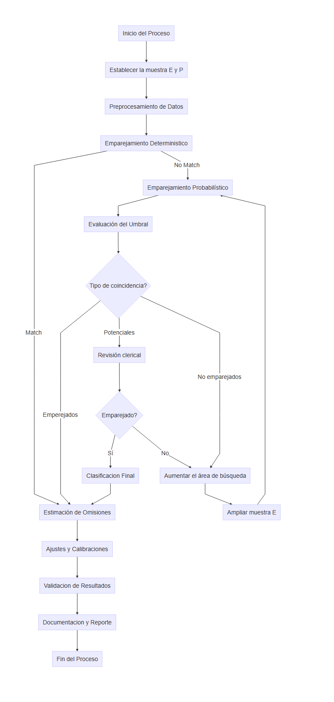

# Emparejamiento estadístico {#cap5}

Acá va la introducción

## Protocolo de clasificación

El protocolo operativo para clasificar registros como correctos o incorrectos implica tres grandes fases: preprocesamiento de datos, emparejamiento de registros, y evaluación de coincidencias.

### Preprocesamiento de datos

Esta fase estandariza y valida la información recolectada, y prepara las bases para el emparejamiento:

- **Geocodificación**: Consiste en validar que las direcciones estén en los segmentos de la muestra.
- **Consistencia Lógica**: Busca asegurar que los datos tengan una consistencia desde la lógica de la composición del hogar, edades y relaciones. por ejemplo, verificar que las relaciones de parentesco sean coherentes un hijo/a no puede ser mayor que el jefe de hogar, validar que las edades sean consistentes con las fechas de nacimiento, revisar inconsistencias en la estructura del hogar como que un hogar no puede tener más de un jefe de hogar.
- **Normalización de nombres**: Se establecen reglas para que los nombres y los apellidos sea válidos. Por ejemplo, que mínimo el primer nombre y primer apellido tengan al menos dos caracteres, eliminar caracteres especiales, espacios innecesarios y normalizar formatos como convertir todo a mayúsculas o minúsculas. 
- **Estandarización**: Consiste en verificar y ajustar los formatos de fechas, sexo, edad y las demás variables que se usarán en el emparejamiento. Por ejemplo, los formatos de fechas deben estar en formato DD/MM/AAAA, unificar categorías de variables categóricas que puedan originar errores (sexo: "M" para masculino, "F" para femenino), revisar y ajustar errores tipográficos o de codificación en variables clave como edad, sexo y relación de parentesco.
- **Identificación de duplicados**: Detectar registros múltiples del mismo individuo.
- **Casos no válidos**: Busca identificar individuos ficticios o registros que no corresponden a personas (mascotas, errores de registro, etc).
- **Análisis descriptivo**: Presentar los resultados del preprocesamiento con el fin de establecer las frecuencias de los valores faltantes. Por ejemplo, porcentaje de registros sin fecha de nacimiento, sin primer nombre, sin segundo nombre, sin departamento, etc.
- **Tratamiento de datos faltantes**:  Imputar datos faltantes o excluir registros no recuperables. Estos corresponden a registros donde no se puede determinar si la enumeración es correcta o incorrecta debido a falta de información. Es importante que exista la evidencia de la decisión, esto se obtiene al marcar los registros con un estado de "imputado" o "excluido".
   

### Emparejamiento de registros

Esta etapa inicia con la muestra E y muestra P. Si al final del proceso existen registros que no se han logrado emparejar, entonces la muestra E se amplia a otras áreas para identificar si la persona encontrada en la muestra P si fue censada pero en un segmento diferente. A continuación se enuncian las etapas del proceso.

 - **Determinístico (exacto)**: Establecer las variables que se usarán para establecer las coincidencias exactas. Es recomendable que el censo y la PES levanten información sobre el tipo de documento y número de documento de identidad, esto ayuda a que el proceso de emparejamiento sea más efectivo.
 - **Probabilístico**: Usar técnicas de vinculación para los registros (record linkage), para los registros que no tuvieron una coincidencia exacta.
 - **Áreas o bloques de búsqueda**: Establecer reglas para limitar el emparejamiento a segmentos censales y áreas adyacentes.
 - **Definición del umbral**: Definir el umbral para establecer las coincidencias es un aspecto relevante, el propósito es minimizar la probabilidad de que un emparejamiento erróneo. En este caso se pueden establecer algunas reglas, si la probabilidad de emparejamiento es superior al 99% se considera "emparejado", si está entre el 90% y 99% se considera "emparejamiento potencial" y si está por debajo del 90% se considera "no emparejado".
 - **Revisión clerical y clasificación**: Los registros marcados como "emparejamiento potencial" son revisadas por personal capacitado.

La Figura \@ref(fig:match) presenta una ilustración general de las fases del proceso de emparejamiento y revisión clerical.

<div class="figure" style="text-align: center">

<p class="caption">(\#fig:match)Flujo general del proceso de emparejamiento en la PES</p>
</div>


Para los registros que tienen estado "no emparejado" se amplia el área de búsqueda hasta llegar al nivel nacional. Como las probabilidades de error de emparejamiento se incrementan cuando se aumenta el área de búsqueda, es recomendable que se haga una revisión clerical de estos registros luego de ser emparejados, incluso si su probabilidad es alta.
 
Si no hay coincidencia tras ampliar el área de búsqueda, el caso se clasifica como omisión, es decir, personas que no estuvieron enumeradas en el censo. La Figura \@ref(fig:match1q) muestra el flujograma que se debría seguir para realizar este proceso. 

<div class="figure" style="text-align: center">

<p class="caption">(\#fig:match1q)Flujo general del proceso de emparejamiento en la PES</p>
</div>

## Emparejamiento probabilístico

Las bases de datos censales, rara vez se cuentan con identificadores únicos fiables y completos. Esto hace que el emparejamiento exacto basado en igualdad absoluta de valores en atributos clave, como el número de identificación, sea insuficiente. Además, las variaciones en nombres, errores tipográficos, diferencias de formato y registros incompletos son frecuentes.

Por ejemplo, los registros:

- _Nohora Rodriguez, nacida el 8/10/1960_
- _Nora Rodrigues, nacida el 19601008_

pueden referirse a la misma persona, pero un algoritmo exacto no emparejará estos registros. por el contrario, el enfoque probabilístico permite capturar estas coincidencias aproximadas mediante modelos estadísticos, como el propuesto por Fellegi y Sunter [@fellegi1969theory].

El emparejamiento probabilístico de registros, también conocido como _record linkage_, tiene una historia extensa en el campo de la estadística y es una técnica fundamental en el contexto de los censos y las encuestas de cobertura. Su objetivo es identificar registros que se refieren a la misma entidad^[Una entidad puede ser un hogar, una persona, una empresa u otro tipo de unidad registrada.] entre diferentes fuentes de datos, incluso cuando no se cuenta con un identificador único o cuando los datos contienen errores, inconsistencias o formatos distintos.

La primera vez que se introdujo formalmente el término _record linkage_ fue en el año 1946, para construir un “libro de vida” a nivel de individuo, desde el nacimiento hasta la muerte, incluyendo eventos relevantes como matrimonios, divorcios, registros médicos y de seguridad social [@dunn1946]. Esta visión anticipaba muchos de los principios de lo que hoy se conoce como integración de datos longitudinales, fundamentales para la planificación de servicios públicos y la mejora de la calidad de las estadísticas nacionales.

Durante las décadas de 1950 y 1960, el avance tecnológico permitió que se comenzara con la automatización del proceso de vinculación de registros. Además, se introdujo el enfoque probabilístico, en el cual se asignan pesos de acuerdo con los atributos comparados, considerando la frecuencia relativa de los valores [@newcombe1959, @newcombe1962]. Este enfoque sentó las bases para el desarrollo del modelo probabilístico propuesto formalmente por Fellegi y Sunter en 1969, quienes demostraron que bajo ciertas condiciones, es posible derivar una regla óptima para decidir si dos registros corresponden a la misma entidad [@fellegi1969theory].

A lo largo de las décadas siguientes, este marco teórico fue ampliado por William Winkler en el U.S. Census Bureau, incorporando funciones de comparación aproximada de cadenas, ponderaciones basadas en frecuencia y algoritmos como EM para mejorar la estimación de parámetros del modelo de vinculación probabilística [@winkler1990, @winkler2006overview]. En el contexto de los censos de población y vivienda, estas técnicas han sido fundamentales para evaluar la omisión censal mediante encuestas de cobertura, al comparar registros del censo con los de la encuesta y estimar la omisión neta de forma robusta.

La necesidad de vincular datos de múltiples fuentes ha crecido en paralelo con el aumento en la cantidad de información recolectada por Oficinas Nacionales de Estadística (ONE). En este contexto, el emparejamiento de registros cumple múltiples funciones:

- **Mejorar la calidad de los datos**, al eliminar duplicados y enriquecer registros incompletos.
- **Optimizar los costos** de operaciones estadísticas al reutilizar datos existentes. Un caso práctico es el Censo Combinado 2023 de Uruguay.
- **Viabilizar el análisis longitudinal y de múltiples fuentes**, especialmente en contextos censales donde los datos se recolectan en por intervalos de tiempo [@bleiholder2009data].

El proceso de emparejamiento consta generalmente de cinco etapas principales:

1. **Normalización y preprocesamiento**: limpieza, estandarización y codificación de atributos.
2. **Reducción del espacio de búsqueda**: indexación o bloques
3. **Comparación de registros**: evaluación de similitudes en atributos comunes (nombre, sexo, fecha de nacimiento, dirección).
4. **Clasificación**: asignación de un estado de emparejado (match), no emparejado (non-match) o revisión clerical (posible match), usualmente mediante reglas probabilísticas [@fellegi1969theory].
5. **Predicción final**: umbral de clasificación y validación.

El emparejamiento completo entre dos bases con $n$ y $m$ registros implica comparar hasta $n \times m$ pares, lo que resulta en complejidad cuadrática. Para mitigar este costo, se emplean técnicas de indexación conocidas como _bloqueo o blocking_, que reducen el espacio de comparación considerando solo subconjuntos plausibles de registros.

Una dificultad adicional en el emparejamiento probabilístico es la falta de verdad conocida como _ground truth_, esto ocurre cuando no se dispone de datos que indiquen con certeza si dos registros corresponden a la misma persona. Esto obliga a realizar revisiones clericales para evaluar la calidad de los emparejamientos. Por esta razón, los procesos logísticos de la encuesta de postcensal (PES) deben considerar una fase de sensibilización para que la población esté dispuesta a colaborar y a entregar información fiable, debido a la resistencia que pueden tener porque fueron censadas hace poco tiempo.

El emparejamiento de registros frecuentemente involucra información sensible como nombres, direcciones y fechas de nacimiento. Por tanto, la privacidad y confidencialidad deben ser cuidadosamente protegidas. En particular, cuando el emparejamiento ocurre entre bases de diferentes entidades, en estos casos se deben aplicar las técnicas de emparejamiento preservando la privacidad (PPRL) [@christen2023privacy; @Vatsalan2020]. Estas consideraciones son especialmente importantes en contextos censales y gubernamentales, donde los datos personales son confidenciales por ley.


### Geolocalización

El primer paso consiste en geocodificar las direcciones proporcionadas por los encuestados y verificar que las mismas coinciden con los segmentos cartográficos seleccionados. En caso de que algunas direcciones no tengan una precisión a nivel de segmento cartográfico, entonces será necesaria una revisión clerical para verificar las direcciones proporcionadas por los encuestados.

El siguiente ejemplo, muestra un conjunto de datos con cinco direcciones en distintos municipios d eun país. Cada dirección se combina con el nombre del municipio y el país para formar una dirección completa. Luego, se obtiene la **georreferenciación**; es decir, las coordenadas de latitud y longitud correspondientes a cada ubicación. La tabla resultante se vería así:  

| DIRECCION              | MUNICIPIO      | LATITUD    | LONGITUD    |
|------------------------|----------------|-----------|------------|
| Av. Jaime Mendoza 123  | Sucre          | -19.0333  | -65.2622   |
| Calle Bolívar 456      | Monteagudo     | -19.7700  | -63.4100   |
| Plaza 25 de Mayo 789   | Camargo        | -20.0500  | -64.5500   |
| Av. del Maestro 321    | Villa Serrano  | -20.4333  | -64.5500   |
| Calle Potosí 654       | Zudáñez        | -19.9000  | -64.8500   |

En caso de que algunos de los puntos de longitud y latitud no queden dentro de los segmentos de la muestra P, los revisores clericales deben verificar las direcciones y establecer si hay descritos algunos puntos de referencia que no se usaron durante el procesamiento automatizado que hubiera afectado la precisión del proceso automático. Los resultados de la geocodificación se utilizan durante el proceso de emparejamiento para identificar áreas de búsqueda alrededor de la dirección proporcionada por el encuestado. 

Durante el proceso de geocodificación manual, los revisores asignan una coordenada que permita una mayor precisión. Si no es posible lograr una precisión que apunte a una UPM específica de la muestra P, entonces la misma podrá asociarse a más de una UPM para crear áreas de búsqueda que abarquen dicha dirección. Asimismo, es recomendable que se asigne un código que refleje el nivel de confianza que el revisor manual considera que hay en que la dirección se encuentra dentro del área de búsqueda.  

Es recomendable que el emparejamiento automático de personas incluya los geocódigos asignados a las direcciones proporcionadas por los encuestados, así como los nombres, apellidos, la edad, el sexo, el día y mes de nacimiento. Otra información que puede ser usada en el proceso son: los números de teléfono de los encuestados del hogar, datos geográficos como el departamento, municipio o código del segmento. Con este propósito se puede usar un modelo de vinculación probabilística de registros conocido como *record linkage*.

Con el objetivo de examinar la completitud de los nombres, es recomendable que el nombre o apellido se considere suficiente cuando la combinación del primer y segundo nombre, así como la combinación de los apellidos, tengan al menos dos caracteres cada uno. Posteriormente, los revisores clericales deben analizar todos los registros marcados como insuficientes y actualizar los nombres cuando sea posible. Por ejemplo, puede haberse registrado el primer nombre de un niño pero no su apellido, el revisor clerical podrá completar el apellido basándose en el de los padres cuando el parentesco sea determinado. En estos casos, se podrá cambiar el estado de insuficiente a suficiente. 

Al finalizar este procesamiento, cada persona de la muestra P y cada persona de la muestra E deben ser codificadas como coincidencia, posible coincidencia, duplicado, posible duplicado o sin coincidencia, y al finalizar la revisión clerical, se usarán los vínculos asignados a las personas de la muestra P y muestra E como insumos para estimar la cobertura neta de la población y sus componentes.  


### Flujo general

La Figura \@ref(fig:match1) muestra los pasos principales del proceso de emparejamiento. 

- El primer paso es el preprocesamiento de datos, cuyo objetivo es asegurar que los datos de ambas fuentes estén en un formato uniforme y comparable. 
- El segundo paso se conoce como indexación, acá se busca reducir la complejidad cuadrática del proceso de emparejamiento mediante el uso de estructuras de datos que permiten generar de manera eficiente y efectiva pares de registros candidatos que probablemente correspondan a la misma persona.
- En el tercer paso, se realiza la comparación de pares de registros, donde los pares candidatos generados a partir de la indexación se comparan utilizando varias variables.
- En el paso de clasificación, los pares de registros se asignan a una de tres categorías: emparejados, no emparejados y emparejamientos potenciales. Si los pares se clasifican como emparejamientos potenciales, se requiere una revisión clerical manual para decidir su estado final (emparejado o no emparejado). 
- En el paso final, se evalua la calidad y la completitud de los datos emparejados.

Para la deduplicación de una única base de datos, todos los pasos del proceso de vinculación siguen siendo aplicables. El preprocesamiento es esencial para asegurar que la base completa esté estandarizada, especialmente si los registros han sido ingresados en diferentes momentos, lo que puede haber introducido variaciones en los formatos o en los métodos de captura de datos. La etapa de indexación también es crítica en la deduplicación, ya que comparar cada registro con todos los demás implica un alto costo computacional.


<div class="figure" style="text-align: center">

<p class="caption">(\#fig:match1)Flujo general del proceso de emparejamiento</p>
</div>

Para ilustrar las tareas involucradas a lo largo del proceso de emparejamiento de registros, se utilizará un ejemplo compuesto por dos tablas de  datos artificiales.


A continuación se presenta la estructura para los primeros registros de la tabla censo:


```{=html}
<div id="ytdhswhgqn" style="padding-left:0px;padding-right:0px;padding-top:10px;padding-bottom:10px;overflow-x:auto;overflow-y:auto;width:auto;height:auto;">
<style>#ytdhswhgqn table {
  font-family: system-ui, 'Segoe UI', Roboto, Helvetica, Arial, sans-serif, 'Apple Color Emoji', 'Segoe UI Emoji', 'Segoe UI Symbol', 'Noto Color Emoji';
  -webkit-font-smoothing: antialiased;
  -moz-osx-font-smoothing: grayscale;
}

#ytdhswhgqn thead, #ytdhswhgqn tbody, #ytdhswhgqn tfoot, #ytdhswhgqn tr, #ytdhswhgqn td, #ytdhswhgqn th {
  border-style: none;
}

#ytdhswhgqn p {
  margin: 0;
  padding: 0;
}

#ytdhswhgqn .gt_table {
  display: table;
  border-collapse: collapse;
  line-height: normal;
  margin-left: auto;
  margin-right: auto;
  color: #333333;
  font-size: 16px;
  font-weight: normal;
  font-style: normal;
  background-color: #FFFFFF;
  width: auto;
  border-top-style: solid;
  border-top-width: 2px;
  border-top-color: #A8A8A8;
  border-right-style: none;
  border-right-width: 2px;
  border-right-color: #D3D3D3;
  border-bottom-style: solid;
  border-bottom-width: 2px;
  border-bottom-color: #A8A8A8;
  border-left-style: none;
  border-left-width: 2px;
  border-left-color: #D3D3D3;
}

#ytdhswhgqn .gt_caption {
  padding-top: 4px;
  padding-bottom: 4px;
}

#ytdhswhgqn .gt_title {
  color: #333333;
  font-size: 125%;
  font-weight: initial;
  padding-top: 4px;
  padding-bottom: 4px;
  padding-left: 5px;
  padding-right: 5px;
  border-bottom-color: #FFFFFF;
  border-bottom-width: 0;
}

#ytdhswhgqn .gt_subtitle {
  color: #333333;
  font-size: 85%;
  font-weight: initial;
  padding-top: 3px;
  padding-bottom: 5px;
  padding-left: 5px;
  padding-right: 5px;
  border-top-color: #FFFFFF;
  border-top-width: 0;
}

#ytdhswhgqn .gt_heading {
  background-color: #FFFFFF;
  text-align: center;
  border-bottom-color: #FFFFFF;
  border-left-style: none;
  border-left-width: 1px;
  border-left-color: #D3D3D3;
  border-right-style: none;
  border-right-width: 1px;
  border-right-color: #D3D3D3;
}

#ytdhswhgqn .gt_bottom_border {
  border-bottom-style: solid;
  border-bottom-width: 2px;
  border-bottom-color: #D3D3D3;
}

#ytdhswhgqn .gt_col_headings {
  border-top-style: solid;
  border-top-width: 2px;
  border-top-color: #D3D3D3;
  border-bottom-style: solid;
  border-bottom-width: 2px;
  border-bottom-color: #D3D3D3;
  border-left-style: none;
  border-left-width: 1px;
  border-left-color: #D3D3D3;
  border-right-style: none;
  border-right-width: 1px;
  border-right-color: #D3D3D3;
}

#ytdhswhgqn .gt_col_heading {
  color: #333333;
  background-color: #FFFFFF;
  font-size: 100%;
  font-weight: normal;
  text-transform: inherit;
  border-left-style: none;
  border-left-width: 1px;
  border-left-color: #D3D3D3;
  border-right-style: none;
  border-right-width: 1px;
  border-right-color: #D3D3D3;
  vertical-align: bottom;
  padding-top: 5px;
  padding-bottom: 6px;
  padding-left: 5px;
  padding-right: 5px;
  overflow-x: hidden;
}

#ytdhswhgqn .gt_column_spanner_outer {
  color: #333333;
  background-color: #FFFFFF;
  font-size: 100%;
  font-weight: normal;
  text-transform: inherit;
  padding-top: 0;
  padding-bottom: 0;
  padding-left: 4px;
  padding-right: 4px;
}

#ytdhswhgqn .gt_column_spanner_outer:first-child {
  padding-left: 0;
}

#ytdhswhgqn .gt_column_spanner_outer:last-child {
  padding-right: 0;
}

#ytdhswhgqn .gt_column_spanner {
  border-bottom-style: solid;
  border-bottom-width: 2px;
  border-bottom-color: #D3D3D3;
  vertical-align: bottom;
  padding-top: 5px;
  padding-bottom: 5px;
  overflow-x: hidden;
  display: inline-block;
  width: 100%;
}

#ytdhswhgqn .gt_spanner_row {
  border-bottom-style: hidden;
}

#ytdhswhgqn .gt_group_heading {
  padding-top: 8px;
  padding-bottom: 8px;
  padding-left: 5px;
  padding-right: 5px;
  color: #333333;
  background-color: #FFFFFF;
  font-size: 100%;
  font-weight: initial;
  text-transform: inherit;
  border-top-style: solid;
  border-top-width: 2px;
  border-top-color: #D3D3D3;
  border-bottom-style: solid;
  border-bottom-width: 2px;
  border-bottom-color: #D3D3D3;
  border-left-style: none;
  border-left-width: 1px;
  border-left-color: #D3D3D3;
  border-right-style: none;
  border-right-width: 1px;
  border-right-color: #D3D3D3;
  vertical-align: middle;
  text-align: left;
}

#ytdhswhgqn .gt_empty_group_heading {
  padding: 0.5px;
  color: #333333;
  background-color: #FFFFFF;
  font-size: 100%;
  font-weight: initial;
  border-top-style: solid;
  border-top-width: 2px;
  border-top-color: #D3D3D3;
  border-bottom-style: solid;
  border-bottom-width: 2px;
  border-bottom-color: #D3D3D3;
  vertical-align: middle;
}

#ytdhswhgqn .gt_from_md > :first-child {
  margin-top: 0;
}

#ytdhswhgqn .gt_from_md > :last-child {
  margin-bottom: 0;
}

#ytdhswhgqn .gt_row {
  padding-top: 8px;
  padding-bottom: 8px;
  padding-left: 5px;
  padding-right: 5px;
  margin: 10px;
  border-top-style: solid;
  border-top-width: 1px;
  border-top-color: #D3D3D3;
  border-left-style: none;
  border-left-width: 1px;
  border-left-color: #D3D3D3;
  border-right-style: none;
  border-right-width: 1px;
  border-right-color: #D3D3D3;
  vertical-align: middle;
  overflow-x: hidden;
}

#ytdhswhgqn .gt_stub {
  color: #333333;
  background-color: #FFFFFF;
  font-size: 100%;
  font-weight: initial;
  text-transform: inherit;
  border-right-style: solid;
  border-right-width: 2px;
  border-right-color: #D3D3D3;
  padding-left: 5px;
  padding-right: 5px;
}

#ytdhswhgqn .gt_stub_row_group {
  color: #333333;
  background-color: #FFFFFF;
  font-size: 100%;
  font-weight: initial;
  text-transform: inherit;
  border-right-style: solid;
  border-right-width: 2px;
  border-right-color: #D3D3D3;
  padding-left: 5px;
  padding-right: 5px;
  vertical-align: top;
}

#ytdhswhgqn .gt_row_group_first td {
  border-top-width: 2px;
}

#ytdhswhgqn .gt_row_group_first th {
  border-top-width: 2px;
}

#ytdhswhgqn .gt_summary_row {
  color: #333333;
  background-color: #FFFFFF;
  text-transform: inherit;
  padding-top: 8px;
  padding-bottom: 8px;
  padding-left: 5px;
  padding-right: 5px;
}

#ytdhswhgqn .gt_first_summary_row {
  border-top-style: solid;
  border-top-color: #D3D3D3;
}

#ytdhswhgqn .gt_first_summary_row.thick {
  border-top-width: 2px;
}

#ytdhswhgqn .gt_last_summary_row {
  padding-top: 8px;
  padding-bottom: 8px;
  padding-left: 5px;
  padding-right: 5px;
  border-bottom-style: solid;
  border-bottom-width: 2px;
  border-bottom-color: #D3D3D3;
}

#ytdhswhgqn .gt_grand_summary_row {
  color: #333333;
  background-color: #FFFFFF;
  text-transform: inherit;
  padding-top: 8px;
  padding-bottom: 8px;
  padding-left: 5px;
  padding-right: 5px;
}

#ytdhswhgqn .gt_first_grand_summary_row {
  padding-top: 8px;
  padding-bottom: 8px;
  padding-left: 5px;
  padding-right: 5px;
  border-top-style: double;
  border-top-width: 6px;
  border-top-color: #D3D3D3;
}

#ytdhswhgqn .gt_last_grand_summary_row_top {
  padding-top: 8px;
  padding-bottom: 8px;
  padding-left: 5px;
  padding-right: 5px;
  border-bottom-style: double;
  border-bottom-width: 6px;
  border-bottom-color: #D3D3D3;
}

#ytdhswhgqn .gt_striped {
  background-color: rgba(128, 128, 128, 0.05);
}

#ytdhswhgqn .gt_table_body {
  border-top-style: solid;
  border-top-width: 2px;
  border-top-color: #D3D3D3;
  border-bottom-style: solid;
  border-bottom-width: 2px;
  border-bottom-color: #D3D3D3;
}

#ytdhswhgqn .gt_footnotes {
  color: #333333;
  background-color: #FFFFFF;
  border-bottom-style: none;
  border-bottom-width: 2px;
  border-bottom-color: #D3D3D3;
  border-left-style: none;
  border-left-width: 2px;
  border-left-color: #D3D3D3;
  border-right-style: none;
  border-right-width: 2px;
  border-right-color: #D3D3D3;
}

#ytdhswhgqn .gt_footnote {
  margin: 0px;
  font-size: 90%;
  padding-top: 4px;
  padding-bottom: 4px;
  padding-left: 5px;
  padding-right: 5px;
}

#ytdhswhgqn .gt_sourcenotes {
  color: #333333;
  background-color: #FFFFFF;
  border-bottom-style: none;
  border-bottom-width: 2px;
  border-bottom-color: #D3D3D3;
  border-left-style: none;
  border-left-width: 2px;
  border-left-color: #D3D3D3;
  border-right-style: none;
  border-right-width: 2px;
  border-right-color: #D3D3D3;
}

#ytdhswhgqn .gt_sourcenote {
  font-size: 90%;
  padding-top: 4px;
  padding-bottom: 4px;
  padding-left: 5px;
  padding-right: 5px;
}

#ytdhswhgqn .gt_left {
  text-align: left;
}

#ytdhswhgqn .gt_center {
  text-align: center;
}

#ytdhswhgqn .gt_right {
  text-align: right;
  font-variant-numeric: tabular-nums;
}

#ytdhswhgqn .gt_font_normal {
  font-weight: normal;
}

#ytdhswhgqn .gt_font_bold {
  font-weight: bold;
}

#ytdhswhgqn .gt_font_italic {
  font-style: italic;
}

#ytdhswhgqn .gt_super {
  font-size: 65%;
}

#ytdhswhgqn .gt_footnote_marks {
  font-size: 75%;
  vertical-align: 0.4em;
  position: initial;
}

#ytdhswhgqn .gt_asterisk {
  font-size: 100%;
  vertical-align: 0;
}

#ytdhswhgqn .gt_indent_1 {
  text-indent: 5px;
}

#ytdhswhgqn .gt_indent_2 {
  text-indent: 10px;
}

#ytdhswhgqn .gt_indent_3 {
  text-indent: 15px;
}

#ytdhswhgqn .gt_indent_4 {
  text-indent: 20px;
}

#ytdhswhgqn .gt_indent_5 {
  text-indent: 25px;
}

#ytdhswhgqn .katex-display {
  display: inline-flex !important;
  margin-bottom: 0.75em !important;
}

#ytdhswhgqn div.Reactable > div.rt-table > div.rt-thead > div.rt-tr.rt-tr-group-header > div.rt-th-group:after {
  height: 0px !important;
}
</style>
<table class="gt_table" data-quarto-disable-processing="false" data-quarto-bootstrap="false">
  <thead>
    <tr class="gt_heading">
      <td colspan="10" class="gt_heading gt_title gt_font_normal gt_bottom_border" style>Tabla censo</td>
    </tr>
    
    <tr class="gt_col_headings">
      <th class="gt_col_heading gt_columns_bottom_border gt_right" rowspan="1" colspan="1" style="background-color: #F9F9F9; font-weight: bold;" scope="col" id="id_segmento">id_segmento</th>
      <th class="gt_col_heading gt_columns_bottom_border gt_left" rowspan="1" colspan="1" style="background-color: #F9F9F9; font-weight: bold;" scope="col" id="id_hogar">id_hogar</th>
      <th class="gt_col_heading gt_columns_bottom_border gt_left" rowspan="1" colspan="1" style="background-color: #F9F9F9; font-weight: bold;" scope="col" id="id_censo">id_censo</th>
      <th class="gt_col_heading gt_columns_bottom_border gt_left" rowspan="1" colspan="1" style="background-color: #F9F9F9; font-weight: bold;" scope="col" id="nombre">nombre</th>
      <th class="gt_col_heading gt_columns_bottom_border gt_left" rowspan="1" colspan="1" style="background-color: #F9F9F9; font-weight: bold;" scope="col" id="apellido">apellido</th>
      <th class="gt_col_heading gt_columns_bottom_border gt_left" rowspan="1" colspan="1" style="background-color: #F9F9F9; font-weight: bold;" scope="col" id="sexo">sexo</th>
      <th class="gt_col_heading gt_columns_bottom_border gt_right" rowspan="1" colspan="1" style="background-color: #F9F9F9; font-weight: bold;" scope="col" id="anio_nac">anio_nac</th>
      <th class="gt_col_heading gt_columns_bottom_border gt_right" rowspan="1" colspan="1" style="background-color: #F9F9F9; font-weight: bold;" scope="col" id="mes_nac">mes_nac</th>
      <th class="gt_col_heading gt_columns_bottom_border gt_right" rowspan="1" colspan="1" style="background-color: #F9F9F9; font-weight: bold;" scope="col" id="dia_nac">dia_nac</th>
      <th class="gt_col_heading gt_columns_bottom_border gt_left" rowspan="1" colspan="1" style="background-color: #F9F9F9; font-weight: bold;" scope="col" id="parentesco">parentesco</th>
    </tr>
  </thead>
  <tbody class="gt_table_body">
    <tr><td headers="id_segmento" class="gt_row gt_right">101</td>
<td headers="id_hogar" class="gt_row gt_left">H101_1</td>
<td headers="id_censo" class="gt_row gt_left">c1</td>
<td headers="nombre" class="gt_row gt_left">Carlos</td>
<td headers="apellido" class="gt_row gt_left">Pérez</td>
<td headers="sexo" class="gt_row gt_left">M</td>
<td headers="anio_nac" class="gt_row gt_right">1947</td>
<td headers="mes_nac" class="gt_row gt_right">1</td>
<td headers="dia_nac" class="gt_row gt_right">1</td>
<td headers="parentesco" class="gt_row gt_left">Jefe</td></tr>
    <tr><td headers="id_segmento" class="gt_row gt_right">101</td>
<td headers="id_hogar" class="gt_row gt_left">H101_1</td>
<td headers="id_censo" class="gt_row gt_left">c2</td>
<td headers="nombre" class="gt_row gt_left">Lucía</td>
<td headers="apellido" class="gt_row gt_left">Castro</td>
<td headers="sexo" class="gt_row gt_left">F</td>
<td headers="anio_nac" class="gt_row gt_right">1975</td>
<td headers="mes_nac" class="gt_row gt_right">1</td>
<td headers="dia_nac" class="gt_row gt_right">1</td>
<td headers="parentesco" class="gt_row gt_left">Hijo/a</td></tr>
    <tr><td headers="id_segmento" class="gt_row gt_right">101</td>
<td headers="id_hogar" class="gt_row gt_left">H101_1</td>
<td headers="id_censo" class="gt_row gt_left">c3</td>
<td headers="nombre" class="gt_row gt_left">Camila</td>
<td headers="apellido" class="gt_row gt_left">Castro</td>
<td headers="sexo" class="gt_row gt_left">F</td>
<td headers="anio_nac" class="gt_row gt_right">2012</td>
<td headers="mes_nac" class="gt_row gt_right">1</td>
<td headers="dia_nac" class="gt_row gt_right">1</td>
<td headers="parentesco" class="gt_row gt_left">Hijo/a</td></tr>
    <tr><td headers="id_segmento" class="gt_row gt_right">101</td>
<td headers="id_hogar" class="gt_row gt_left">H101_1</td>
<td headers="id_censo" class="gt_row gt_left">c4</td>
<td headers="nombre" class="gt_row gt_left">María</td>
<td headers="apellido" class="gt_row gt_left">Castro</td>
<td headers="sexo" class="gt_row gt_left">F</td>
<td headers="anio_nac" class="gt_row gt_right">1959</td>
<td headers="mes_nac" class="gt_row gt_right">1</td>
<td headers="dia_nac" class="gt_row gt_right">1</td>
<td headers="parentesco" class="gt_row gt_left">Nieto/a</td></tr>
    <tr><td headers="id_segmento" class="gt_row gt_right">102</td>
<td headers="id_hogar" class="gt_row gt_left">H102_1</td>
<td headers="id_censo" class="gt_row gt_left">c5</td>
<td headers="nombre" class="gt_row gt_left">Jorge</td>
<td headers="apellido" class="gt_row gt_left">Gómez</td>
<td headers="sexo" class="gt_row gt_left">M</td>
<td headers="anio_nac" class="gt_row gt_right">1954</td>
<td headers="mes_nac" class="gt_row gt_right">1</td>
<td headers="dia_nac" class="gt_row gt_right">1</td>
<td headers="parentesco" class="gt_row gt_left">Jefe</td></tr>
    <tr><td headers="id_segmento" class="gt_row gt_right">102</td>
<td headers="id_hogar" class="gt_row gt_left">H102_1</td>
<td headers="id_censo" class="gt_row gt_left">c6</td>
<td headers="nombre" class="gt_row gt_left">Sofía</td>
<td headers="apellido" class="gt_row gt_left">Ramírez</td>
<td headers="sexo" class="gt_row gt_left">F</td>
<td headers="anio_nac" class="gt_row gt_right">2000</td>
<td headers="mes_nac" class="gt_row gt_right">1</td>
<td headers="dia_nac" class="gt_row gt_right">1</td>
<td headers="parentesco" class="gt_row gt_left">Hijo/a</td></tr>
  </tbody>
  
</table>
</div>
```


La tabla encuesta presenta la siguiente estructura para los primeros registros:


```{=html}
<div id="vzgtyozbwq" style="padding-left:0px;padding-right:0px;padding-top:10px;padding-bottom:10px;overflow-x:auto;overflow-y:auto;width:auto;height:auto;">
<style>#vzgtyozbwq table {
  font-family: system-ui, 'Segoe UI', Roboto, Helvetica, Arial, sans-serif, 'Apple Color Emoji', 'Segoe UI Emoji', 'Segoe UI Symbol', 'Noto Color Emoji';
  -webkit-font-smoothing: antialiased;
  -moz-osx-font-smoothing: grayscale;
}

#vzgtyozbwq thead, #vzgtyozbwq tbody, #vzgtyozbwq tfoot, #vzgtyozbwq tr, #vzgtyozbwq td, #vzgtyozbwq th {
  border-style: none;
}

#vzgtyozbwq p {
  margin: 0;
  padding: 0;
}

#vzgtyozbwq .gt_table {
  display: table;
  border-collapse: collapse;
  line-height: normal;
  margin-left: auto;
  margin-right: auto;
  color: #333333;
  font-size: 16px;
  font-weight: normal;
  font-style: normal;
  background-color: #FFFFFF;
  width: auto;
  border-top-style: solid;
  border-top-width: 2px;
  border-top-color: #A8A8A8;
  border-right-style: none;
  border-right-width: 2px;
  border-right-color: #D3D3D3;
  border-bottom-style: solid;
  border-bottom-width: 2px;
  border-bottom-color: #A8A8A8;
  border-left-style: none;
  border-left-width: 2px;
  border-left-color: #D3D3D3;
}

#vzgtyozbwq .gt_caption {
  padding-top: 4px;
  padding-bottom: 4px;
}

#vzgtyozbwq .gt_title {
  color: #333333;
  font-size: 125%;
  font-weight: initial;
  padding-top: 4px;
  padding-bottom: 4px;
  padding-left: 5px;
  padding-right: 5px;
  border-bottom-color: #FFFFFF;
  border-bottom-width: 0;
}

#vzgtyozbwq .gt_subtitle {
  color: #333333;
  font-size: 85%;
  font-weight: initial;
  padding-top: 3px;
  padding-bottom: 5px;
  padding-left: 5px;
  padding-right: 5px;
  border-top-color: #FFFFFF;
  border-top-width: 0;
}

#vzgtyozbwq .gt_heading {
  background-color: #FFFFFF;
  text-align: center;
  border-bottom-color: #FFFFFF;
  border-left-style: none;
  border-left-width: 1px;
  border-left-color: #D3D3D3;
  border-right-style: none;
  border-right-width: 1px;
  border-right-color: #D3D3D3;
}

#vzgtyozbwq .gt_bottom_border {
  border-bottom-style: solid;
  border-bottom-width: 2px;
  border-bottom-color: #D3D3D3;
}

#vzgtyozbwq .gt_col_headings {
  border-top-style: solid;
  border-top-width: 2px;
  border-top-color: #D3D3D3;
  border-bottom-style: solid;
  border-bottom-width: 2px;
  border-bottom-color: #D3D3D3;
  border-left-style: none;
  border-left-width: 1px;
  border-left-color: #D3D3D3;
  border-right-style: none;
  border-right-width: 1px;
  border-right-color: #D3D3D3;
}

#vzgtyozbwq .gt_col_heading {
  color: #333333;
  background-color: #FFFFFF;
  font-size: 100%;
  font-weight: normal;
  text-transform: inherit;
  border-left-style: none;
  border-left-width: 1px;
  border-left-color: #D3D3D3;
  border-right-style: none;
  border-right-width: 1px;
  border-right-color: #D3D3D3;
  vertical-align: bottom;
  padding-top: 5px;
  padding-bottom: 6px;
  padding-left: 5px;
  padding-right: 5px;
  overflow-x: hidden;
}

#vzgtyozbwq .gt_column_spanner_outer {
  color: #333333;
  background-color: #FFFFFF;
  font-size: 100%;
  font-weight: normal;
  text-transform: inherit;
  padding-top: 0;
  padding-bottom: 0;
  padding-left: 4px;
  padding-right: 4px;
}

#vzgtyozbwq .gt_column_spanner_outer:first-child {
  padding-left: 0;
}

#vzgtyozbwq .gt_column_spanner_outer:last-child {
  padding-right: 0;
}

#vzgtyozbwq .gt_column_spanner {
  border-bottom-style: solid;
  border-bottom-width: 2px;
  border-bottom-color: #D3D3D3;
  vertical-align: bottom;
  padding-top: 5px;
  padding-bottom: 5px;
  overflow-x: hidden;
  display: inline-block;
  width: 100%;
}

#vzgtyozbwq .gt_spanner_row {
  border-bottom-style: hidden;
}

#vzgtyozbwq .gt_group_heading {
  padding-top: 8px;
  padding-bottom: 8px;
  padding-left: 5px;
  padding-right: 5px;
  color: #333333;
  background-color: #FFFFFF;
  font-size: 100%;
  font-weight: initial;
  text-transform: inherit;
  border-top-style: solid;
  border-top-width: 2px;
  border-top-color: #D3D3D3;
  border-bottom-style: solid;
  border-bottom-width: 2px;
  border-bottom-color: #D3D3D3;
  border-left-style: none;
  border-left-width: 1px;
  border-left-color: #D3D3D3;
  border-right-style: none;
  border-right-width: 1px;
  border-right-color: #D3D3D3;
  vertical-align: middle;
  text-align: left;
}

#vzgtyozbwq .gt_empty_group_heading {
  padding: 0.5px;
  color: #333333;
  background-color: #FFFFFF;
  font-size: 100%;
  font-weight: initial;
  border-top-style: solid;
  border-top-width: 2px;
  border-top-color: #D3D3D3;
  border-bottom-style: solid;
  border-bottom-width: 2px;
  border-bottom-color: #D3D3D3;
  vertical-align: middle;
}

#vzgtyozbwq .gt_from_md > :first-child {
  margin-top: 0;
}

#vzgtyozbwq .gt_from_md > :last-child {
  margin-bottom: 0;
}

#vzgtyozbwq .gt_row {
  padding-top: 8px;
  padding-bottom: 8px;
  padding-left: 5px;
  padding-right: 5px;
  margin: 10px;
  border-top-style: solid;
  border-top-width: 1px;
  border-top-color: #D3D3D3;
  border-left-style: none;
  border-left-width: 1px;
  border-left-color: #D3D3D3;
  border-right-style: none;
  border-right-width: 1px;
  border-right-color: #D3D3D3;
  vertical-align: middle;
  overflow-x: hidden;
}

#vzgtyozbwq .gt_stub {
  color: #333333;
  background-color: #FFFFFF;
  font-size: 100%;
  font-weight: initial;
  text-transform: inherit;
  border-right-style: solid;
  border-right-width: 2px;
  border-right-color: #D3D3D3;
  padding-left: 5px;
  padding-right: 5px;
}

#vzgtyozbwq .gt_stub_row_group {
  color: #333333;
  background-color: #FFFFFF;
  font-size: 100%;
  font-weight: initial;
  text-transform: inherit;
  border-right-style: solid;
  border-right-width: 2px;
  border-right-color: #D3D3D3;
  padding-left: 5px;
  padding-right: 5px;
  vertical-align: top;
}

#vzgtyozbwq .gt_row_group_first td {
  border-top-width: 2px;
}

#vzgtyozbwq .gt_row_group_first th {
  border-top-width: 2px;
}

#vzgtyozbwq .gt_summary_row {
  color: #333333;
  background-color: #FFFFFF;
  text-transform: inherit;
  padding-top: 8px;
  padding-bottom: 8px;
  padding-left: 5px;
  padding-right: 5px;
}

#vzgtyozbwq .gt_first_summary_row {
  border-top-style: solid;
  border-top-color: #D3D3D3;
}

#vzgtyozbwq .gt_first_summary_row.thick {
  border-top-width: 2px;
}

#vzgtyozbwq .gt_last_summary_row {
  padding-top: 8px;
  padding-bottom: 8px;
  padding-left: 5px;
  padding-right: 5px;
  border-bottom-style: solid;
  border-bottom-width: 2px;
  border-bottom-color: #D3D3D3;
}

#vzgtyozbwq .gt_grand_summary_row {
  color: #333333;
  background-color: #FFFFFF;
  text-transform: inherit;
  padding-top: 8px;
  padding-bottom: 8px;
  padding-left: 5px;
  padding-right: 5px;
}

#vzgtyozbwq .gt_first_grand_summary_row {
  padding-top: 8px;
  padding-bottom: 8px;
  padding-left: 5px;
  padding-right: 5px;
  border-top-style: double;
  border-top-width: 6px;
  border-top-color: #D3D3D3;
}

#vzgtyozbwq .gt_last_grand_summary_row_top {
  padding-top: 8px;
  padding-bottom: 8px;
  padding-left: 5px;
  padding-right: 5px;
  border-bottom-style: double;
  border-bottom-width: 6px;
  border-bottom-color: #D3D3D3;
}

#vzgtyozbwq .gt_striped {
  background-color: rgba(128, 128, 128, 0.05);
}

#vzgtyozbwq .gt_table_body {
  border-top-style: solid;
  border-top-width: 2px;
  border-top-color: #D3D3D3;
  border-bottom-style: solid;
  border-bottom-width: 2px;
  border-bottom-color: #D3D3D3;
}

#vzgtyozbwq .gt_footnotes {
  color: #333333;
  background-color: #FFFFFF;
  border-bottom-style: none;
  border-bottom-width: 2px;
  border-bottom-color: #D3D3D3;
  border-left-style: none;
  border-left-width: 2px;
  border-left-color: #D3D3D3;
  border-right-style: none;
  border-right-width: 2px;
  border-right-color: #D3D3D3;
}

#vzgtyozbwq .gt_footnote {
  margin: 0px;
  font-size: 90%;
  padding-top: 4px;
  padding-bottom: 4px;
  padding-left: 5px;
  padding-right: 5px;
}

#vzgtyozbwq .gt_sourcenotes {
  color: #333333;
  background-color: #FFFFFF;
  border-bottom-style: none;
  border-bottom-width: 2px;
  border-bottom-color: #D3D3D3;
  border-left-style: none;
  border-left-width: 2px;
  border-left-color: #D3D3D3;
  border-right-style: none;
  border-right-width: 2px;
  border-right-color: #D3D3D3;
}

#vzgtyozbwq .gt_sourcenote {
  font-size: 90%;
  padding-top: 4px;
  padding-bottom: 4px;
  padding-left: 5px;
  padding-right: 5px;
}

#vzgtyozbwq .gt_left {
  text-align: left;
}

#vzgtyozbwq .gt_center {
  text-align: center;
}

#vzgtyozbwq .gt_right {
  text-align: right;
  font-variant-numeric: tabular-nums;
}

#vzgtyozbwq .gt_font_normal {
  font-weight: normal;
}

#vzgtyozbwq .gt_font_bold {
  font-weight: bold;
}

#vzgtyozbwq .gt_font_italic {
  font-style: italic;
}

#vzgtyozbwq .gt_super {
  font-size: 65%;
}

#vzgtyozbwq .gt_footnote_marks {
  font-size: 75%;
  vertical-align: 0.4em;
  position: initial;
}

#vzgtyozbwq .gt_asterisk {
  font-size: 100%;
  vertical-align: 0;
}

#vzgtyozbwq .gt_indent_1 {
  text-indent: 5px;
}

#vzgtyozbwq .gt_indent_2 {
  text-indent: 10px;
}

#vzgtyozbwq .gt_indent_3 {
  text-indent: 15px;
}

#vzgtyozbwq .gt_indent_4 {
  text-indent: 20px;
}

#vzgtyozbwq .gt_indent_5 {
  text-indent: 25px;
}

#vzgtyozbwq .katex-display {
  display: inline-flex !important;
  margin-bottom: 0.75em !important;
}

#vzgtyozbwq div.Reactable > div.rt-table > div.rt-thead > div.rt-tr.rt-tr-group-header > div.rt-th-group:after {
  height: 0px !important;
}
</style>
<table class="gt_table" data-quarto-disable-processing="false" data-quarto-bootstrap="false">
  <thead>
    <tr class="gt_heading">
      <td colspan="7" class="gt_heading gt_title gt_font_normal gt_bottom_border" style>Tabla encuesta</td>
    </tr>
    
    <tr class="gt_col_headings">
      <th class="gt_col_heading gt_columns_bottom_border gt_right" rowspan="1" colspan="1" style="background-color: #F9F9F9; font-weight: bold;" scope="col" id="id_segmento">id_segmento</th>
      <th class="gt_col_heading gt_columns_bottom_border gt_left" rowspan="1" colspan="1" style="background-color: #F9F9F9; font-weight: bold;" scope="col" id="id_hogar">id_hogar</th>
      <th class="gt_col_heading gt_columns_bottom_border gt_left" rowspan="1" colspan="1" style="background-color: #F9F9F9; font-weight: bold;" scope="col" id="id_encuesta">id_encuesta</th>
      <th class="gt_col_heading gt_columns_bottom_border gt_left" rowspan="1" colspan="1" style="background-color: #F9F9F9; font-weight: bold;" scope="col" id="nombre_completo">nombre_completo</th>
      <th class="gt_col_heading gt_columns_bottom_border gt_left" rowspan="1" colspan="1" style="background-color: #F9F9F9; font-weight: bold;" scope="col" id="sexo">sexo</th>
      <th class="gt_col_heading gt_columns_bottom_border gt_right" rowspan="1" colspan="1" style="background-color: #F9F9F9; font-weight: bold;" scope="col" id="fecha_nacimiento">fecha_nacimiento</th>
      <th class="gt_col_heading gt_columns_bottom_border gt_left" rowspan="1" colspan="1" style="background-color: #F9F9F9; font-weight: bold;" scope="col" id="parentesco">parentesco</th>
    </tr>
  </thead>
  <tbody class="gt_table_body">
    <tr><td headers="id_segmento" class="gt_row gt_right">101</td>
<td headers="id_hogar" class="gt_row gt_left">H101_1</td>
<td headers="id_encuesta" class="gt_row gt_left">e1</td>
<td headers="nombre_completo" class="gt_row gt_left">María Castro</td>
<td headers="sexo" class="gt_row gt_left">F</td>
<td headers="fecha_nacimiento" class="gt_row gt_right">1959-1-1</td>
<td headers="parentesco" class="gt_row gt_left">Nieto/a</td></tr>
    <tr><td headers="id_segmento" class="gt_row gt_right">101</td>
<td headers="id_hogar" class="gt_row gt_left">H101_1</td>
<td headers="id_encuesta" class="gt_row gt_left">e2</td>
<td headers="nombre_completo" class="gt_row gt_left">Carlos Pérez</td>
<td headers="sexo" class="gt_row gt_left">M</td>
<td headers="fecha_nacimiento" class="gt_row gt_right">1947-1-1</td>
<td headers="parentesco" class="gt_row gt_left">Jefe</td></tr>
    <tr><td headers="id_segmento" class="gt_row gt_right">101</td>
<td headers="id_hogar" class="gt_row gt_left">H101_1</td>
<td headers="id_encuesta" class="gt_row gt_left">e3</td>
<td headers="nombre_completo" class="gt_row gt_left">Lucía Castro</td>
<td headers="sexo" class="gt_row gt_left">F</td>
<td headers="fecha_nacimiento" class="gt_row gt_right">1975-1-1</td>
<td headers="parentesco" class="gt_row gt_left">Hijo/a</td></tr>
    <tr><td headers="id_segmento" class="gt_row gt_right">101</td>
<td headers="id_hogar" class="gt_row gt_left">H101_10</td>
<td headers="id_encuesta" class="gt_row gt_left">e4</td>
<td headers="nombre_completo" class="gt_row gt_left">Camila Ramírez</td>
<td headers="sexo" class="gt_row gt_left">F</td>
<td headers="fecha_nacimiento" class="gt_row gt_right">2010-1-1</td>
<td headers="parentesco" class="gt_row gt_left">Hijo/a</td></tr>
    <tr><td headers="id_segmento" class="gt_row gt_right">101</td>
<td headers="id_hogar" class="gt_row gt_left">H101_2</td>
<td headers="id_encuesta" class="gt_row gt_left">e5</td>
<td headers="nombre_completo" class="gt_row gt_left">Sofíá Cástro</td>
<td headers="sexo" class="gt_row gt_left">F</td>
<td headers="fecha_nacimiento" class="gt_row gt_right">1966-1-1</td>
<td headers="parentesco" class="gt_row gt_left">Jefe</td></tr>
    <tr><td headers="id_segmento" class="gt_row gt_right">101</td>
<td headers="id_hogar" class="gt_row gt_left">H101_2</td>
<td headers="id_encuesta" class="gt_row gt_left">e6</td>
<td headers="nombre_completo" class="gt_row gt_left">Ana Martínez</td>
<td headers="sexo" class="gt_row gt_left">F</td>
<td headers="fecha_nacimiento" class="gt_row gt_right">1973-1-1</td>
<td headers="parentesco" class="gt_row gt_left">Cónyuge</td></tr>
  </tbody>
  
</table>
</div>
```


El objetivo es realizar un proceso de emparejamiento de las dos tablas anteriores. Como puede observarse, aunque ambas contienen información sobre nombre, apellido, sexo, fecha de nacimiento, parentesco y barrio, la estructura de las dos tablas es diferente, al igual que el formato de los valores almacenados en algunas de ellas. 

### Preprocesamiento


Es común que las tablas de datos que se usarán en el proceso de emparejamiento de datos puedan variar en formato, estructura y contenido. Dado que el emparejamiento de datos comúnmente se basa en información personal, como nombres, sexo, direcciones y fechas de nacimiento, es importante asegurarse de que los datos provenientes de diferentes bases de datos sean limpiados y estandarizados adecuadamente.

El objetivo de esta etapa es garantizar que los atributos utilizados para el emparejamiento tengan la misma estructura y que su contenido siga los mismos formatos. Se ha reconocido que la limpieza y estandarización de datos son pasos cruciales para un emparejamiento exitoso [@herzog2007data]. Los datos brutos de entrada deben convertirse en formatos bien definidos y consistentes, y las inconsistencias en la forma en que se representa y codifica la información deben resolverse [@churches2002preparation].

Existen al menos cinco pasos que son necesarios (aunque probablemente no suficientes) en el preprocesamiento de datos:

1. Eliminar caracteres y palabras irrelevantes: Este paso corresponde a una limpieza inicial, donde se eliminan caracteres como comas, dos puntos, puntos y comas, puntos, numerales y comillas. En ciertas aplicaciones, también se pueden eliminar algunas palabras si se sabe que no contienen información relevante para el proceso de emparejamiento. Estas palabras también se conocen como "stop words" o palabras vacías.

2. Expandir abreviaturas y corregir errores ortográficos: Este segundo paso del preprocesamiento es crucial para mejorar la calidad de los datos a emparejar. Comúnmente, este paso se basa en tablas de búsqueda que contienen variaciones de nombres, apodos, errores ortográficos comunes y sus versiones correctas o expandidas. La estandarización de valores realizada en este paso reducirá significativamente las variaciones en atributos que contienen nombres.

3. Codificación fonética: Es muy común que se tengan errores de ortografía o que los nombres se escriban de manera diferente, por ejemplo "Catalina Benavides" puede corresponder a "Katalina Venavidez", pero un algoritmo no encontrará la coincidencia perfecta, así que lograr el emparejamiento automático se convierte en un desafío.

4. Segmentación: Dividir el contenido de atributos que contienen varias piezas de información en un conjunto de nuevos atributos, cada uno con una pieza de información bien definida regularmente es exitoso. El proceso de segmentar valores de atributos también se llama _parsing_ [@herzog2007data]. Es de gran importancia realizarlo para nombres, direcciones o fechas. Se han desarrollado diversas técnicas para lograr esta segmentación, ya sea utilizando sistemas basados en reglas o técnicas probabilísticas como modelos ocultos de Markov [@churches2002preparation]. 

5. Verificar: Este paso puede aplicarse cuando existen fuentes externas que permiten realizar una validación de los datos, por ejemplo, si se dispone de una base de datos externa que contenga todas las direcciones conocidas y válidas en un país o región. La información detallada en dicha base de datos debe incluir el rango de números de calles, así como combinaciones de nombres de calles para validar la información del censo y de la PES.


#### Limpieza de los datos

Es posible implementar una rutina de limpieza que limpie y estandarice un texto para que sea más fácil de analizar. A continuación se ejemplifican los pasos para esta limpieza:

- En primer lugar, se debe asegurar que el texto esté en una codificación estándar, lo cual evita que aparezcan símbolos extraños; por ejemplo, un nombre como “José” se convierte correctamente en “José”.
- Luego se transforman todas las letras a minúsculas para uniformar el estilo, de modo que nombres como “Andrés”, “ANDRÉS” y “andrés” queden todos representados como “andrés”. 
- Después elimina los acentos y signos diacríticos, de manera que “José” se convierte en “jose” y “María” en “maria”. 
- El siguiente paso reemplaza todos los signos de puntuación por espacios; así, un nombre escrito como “Juan-Camilo!” se transforma en “juan camilo”. 
- Posteriormente, se reducen los espacios múltiples a un solo espacio, de modo que “Luis    Fernando” se corrige a “luis fernando”. 
- Finalmente, se eliminan los espacios sobrantes al inicio y al final del texto, de manera que “ Catalina Gómez ” queda como “catalina gomez”. 

Como resultado, se obtiene un texto limpio y homogéneo, listo para análisis posterior o procesamiento automático de datos.


De igual manera, el investigador puede definir un conjunto de palabras que considera vacías o irrelevantes para el análisis y que prefiere eliminar de las cadenas de texto. Estas palabras suelen ser artículos, preposiciones o conjunciones que no aportan información significativa, como “de”, “del”, “la”, “los”, “las”, “el” o “y”. Una vez definido este conjunto de palabras, se procede a recorrer el texto y eliminar todas las ocurrencias de estas palabras, asegurándose de que no queden espacios sobrantes ni múltiples espacios consecutivos. Finalmente, se recortan los espacios al inicio y al final de cada texto, de modo que el resultado sea una cadena limpia, homogénea y lista para un análisis más preciso.


Ahora podemos aplicar nuestras funciones sobre las variables de interés en los conjuntos de datos. Es importante destacar que el proceso de preprocesamiento de datos no debe sobrescribir los datos originales y en su lugar, se deben crear nuevos atributos que contengan los datos limpios y estandarizados, o generar nuevas tablas de datos que contengan los datos limpios y estandarizados.


```{=html}
<div id="pmzvyhkchb" style="padding-left:0px;padding-right:0px;padding-top:10px;padding-bottom:10px;overflow-x:auto;overflow-y:auto;width:auto;height:auto;">
<style>#pmzvyhkchb table {
  font-family: system-ui, 'Segoe UI', Roboto, Helvetica, Arial, sans-serif, 'Apple Color Emoji', 'Segoe UI Emoji', 'Segoe UI Symbol', 'Noto Color Emoji';
  -webkit-font-smoothing: antialiased;
  -moz-osx-font-smoothing: grayscale;
}

#pmzvyhkchb thead, #pmzvyhkchb tbody, #pmzvyhkchb tfoot, #pmzvyhkchb tr, #pmzvyhkchb td, #pmzvyhkchb th {
  border-style: none;
}

#pmzvyhkchb p {
  margin: 0;
  padding: 0;
}

#pmzvyhkchb .gt_table {
  display: table;
  border-collapse: collapse;
  line-height: normal;
  margin-left: auto;
  margin-right: auto;
  color: #333333;
  font-size: 16px;
  font-weight: normal;
  font-style: normal;
  background-color: #FFFFFF;
  width: auto;
  border-top-style: solid;
  border-top-width: 2px;
  border-top-color: #A8A8A8;
  border-right-style: none;
  border-right-width: 2px;
  border-right-color: #D3D3D3;
  border-bottom-style: solid;
  border-bottom-width: 2px;
  border-bottom-color: #A8A8A8;
  border-left-style: none;
  border-left-width: 2px;
  border-left-color: #D3D3D3;
}

#pmzvyhkchb .gt_caption {
  padding-top: 4px;
  padding-bottom: 4px;
}

#pmzvyhkchb .gt_title {
  color: #333333;
  font-size: 125%;
  font-weight: initial;
  padding-top: 4px;
  padding-bottom: 4px;
  padding-left: 5px;
  padding-right: 5px;
  border-bottom-color: #FFFFFF;
  border-bottom-width: 0;
}

#pmzvyhkchb .gt_subtitle {
  color: #333333;
  font-size: 85%;
  font-weight: initial;
  padding-top: 3px;
  padding-bottom: 5px;
  padding-left: 5px;
  padding-right: 5px;
  border-top-color: #FFFFFF;
  border-top-width: 0;
}

#pmzvyhkchb .gt_heading {
  background-color: #FFFFFF;
  text-align: center;
  border-bottom-color: #FFFFFF;
  border-left-style: none;
  border-left-width: 1px;
  border-left-color: #D3D3D3;
  border-right-style: none;
  border-right-width: 1px;
  border-right-color: #D3D3D3;
}

#pmzvyhkchb .gt_bottom_border {
  border-bottom-style: solid;
  border-bottom-width: 2px;
  border-bottom-color: #D3D3D3;
}

#pmzvyhkchb .gt_col_headings {
  border-top-style: solid;
  border-top-width: 2px;
  border-top-color: #D3D3D3;
  border-bottom-style: solid;
  border-bottom-width: 2px;
  border-bottom-color: #D3D3D3;
  border-left-style: none;
  border-left-width: 1px;
  border-left-color: #D3D3D3;
  border-right-style: none;
  border-right-width: 1px;
  border-right-color: #D3D3D3;
}

#pmzvyhkchb .gt_col_heading {
  color: #333333;
  background-color: #FFFFFF;
  font-size: 100%;
  font-weight: normal;
  text-transform: inherit;
  border-left-style: none;
  border-left-width: 1px;
  border-left-color: #D3D3D3;
  border-right-style: none;
  border-right-width: 1px;
  border-right-color: #D3D3D3;
  vertical-align: bottom;
  padding-top: 5px;
  padding-bottom: 6px;
  padding-left: 5px;
  padding-right: 5px;
  overflow-x: hidden;
}

#pmzvyhkchb .gt_column_spanner_outer {
  color: #333333;
  background-color: #FFFFFF;
  font-size: 100%;
  font-weight: normal;
  text-transform: inherit;
  padding-top: 0;
  padding-bottom: 0;
  padding-left: 4px;
  padding-right: 4px;
}

#pmzvyhkchb .gt_column_spanner_outer:first-child {
  padding-left: 0;
}

#pmzvyhkchb .gt_column_spanner_outer:last-child {
  padding-right: 0;
}

#pmzvyhkchb .gt_column_spanner {
  border-bottom-style: solid;
  border-bottom-width: 2px;
  border-bottom-color: #D3D3D3;
  vertical-align: bottom;
  padding-top: 5px;
  padding-bottom: 5px;
  overflow-x: hidden;
  display: inline-block;
  width: 100%;
}

#pmzvyhkchb .gt_spanner_row {
  border-bottom-style: hidden;
}

#pmzvyhkchb .gt_group_heading {
  padding-top: 8px;
  padding-bottom: 8px;
  padding-left: 5px;
  padding-right: 5px;
  color: #333333;
  background-color: #FFFFFF;
  font-size: 100%;
  font-weight: initial;
  text-transform: inherit;
  border-top-style: solid;
  border-top-width: 2px;
  border-top-color: #D3D3D3;
  border-bottom-style: solid;
  border-bottom-width: 2px;
  border-bottom-color: #D3D3D3;
  border-left-style: none;
  border-left-width: 1px;
  border-left-color: #D3D3D3;
  border-right-style: none;
  border-right-width: 1px;
  border-right-color: #D3D3D3;
  vertical-align: middle;
  text-align: left;
}

#pmzvyhkchb .gt_empty_group_heading {
  padding: 0.5px;
  color: #333333;
  background-color: #FFFFFF;
  font-size: 100%;
  font-weight: initial;
  border-top-style: solid;
  border-top-width: 2px;
  border-top-color: #D3D3D3;
  border-bottom-style: solid;
  border-bottom-width: 2px;
  border-bottom-color: #D3D3D3;
  vertical-align: middle;
}

#pmzvyhkchb .gt_from_md > :first-child {
  margin-top: 0;
}

#pmzvyhkchb .gt_from_md > :last-child {
  margin-bottom: 0;
}

#pmzvyhkchb .gt_row {
  padding-top: 8px;
  padding-bottom: 8px;
  padding-left: 5px;
  padding-right: 5px;
  margin: 10px;
  border-top-style: solid;
  border-top-width: 1px;
  border-top-color: #D3D3D3;
  border-left-style: none;
  border-left-width: 1px;
  border-left-color: #D3D3D3;
  border-right-style: none;
  border-right-width: 1px;
  border-right-color: #D3D3D3;
  vertical-align: middle;
  overflow-x: hidden;
}

#pmzvyhkchb .gt_stub {
  color: #333333;
  background-color: #FFFFFF;
  font-size: 100%;
  font-weight: initial;
  text-transform: inherit;
  border-right-style: solid;
  border-right-width: 2px;
  border-right-color: #D3D3D3;
  padding-left: 5px;
  padding-right: 5px;
}

#pmzvyhkchb .gt_stub_row_group {
  color: #333333;
  background-color: #FFFFFF;
  font-size: 100%;
  font-weight: initial;
  text-transform: inherit;
  border-right-style: solid;
  border-right-width: 2px;
  border-right-color: #D3D3D3;
  padding-left: 5px;
  padding-right: 5px;
  vertical-align: top;
}

#pmzvyhkchb .gt_row_group_first td {
  border-top-width: 2px;
}

#pmzvyhkchb .gt_row_group_first th {
  border-top-width: 2px;
}

#pmzvyhkchb .gt_summary_row {
  color: #333333;
  background-color: #FFFFFF;
  text-transform: inherit;
  padding-top: 8px;
  padding-bottom: 8px;
  padding-left: 5px;
  padding-right: 5px;
}

#pmzvyhkchb .gt_first_summary_row {
  border-top-style: solid;
  border-top-color: #D3D3D3;
}

#pmzvyhkchb .gt_first_summary_row.thick {
  border-top-width: 2px;
}

#pmzvyhkchb .gt_last_summary_row {
  padding-top: 8px;
  padding-bottom: 8px;
  padding-left: 5px;
  padding-right: 5px;
  border-bottom-style: solid;
  border-bottom-width: 2px;
  border-bottom-color: #D3D3D3;
}

#pmzvyhkchb .gt_grand_summary_row {
  color: #333333;
  background-color: #FFFFFF;
  text-transform: inherit;
  padding-top: 8px;
  padding-bottom: 8px;
  padding-left: 5px;
  padding-right: 5px;
}

#pmzvyhkchb .gt_first_grand_summary_row {
  padding-top: 8px;
  padding-bottom: 8px;
  padding-left: 5px;
  padding-right: 5px;
  border-top-style: double;
  border-top-width: 6px;
  border-top-color: #D3D3D3;
}

#pmzvyhkchb .gt_last_grand_summary_row_top {
  padding-top: 8px;
  padding-bottom: 8px;
  padding-left: 5px;
  padding-right: 5px;
  border-bottom-style: double;
  border-bottom-width: 6px;
  border-bottom-color: #D3D3D3;
}

#pmzvyhkchb .gt_striped {
  background-color: rgba(128, 128, 128, 0.05);
}

#pmzvyhkchb .gt_table_body {
  border-top-style: solid;
  border-top-width: 2px;
  border-top-color: #D3D3D3;
  border-bottom-style: solid;
  border-bottom-width: 2px;
  border-bottom-color: #D3D3D3;
}

#pmzvyhkchb .gt_footnotes {
  color: #333333;
  background-color: #FFFFFF;
  border-bottom-style: none;
  border-bottom-width: 2px;
  border-bottom-color: #D3D3D3;
  border-left-style: none;
  border-left-width: 2px;
  border-left-color: #D3D3D3;
  border-right-style: none;
  border-right-width: 2px;
  border-right-color: #D3D3D3;
}

#pmzvyhkchb .gt_footnote {
  margin: 0px;
  font-size: 90%;
  padding-top: 4px;
  padding-bottom: 4px;
  padding-left: 5px;
  padding-right: 5px;
}

#pmzvyhkchb .gt_sourcenotes {
  color: #333333;
  background-color: #FFFFFF;
  border-bottom-style: none;
  border-bottom-width: 2px;
  border-bottom-color: #D3D3D3;
  border-left-style: none;
  border-left-width: 2px;
  border-left-color: #D3D3D3;
  border-right-style: none;
  border-right-width: 2px;
  border-right-color: #D3D3D3;
}

#pmzvyhkchb .gt_sourcenote {
  font-size: 90%;
  padding-top: 4px;
  padding-bottom: 4px;
  padding-left: 5px;
  padding-right: 5px;
}

#pmzvyhkchb .gt_left {
  text-align: left;
}

#pmzvyhkchb .gt_center {
  text-align: center;
}

#pmzvyhkchb .gt_right {
  text-align: right;
  font-variant-numeric: tabular-nums;
}

#pmzvyhkchb .gt_font_normal {
  font-weight: normal;
}

#pmzvyhkchb .gt_font_bold {
  font-weight: bold;
}

#pmzvyhkchb .gt_font_italic {
  font-style: italic;
}

#pmzvyhkchb .gt_super {
  font-size: 65%;
}

#pmzvyhkchb .gt_footnote_marks {
  font-size: 75%;
  vertical-align: 0.4em;
  position: initial;
}

#pmzvyhkchb .gt_asterisk {
  font-size: 100%;
  vertical-align: 0;
}

#pmzvyhkchb .gt_indent_1 {
  text-indent: 5px;
}

#pmzvyhkchb .gt_indent_2 {
  text-indent: 10px;
}

#pmzvyhkchb .gt_indent_3 {
  text-indent: 15px;
}

#pmzvyhkchb .gt_indent_4 {
  text-indent: 20px;
}

#pmzvyhkchb .gt_indent_5 {
  text-indent: 25px;
}

#pmzvyhkchb .katex-display {
  display: inline-flex !important;
  margin-bottom: 0.75em !important;
}

#pmzvyhkchb div.Reactable > div.rt-table > div.rt-thead > div.rt-tr.rt-tr-group-header > div.rt-th-group:after {
  height: 0px !important;
}
</style>
<table class="gt_table" data-quarto-disable-processing="false" data-quarto-bootstrap="false">
  <thead>
    <tr class="gt_heading">
      <td colspan="10" class="gt_heading gt_title gt_font_normal gt_bottom_border" style>Tabla censo_limpio</td>
    </tr>
    
    <tr class="gt_col_headings">
      <th class="gt_col_heading gt_columns_bottom_border gt_right" rowspan="1" colspan="1" style="background-color: #F9F9F9; font-weight: bold;" scope="col" id="id_segmento">id_segmento</th>
      <th class="gt_col_heading gt_columns_bottom_border gt_left" rowspan="1" colspan="1" style="background-color: #F9F9F9; font-weight: bold;" scope="col" id="id_hogar">id_hogar</th>
      <th class="gt_col_heading gt_columns_bottom_border gt_left" rowspan="1" colspan="1" style="background-color: #F9F9F9; font-weight: bold;" scope="col" id="id_censo">id_censo</th>
      <th class="gt_col_heading gt_columns_bottom_border gt_left" rowspan="1" colspan="1" style="background-color: #F9F9F9; font-weight: bold;" scope="col" id="nombre">nombre</th>
      <th class="gt_col_heading gt_columns_bottom_border gt_left" rowspan="1" colspan="1" style="background-color: #F9F9F9; font-weight: bold;" scope="col" id="apellido">apellido</th>
      <th class="gt_col_heading gt_columns_bottom_border gt_left" rowspan="1" colspan="1" style="background-color: #F9F9F9; font-weight: bold;" scope="col" id="sexo">sexo</th>
      <th class="gt_col_heading gt_columns_bottom_border gt_right" rowspan="1" colspan="1" style="background-color: #F9F9F9; font-weight: bold;" scope="col" id="anio_nac">anio_nac</th>
      <th class="gt_col_heading gt_columns_bottom_border gt_right" rowspan="1" colspan="1" style="background-color: #F9F9F9; font-weight: bold;" scope="col" id="mes_nac">mes_nac</th>
      <th class="gt_col_heading gt_columns_bottom_border gt_right" rowspan="1" colspan="1" style="background-color: #F9F9F9; font-weight: bold;" scope="col" id="dia_nac">dia_nac</th>
      <th class="gt_col_heading gt_columns_bottom_border gt_left" rowspan="1" colspan="1" style="background-color: #F9F9F9; font-weight: bold;" scope="col" id="parentesco">parentesco</th>
    </tr>
  </thead>
  <tbody class="gt_table_body">
    <tr><td headers="id_segmento" class="gt_row gt_right">101</td>
<td headers="id_hogar" class="gt_row gt_left">H101_1</td>
<td headers="id_censo" class="gt_row gt_left">c1</td>
<td headers="nombre" class="gt_row gt_left">carlos</td>
<td headers="apellido" class="gt_row gt_left">perez</td>
<td headers="sexo" class="gt_row gt_left">m</td>
<td headers="anio_nac" class="gt_row gt_right">1947</td>
<td headers="mes_nac" class="gt_row gt_right">1</td>
<td headers="dia_nac" class="gt_row gt_right">1</td>
<td headers="parentesco" class="gt_row gt_left">jefe</td></tr>
    <tr><td headers="id_segmento" class="gt_row gt_right">101</td>
<td headers="id_hogar" class="gt_row gt_left">H101_1</td>
<td headers="id_censo" class="gt_row gt_left">c2</td>
<td headers="nombre" class="gt_row gt_left">lucia</td>
<td headers="apellido" class="gt_row gt_left">castro</td>
<td headers="sexo" class="gt_row gt_left">f</td>
<td headers="anio_nac" class="gt_row gt_right">1975</td>
<td headers="mes_nac" class="gt_row gt_right">1</td>
<td headers="dia_nac" class="gt_row gt_right">1</td>
<td headers="parentesco" class="gt_row gt_left">hijo a</td></tr>
    <tr><td headers="id_segmento" class="gt_row gt_right">101</td>
<td headers="id_hogar" class="gt_row gt_left">H101_1</td>
<td headers="id_censo" class="gt_row gt_left">c3</td>
<td headers="nombre" class="gt_row gt_left">camila</td>
<td headers="apellido" class="gt_row gt_left">castro</td>
<td headers="sexo" class="gt_row gt_left">f</td>
<td headers="anio_nac" class="gt_row gt_right">2012</td>
<td headers="mes_nac" class="gt_row gt_right">1</td>
<td headers="dia_nac" class="gt_row gt_right">1</td>
<td headers="parentesco" class="gt_row gt_left">hijo a</td></tr>
    <tr><td headers="id_segmento" class="gt_row gt_right">101</td>
<td headers="id_hogar" class="gt_row gt_left">H101_1</td>
<td headers="id_censo" class="gt_row gt_left">c4</td>
<td headers="nombre" class="gt_row gt_left">maria</td>
<td headers="apellido" class="gt_row gt_left">castro</td>
<td headers="sexo" class="gt_row gt_left">f</td>
<td headers="anio_nac" class="gt_row gt_right">1959</td>
<td headers="mes_nac" class="gt_row gt_right">1</td>
<td headers="dia_nac" class="gt_row gt_right">1</td>
<td headers="parentesco" class="gt_row gt_left">nieto a</td></tr>
    <tr><td headers="id_segmento" class="gt_row gt_right">102</td>
<td headers="id_hogar" class="gt_row gt_left">H102_1</td>
<td headers="id_censo" class="gt_row gt_left">c5</td>
<td headers="nombre" class="gt_row gt_left">jorge</td>
<td headers="apellido" class="gt_row gt_left">gomez</td>
<td headers="sexo" class="gt_row gt_left">m</td>
<td headers="anio_nac" class="gt_row gt_right">1954</td>
<td headers="mes_nac" class="gt_row gt_right">1</td>
<td headers="dia_nac" class="gt_row gt_right">1</td>
<td headers="parentesco" class="gt_row gt_left">jefe</td></tr>
    <tr><td headers="id_segmento" class="gt_row gt_right">102</td>
<td headers="id_hogar" class="gt_row gt_left">H102_1</td>
<td headers="id_censo" class="gt_row gt_left">c6</td>
<td headers="nombre" class="gt_row gt_left">sofia</td>
<td headers="apellido" class="gt_row gt_left">ramirez</td>
<td headers="sexo" class="gt_row gt_left">f</td>
<td headers="anio_nac" class="gt_row gt_right">2000</td>
<td headers="mes_nac" class="gt_row gt_right">1</td>
<td headers="dia_nac" class="gt_row gt_right">1</td>
<td headers="parentesco" class="gt_row gt_left">hijo a</td></tr>
  </tbody>
  
</table>
</div>
```

En el caso de la tabla de la encuesta, primero se separa el nombre_completo en varias variables para generar la misma estructura que la tabla del censo, o podría unirse las variables del censo para generar un nombre_unico, lo importante es dejar las tablas en la misma estructura. De igual forma para la fecha de nacimiento. Paso seguido se aplican las funciones sobre las variables de interés.


```{=html}
<div id="ctlwaeeiqd" style="padding-left:0px;padding-right:0px;padding-top:10px;padding-bottom:10px;overflow-x:auto;overflow-y:auto;width:auto;height:auto;">
<style>#ctlwaeeiqd table {
  font-family: system-ui, 'Segoe UI', Roboto, Helvetica, Arial, sans-serif, 'Apple Color Emoji', 'Segoe UI Emoji', 'Segoe UI Symbol', 'Noto Color Emoji';
  -webkit-font-smoothing: antialiased;
  -moz-osx-font-smoothing: grayscale;
}

#ctlwaeeiqd thead, #ctlwaeeiqd tbody, #ctlwaeeiqd tfoot, #ctlwaeeiqd tr, #ctlwaeeiqd td, #ctlwaeeiqd th {
  border-style: none;
}

#ctlwaeeiqd p {
  margin: 0;
  padding: 0;
}

#ctlwaeeiqd .gt_table {
  display: table;
  border-collapse: collapse;
  line-height: normal;
  margin-left: auto;
  margin-right: auto;
  color: #333333;
  font-size: 16px;
  font-weight: normal;
  font-style: normal;
  background-color: #FFFFFF;
  width: auto;
  border-top-style: solid;
  border-top-width: 2px;
  border-top-color: #A8A8A8;
  border-right-style: none;
  border-right-width: 2px;
  border-right-color: #D3D3D3;
  border-bottom-style: solid;
  border-bottom-width: 2px;
  border-bottom-color: #A8A8A8;
  border-left-style: none;
  border-left-width: 2px;
  border-left-color: #D3D3D3;
}

#ctlwaeeiqd .gt_caption {
  padding-top: 4px;
  padding-bottom: 4px;
}

#ctlwaeeiqd .gt_title {
  color: #333333;
  font-size: 125%;
  font-weight: initial;
  padding-top: 4px;
  padding-bottom: 4px;
  padding-left: 5px;
  padding-right: 5px;
  border-bottom-color: #FFFFFF;
  border-bottom-width: 0;
}

#ctlwaeeiqd .gt_subtitle {
  color: #333333;
  font-size: 85%;
  font-weight: initial;
  padding-top: 3px;
  padding-bottom: 5px;
  padding-left: 5px;
  padding-right: 5px;
  border-top-color: #FFFFFF;
  border-top-width: 0;
}

#ctlwaeeiqd .gt_heading {
  background-color: #FFFFFF;
  text-align: center;
  border-bottom-color: #FFFFFF;
  border-left-style: none;
  border-left-width: 1px;
  border-left-color: #D3D3D3;
  border-right-style: none;
  border-right-width: 1px;
  border-right-color: #D3D3D3;
}

#ctlwaeeiqd .gt_bottom_border {
  border-bottom-style: solid;
  border-bottom-width: 2px;
  border-bottom-color: #D3D3D3;
}

#ctlwaeeiqd .gt_col_headings {
  border-top-style: solid;
  border-top-width: 2px;
  border-top-color: #D3D3D3;
  border-bottom-style: solid;
  border-bottom-width: 2px;
  border-bottom-color: #D3D3D3;
  border-left-style: none;
  border-left-width: 1px;
  border-left-color: #D3D3D3;
  border-right-style: none;
  border-right-width: 1px;
  border-right-color: #D3D3D3;
}

#ctlwaeeiqd .gt_col_heading {
  color: #333333;
  background-color: #FFFFFF;
  font-size: 100%;
  font-weight: normal;
  text-transform: inherit;
  border-left-style: none;
  border-left-width: 1px;
  border-left-color: #D3D3D3;
  border-right-style: none;
  border-right-width: 1px;
  border-right-color: #D3D3D3;
  vertical-align: bottom;
  padding-top: 5px;
  padding-bottom: 6px;
  padding-left: 5px;
  padding-right: 5px;
  overflow-x: hidden;
}

#ctlwaeeiqd .gt_column_spanner_outer {
  color: #333333;
  background-color: #FFFFFF;
  font-size: 100%;
  font-weight: normal;
  text-transform: inherit;
  padding-top: 0;
  padding-bottom: 0;
  padding-left: 4px;
  padding-right: 4px;
}

#ctlwaeeiqd .gt_column_spanner_outer:first-child {
  padding-left: 0;
}

#ctlwaeeiqd .gt_column_spanner_outer:last-child {
  padding-right: 0;
}

#ctlwaeeiqd .gt_column_spanner {
  border-bottom-style: solid;
  border-bottom-width: 2px;
  border-bottom-color: #D3D3D3;
  vertical-align: bottom;
  padding-top: 5px;
  padding-bottom: 5px;
  overflow-x: hidden;
  display: inline-block;
  width: 100%;
}

#ctlwaeeiqd .gt_spanner_row {
  border-bottom-style: hidden;
}

#ctlwaeeiqd .gt_group_heading {
  padding-top: 8px;
  padding-bottom: 8px;
  padding-left: 5px;
  padding-right: 5px;
  color: #333333;
  background-color: #FFFFFF;
  font-size: 100%;
  font-weight: initial;
  text-transform: inherit;
  border-top-style: solid;
  border-top-width: 2px;
  border-top-color: #D3D3D3;
  border-bottom-style: solid;
  border-bottom-width: 2px;
  border-bottom-color: #D3D3D3;
  border-left-style: none;
  border-left-width: 1px;
  border-left-color: #D3D3D3;
  border-right-style: none;
  border-right-width: 1px;
  border-right-color: #D3D3D3;
  vertical-align: middle;
  text-align: left;
}

#ctlwaeeiqd .gt_empty_group_heading {
  padding: 0.5px;
  color: #333333;
  background-color: #FFFFFF;
  font-size: 100%;
  font-weight: initial;
  border-top-style: solid;
  border-top-width: 2px;
  border-top-color: #D3D3D3;
  border-bottom-style: solid;
  border-bottom-width: 2px;
  border-bottom-color: #D3D3D3;
  vertical-align: middle;
}

#ctlwaeeiqd .gt_from_md > :first-child {
  margin-top: 0;
}

#ctlwaeeiqd .gt_from_md > :last-child {
  margin-bottom: 0;
}

#ctlwaeeiqd .gt_row {
  padding-top: 8px;
  padding-bottom: 8px;
  padding-left: 5px;
  padding-right: 5px;
  margin: 10px;
  border-top-style: solid;
  border-top-width: 1px;
  border-top-color: #D3D3D3;
  border-left-style: none;
  border-left-width: 1px;
  border-left-color: #D3D3D3;
  border-right-style: none;
  border-right-width: 1px;
  border-right-color: #D3D3D3;
  vertical-align: middle;
  overflow-x: hidden;
}

#ctlwaeeiqd .gt_stub {
  color: #333333;
  background-color: #FFFFFF;
  font-size: 100%;
  font-weight: initial;
  text-transform: inherit;
  border-right-style: solid;
  border-right-width: 2px;
  border-right-color: #D3D3D3;
  padding-left: 5px;
  padding-right: 5px;
}

#ctlwaeeiqd .gt_stub_row_group {
  color: #333333;
  background-color: #FFFFFF;
  font-size: 100%;
  font-weight: initial;
  text-transform: inherit;
  border-right-style: solid;
  border-right-width: 2px;
  border-right-color: #D3D3D3;
  padding-left: 5px;
  padding-right: 5px;
  vertical-align: top;
}

#ctlwaeeiqd .gt_row_group_first td {
  border-top-width: 2px;
}

#ctlwaeeiqd .gt_row_group_first th {
  border-top-width: 2px;
}

#ctlwaeeiqd .gt_summary_row {
  color: #333333;
  background-color: #FFFFFF;
  text-transform: inherit;
  padding-top: 8px;
  padding-bottom: 8px;
  padding-left: 5px;
  padding-right: 5px;
}

#ctlwaeeiqd .gt_first_summary_row {
  border-top-style: solid;
  border-top-color: #D3D3D3;
}

#ctlwaeeiqd .gt_first_summary_row.thick {
  border-top-width: 2px;
}

#ctlwaeeiqd .gt_last_summary_row {
  padding-top: 8px;
  padding-bottom: 8px;
  padding-left: 5px;
  padding-right: 5px;
  border-bottom-style: solid;
  border-bottom-width: 2px;
  border-bottom-color: #D3D3D3;
}

#ctlwaeeiqd .gt_grand_summary_row {
  color: #333333;
  background-color: #FFFFFF;
  text-transform: inherit;
  padding-top: 8px;
  padding-bottom: 8px;
  padding-left: 5px;
  padding-right: 5px;
}

#ctlwaeeiqd .gt_first_grand_summary_row {
  padding-top: 8px;
  padding-bottom: 8px;
  padding-left: 5px;
  padding-right: 5px;
  border-top-style: double;
  border-top-width: 6px;
  border-top-color: #D3D3D3;
}

#ctlwaeeiqd .gt_last_grand_summary_row_top {
  padding-top: 8px;
  padding-bottom: 8px;
  padding-left: 5px;
  padding-right: 5px;
  border-bottom-style: double;
  border-bottom-width: 6px;
  border-bottom-color: #D3D3D3;
}

#ctlwaeeiqd .gt_striped {
  background-color: rgba(128, 128, 128, 0.05);
}

#ctlwaeeiqd .gt_table_body {
  border-top-style: solid;
  border-top-width: 2px;
  border-top-color: #D3D3D3;
  border-bottom-style: solid;
  border-bottom-width: 2px;
  border-bottom-color: #D3D3D3;
}

#ctlwaeeiqd .gt_footnotes {
  color: #333333;
  background-color: #FFFFFF;
  border-bottom-style: none;
  border-bottom-width: 2px;
  border-bottom-color: #D3D3D3;
  border-left-style: none;
  border-left-width: 2px;
  border-left-color: #D3D3D3;
  border-right-style: none;
  border-right-width: 2px;
  border-right-color: #D3D3D3;
}

#ctlwaeeiqd .gt_footnote {
  margin: 0px;
  font-size: 90%;
  padding-top: 4px;
  padding-bottom: 4px;
  padding-left: 5px;
  padding-right: 5px;
}

#ctlwaeeiqd .gt_sourcenotes {
  color: #333333;
  background-color: #FFFFFF;
  border-bottom-style: none;
  border-bottom-width: 2px;
  border-bottom-color: #D3D3D3;
  border-left-style: none;
  border-left-width: 2px;
  border-left-color: #D3D3D3;
  border-right-style: none;
  border-right-width: 2px;
  border-right-color: #D3D3D3;
}

#ctlwaeeiqd .gt_sourcenote {
  font-size: 90%;
  padding-top: 4px;
  padding-bottom: 4px;
  padding-left: 5px;
  padding-right: 5px;
}

#ctlwaeeiqd .gt_left {
  text-align: left;
}

#ctlwaeeiqd .gt_center {
  text-align: center;
}

#ctlwaeeiqd .gt_right {
  text-align: right;
  font-variant-numeric: tabular-nums;
}

#ctlwaeeiqd .gt_font_normal {
  font-weight: normal;
}

#ctlwaeeiqd .gt_font_bold {
  font-weight: bold;
}

#ctlwaeeiqd .gt_font_italic {
  font-style: italic;
}

#ctlwaeeiqd .gt_super {
  font-size: 65%;
}

#ctlwaeeiqd .gt_footnote_marks {
  font-size: 75%;
  vertical-align: 0.4em;
  position: initial;
}

#ctlwaeeiqd .gt_asterisk {
  font-size: 100%;
  vertical-align: 0;
}

#ctlwaeeiqd .gt_indent_1 {
  text-indent: 5px;
}

#ctlwaeeiqd .gt_indent_2 {
  text-indent: 10px;
}

#ctlwaeeiqd .gt_indent_3 {
  text-indent: 15px;
}

#ctlwaeeiqd .gt_indent_4 {
  text-indent: 20px;
}

#ctlwaeeiqd .gt_indent_5 {
  text-indent: 25px;
}

#ctlwaeeiqd .katex-display {
  display: inline-flex !important;
  margin-bottom: 0.75em !important;
}

#ctlwaeeiqd div.Reactable > div.rt-table > div.rt-thead > div.rt-tr.rt-tr-group-header > div.rt-th-group:after {
  height: 0px !important;
}
</style>
<table class="gt_table" data-quarto-disable-processing="false" data-quarto-bootstrap="false">
  <thead>
    <tr class="gt_heading">
      <td colspan="10" class="gt_heading gt_title gt_font_normal gt_bottom_border" style>Tabla encuesta_limpia</td>
    </tr>
    
    <tr class="gt_col_headings">
      <th class="gt_col_heading gt_columns_bottom_border gt_right" rowspan="1" colspan="1" style="background-color: #F9F9F9; font-weight: bold;" scope="col" id="id_segmento">id_segmento</th>
      <th class="gt_col_heading gt_columns_bottom_border gt_left" rowspan="1" colspan="1" style="background-color: #F9F9F9; font-weight: bold;" scope="col" id="id_hogar">id_hogar</th>
      <th class="gt_col_heading gt_columns_bottom_border gt_left" rowspan="1" colspan="1" style="background-color: #F9F9F9; font-weight: bold;" scope="col" id="id_encuesta">id_encuesta</th>
      <th class="gt_col_heading gt_columns_bottom_border gt_left" rowspan="1" colspan="1" style="background-color: #F9F9F9; font-weight: bold;" scope="col" id="nombre">nombre</th>
      <th class="gt_col_heading gt_columns_bottom_border gt_left" rowspan="1" colspan="1" style="background-color: #F9F9F9; font-weight: bold;" scope="col" id="apellido">apellido</th>
      <th class="gt_col_heading gt_columns_bottom_border gt_left" rowspan="1" colspan="1" style="background-color: #F9F9F9; font-weight: bold;" scope="col" id="sexo">sexo</th>
      <th class="gt_col_heading gt_columns_bottom_border gt_right" rowspan="1" colspan="1" style="background-color: #F9F9F9; font-weight: bold;" scope="col" id="anio_nac">anio_nac</th>
      <th class="gt_col_heading gt_columns_bottom_border gt_right" rowspan="1" colspan="1" style="background-color: #F9F9F9; font-weight: bold;" scope="col" id="mes_nac">mes_nac</th>
      <th class="gt_col_heading gt_columns_bottom_border gt_right" rowspan="1" colspan="1" style="background-color: #F9F9F9; font-weight: bold;" scope="col" id="dia_nac">dia_nac</th>
      <th class="gt_col_heading gt_columns_bottom_border gt_left" rowspan="1" colspan="1" style="background-color: #F9F9F9; font-weight: bold;" scope="col" id="parentesco">parentesco</th>
    </tr>
  </thead>
  <tbody class="gt_table_body">
    <tr><td headers="id_segmento" class="gt_row gt_right">101</td>
<td headers="id_hogar" class="gt_row gt_left">H101_1</td>
<td headers="id_encuesta" class="gt_row gt_left">e1</td>
<td headers="nombre" class="gt_row gt_left">maria</td>
<td headers="apellido" class="gt_row gt_left">castro</td>
<td headers="sexo" class="gt_row gt_left">f</td>
<td headers="anio_nac" class="gt_row gt_right">1959</td>
<td headers="mes_nac" class="gt_row gt_right">1</td>
<td headers="dia_nac" class="gt_row gt_right">1</td>
<td headers="parentesco" class="gt_row gt_left">nieto a</td></tr>
    <tr><td headers="id_segmento" class="gt_row gt_right">101</td>
<td headers="id_hogar" class="gt_row gt_left">H101_1</td>
<td headers="id_encuesta" class="gt_row gt_left">e2</td>
<td headers="nombre" class="gt_row gt_left">carlos</td>
<td headers="apellido" class="gt_row gt_left">perez</td>
<td headers="sexo" class="gt_row gt_left">m</td>
<td headers="anio_nac" class="gt_row gt_right">1947</td>
<td headers="mes_nac" class="gt_row gt_right">1</td>
<td headers="dia_nac" class="gt_row gt_right">1</td>
<td headers="parentesco" class="gt_row gt_left">jefe</td></tr>
    <tr><td headers="id_segmento" class="gt_row gt_right">101</td>
<td headers="id_hogar" class="gt_row gt_left">H101_1</td>
<td headers="id_encuesta" class="gt_row gt_left">e3</td>
<td headers="nombre" class="gt_row gt_left">lucia</td>
<td headers="apellido" class="gt_row gt_left">castro</td>
<td headers="sexo" class="gt_row gt_left">f</td>
<td headers="anio_nac" class="gt_row gt_right">1975</td>
<td headers="mes_nac" class="gt_row gt_right">1</td>
<td headers="dia_nac" class="gt_row gt_right">1</td>
<td headers="parentesco" class="gt_row gt_left">hijo a</td></tr>
    <tr><td headers="id_segmento" class="gt_row gt_right">101</td>
<td headers="id_hogar" class="gt_row gt_left">H101_10</td>
<td headers="id_encuesta" class="gt_row gt_left">e4</td>
<td headers="nombre" class="gt_row gt_left">camila</td>
<td headers="apellido" class="gt_row gt_left">ramirez</td>
<td headers="sexo" class="gt_row gt_left">f</td>
<td headers="anio_nac" class="gt_row gt_right">2010</td>
<td headers="mes_nac" class="gt_row gt_right">1</td>
<td headers="dia_nac" class="gt_row gt_right">1</td>
<td headers="parentesco" class="gt_row gt_left">hijo a</td></tr>
    <tr><td headers="id_segmento" class="gt_row gt_right">101</td>
<td headers="id_hogar" class="gt_row gt_left">H101_2</td>
<td headers="id_encuesta" class="gt_row gt_left">e5</td>
<td headers="nombre" class="gt_row gt_left">sofia</td>
<td headers="apellido" class="gt_row gt_left">castro</td>
<td headers="sexo" class="gt_row gt_left">f</td>
<td headers="anio_nac" class="gt_row gt_right">1966</td>
<td headers="mes_nac" class="gt_row gt_right">1</td>
<td headers="dia_nac" class="gt_row gt_right">1</td>
<td headers="parentesco" class="gt_row gt_left">jefe</td></tr>
    <tr><td headers="id_segmento" class="gt_row gt_right">101</td>
<td headers="id_hogar" class="gt_row gt_left">H101_2</td>
<td headers="id_encuesta" class="gt_row gt_left">e6</td>
<td headers="nombre" class="gt_row gt_left">ana</td>
<td headers="apellido" class="gt_row gt_left">martinez</td>
<td headers="sexo" class="gt_row gt_left">f</td>
<td headers="anio_nac" class="gt_row gt_right">1973</td>
<td headers="mes_nac" class="gt_row gt_right">1</td>
<td headers="dia_nac" class="gt_row gt_right">1</td>
<td headers="parentesco" class="gt_row gt_left">conyuge</td></tr>
  </tbody>
  
</table>
</div>
```

Las versiones preprocesadas (limpiadas y estandarizadas) de las dos tablas de datos ahora tienen los mismos atributos. El formato y contenido de estos atributos han sido estandarizados.

#### Codificación fonética

Existen diversas funciones diseñadas para codificar fonéticamente los valores de ciertos atributos antes de utilizarlos en procesos de emparejamiento o deduplicación de registros. Su propósito es mitigar los errores derivados de variaciones en la escritura o errores ortográficos, especialmente en variables como nombres, apellidos u otras susceptibles a inconsistencias tipográficas. Estas funciones buscan agrupar cadenas de texto que suenan de forma similar al ser pronunciadas, aunque estén escritas de manera distinta.

La codificación fonética también puede combinarse con medidas de similitud como la distancia de Levenshtein, Smith-Waterman o el coeficiente de Jaccard, para comparar cadenas de texto que suenan de forma similar [@navarro2001guided; @nauman2022introduction].

El principio fundamental consiste en transformar un texto en un código fonético basado en su pronunciación. ESin embargo, muchas de las técnicas clásicas fueron desarrolladas para el idioma inglés, lo que limita su aplicabilidad directa en contextos de América Latina y el Caribe, donde se emplean otros idiomas como el español, portugués, francés o lenguas indígenas. 

A pesar de estas limitaciones, algunos métodos pueden resultar útiles en este contexto. Por ejemplo, el algoritmo Double Metaphone permite generar codificaciones alternativas para un mismo nombre, considerando distintas variantes ortográficas. Su uso puede mejorar la identificación de coincidencias en registros provenientes de censos y encuestas, donde la calidad y la estandarización de los nombres pueden variar significativamente entre fuentes y regiones.

##### Algoritmo Soundex

El algoritmo Soundex es uno de los métodos más antiguos y ampliamente conocidos para la codificación fonética de cadenas de texto. Fue desarrollado originalmente por [@odell1918soundex] y ha sido utilizado tradicionalmente en tareas como la consolidación de listas de nombres y la indexación de registros. En el ámbito del emparejamiento de registros entre censos y encuestas de cobertura en América Latina y el Caribe, Soundex puede servir como una herramienta complementaria para enfrentar errores de escritura, diferencias dialectales, y variaciones ortográficas en nombres y apellidos.

Soundex fue diseñado originalmente para nombres en inglés estadounidense, por lo que puede presentar limitaciones en su aplicación directa a nombres hispanos, portugueses o de otras lenguas de la región. Sin embargo, su simplicidad y bajo costo computacional lo convierten en un buen punto de partida para ilustrar los principios básicos de codificación fonética.

| Letras                   | Código |
|--------------------------|--------|
| b, f, p, v               | 1      |
| c, g, j, k, q, s, x, z   | 2      |
| d, t                    | 3      |
| l                       | 4      |
| m, n                    | 5      |
| r                       | 6      |
| a, e, i, o, u, h, w, y   | 0 (se elimina) |

Después de convertir la cadena en dígitos, se eliminan todos los ceros (que corresponden a vocales y las letras *'h', 'w'* e *'y'*), así como las repeticiones del mismo número. Por ejemplo: 

Las reglas del algoritmo son:

- Conservar la primera letra del nombre.
- Convertir las letras restantes en números usando la tabla de codificación.
- Eliminar los ceros, ya que las vocales y ciertas consonantes no aportan a la diferenciación fonética.
- Eliminar repeticiones consecutivas del mismo número (por ejemplo, "bb" se convierte en "b1", no en "b11").
- Si el código resultante tiene más de tres dígitos, se trunca para que tenga una longitud final de cuatro caracteres (letra + tres dígitos).
- Si tiene menos de tres dígitos, se rellena con ceros.

Este algoritmo se puede implementar en R con el paquete `phonics` [@howard2020phonetic]. La siguiente tabla presenta un ejemplo de codificación con el algoritmo soundex. Se observa que, a pesar de que algunos nombres suenan igual, el algoritmo los diferencia según la primera letra.

| Nombre    | Codificación                          | Resultado Final |
|-----------|----------------------------------------|-----------------|
| Catalina  | C, 0, 3, 4, 0, 4, 5, 0                 | C345            |
| Katalina  | K, 0, 3, 4, 0, 4, 5, 0                 | K345            |
| Yovana    | Y, 0, 1, 5, 0, 0                       | Y150            |
| Jovanna   | J, 0, 1, 5, 5, 0, 0                    | J150            |
| Giovanna  | G, 0, 1, 5, 5, 0, 0                    | G150            |
| Yenny     | Y, 0, 5, 5, 0                          | Y550 → Y500     |
| Yeni      | Y, 0, 5, 0                             | Y50 → Y500      |
| Gonzales  | G, 0, 5, 2, 4, 2                       | G524            |
| Gonzalez  | G, 0, 5, 2, 4, 2                       | G524            |


```
## Catalina Katalina   Yovana  Jovanna Giovanna    Yenny     Yeni Gonzalez 
##   "C345"   "K345"   "Y150"   "J150"   "G150"   "Y500"   "Y500"   "G524" 
## Gonzales 
##   "G524"
```

##### Metaphone

El algoritmo Metaphone es una técnica de codificación fonética desarrollada por Lawrence Philips en 1990 [@philips1990hanging], diseñada para mejorar la coincidencia de palabras con escritura diferente pero pronunciación similar. A diferencia de algoritmos como Soundex, Metaphone no se limita al análisis de nombres en inglés, lo que lo convierte en una alternativa útil para la deduplicación de datos en contextos de otros idiomas, como los encontrados en los censos y encuestas de cobertura en América Latina y el Caribe.

Una ventaja clave de Metaphone es que no asigna códigos numéricos sino representaciones fonéticas alfabéticas, lo que permite una mayor precisión fonética, especialmente para consonantes. El algoritmo captura 16 sonidos consonánticos comunes en múltiples idiomas y los representa en la transcripción resultante.

No obstante, como fue diseñado originalmente para el inglés, su aplicación en nombres de origen hispano o indígena puede ser limitada. Para superar estas limitaciones, se desarrollaron algoritmos posteriores como Double Metaphone, que permite hasta dos codificaciones por palabra para capturar variaciones fonéticas adicionales, especialmente útiles en bases de datos que tienen varios idiomas [@christen2012data].

El algoritmo se puede implementar en R con el paquete `phonics` de la siguiente manera:


```
## Catalina Katalina   Yovana  Jovanna Giovanna    Yenny     Yeni Gonzalez 
##   "KTLN"   "KTLN"    "YFN"    "JFN"    "JFN"     "YN"     "YN"  "KNSLS" 
## Gonzales 
##  "KNSLS"
```
Note que este algoritmo resulta más preciso para los nombres y apellidos de nuestro ejemplo, generando la misma codificación para los nombres que suenan igual.

##### Algoritmo Statistics Canada

El algoritmo fonético desarrollado por Statistics Canada, también conocido como el método de Lynch y Arends [@lynch1977selection], es una alternativa simple y eficiente para la codificación fonética de nombres, ampliamente utilizada en censos y procesos de vinculación de registros administrativos en Canadá.

Este método es útil cuando se requiere una solución rápida, pero con capacidad de captura de errores comunes de transcripción y ortografía. Es especialmente relevante en contextos de censos de población y encuestas de gran escala en países de América Latina y el Caribe, donde los nombres pueden tener múltiples variantes fonéticas y ortográficas debido a la diversidad cultural.

Entre las características principales del algoritmo se encuentran:

1. Elimina las vocales, conservando únicamente la estructura consonántica de los nombres.
2. Reduce sonidos duplicados, unificando repeticiones que suelen aparecer por errores de tipeo o escritura fonética.
3. No recodifica letras individuales, lo que disminuye la carga computacional.
4. Proporciona una forma simplificada de agrupación fonética que no depende del idioma, a diferencia de algoritmos como Soundex o Metaphone.


```
## Catalina Katalina   Yovana  Jovanna Giovanna    Yenny     Yeni Gonzalez 
##   "CTLN"   "KTLN"    "YVN"    "JVN"    "GVN"     "YN"     "YN"   "GNZL" 
## Gonzales 
##   "GNZL"
```

Hay otras alternativas que pueden ser utilizadas, en @howard2020phonetic se pueden encontrar otros algoritmos como NYSIIS, Caverphone, Cologne, RogerRoot, Phonex o MRA.


##### Adaptación para Encuestas de América Latina

A diferencia de los algoritmos fonéticos clásicos como Soundex, Metaphone y StatCan, que fueron desarrollados principalmente para nombres de origen anglosajón, en América Latina los nombres presentan una gran diversidad fonética y ortográfica influenciada por lenguas indígenas, castellano, portugués y otras tradiciones europeas. Por ello, se ha desarrollado un algoritmo personalizado que tiene en cuenta las transformaciones fonéticas y ortográficas más comunes en la región.

La función `codif_fonetico()` fue diseñada por los autores de este material para capturar las variantes más frecuentes en los nombres latinoamericanos, mediante las siguientes transformaciones:

1. Reducción de dobles letras y sílabas características: ll → y, qu → k, ch → x.
2. Conversión de combinaciones como ce, ci a se, si; y gue, gui a gi.
3. Reglas específicas como ^j → y, ^hua → wa, y ^hu → w, comunes en nombres quechuas o aimaras.
4. Normalización de acentos, letra ñ y otros caracteres mediante stri_trans_general(..., "Latin-ASCII").
5. Eliminación de vocales y letras mudas para capturar la estructura fonética esencial.
6. Conversión de v a b, y de z a s, fonéticamente indistinguibles en la mayoría de los dialectos del español latino.

El orden en que se aplican las transformaciones también juega un rol especial, el usuario puede ampliar las reglas si así lo desea, incorporando nuevas líneas. 


A continuación se presenta la aplicación para nuestro ejemplo


```{=html}
<div id="biybqkynaz" style="padding-left:0px;padding-right:0px;padding-top:10px;padding-bottom:10px;overflow-x:auto;overflow-y:auto;width:auto;height:auto;">
<style>#biybqkynaz table {
  font-family: system-ui, 'Segoe UI', Roboto, Helvetica, Arial, sans-serif, 'Apple Color Emoji', 'Segoe UI Emoji', 'Segoe UI Symbol', 'Noto Color Emoji';
  -webkit-font-smoothing: antialiased;
  -moz-osx-font-smoothing: grayscale;
}

#biybqkynaz thead, #biybqkynaz tbody, #biybqkynaz tfoot, #biybqkynaz tr, #biybqkynaz td, #biybqkynaz th {
  border-style: none;
}

#biybqkynaz p {
  margin: 0;
  padding: 0;
}

#biybqkynaz .gt_table {
  display: table;
  border-collapse: collapse;
  line-height: normal;
  margin-left: auto;
  margin-right: auto;
  color: #333333;
  font-size: 16px;
  font-weight: normal;
  font-style: normal;
  background-color: #FFFFFF;
  width: auto;
  border-top-style: solid;
  border-top-width: 2px;
  border-top-color: #A8A8A8;
  border-right-style: none;
  border-right-width: 2px;
  border-right-color: #D3D3D3;
  border-bottom-style: solid;
  border-bottom-width: 2px;
  border-bottom-color: #A8A8A8;
  border-left-style: none;
  border-left-width: 2px;
  border-left-color: #D3D3D3;
}

#biybqkynaz .gt_caption {
  padding-top: 4px;
  padding-bottom: 4px;
}

#biybqkynaz .gt_title {
  color: #333333;
  font-size: 125%;
  font-weight: initial;
  padding-top: 4px;
  padding-bottom: 4px;
  padding-left: 5px;
  padding-right: 5px;
  border-bottom-color: #FFFFFF;
  border-bottom-width: 0;
}

#biybqkynaz .gt_subtitle {
  color: #333333;
  font-size: 85%;
  font-weight: initial;
  padding-top: 3px;
  padding-bottom: 5px;
  padding-left: 5px;
  padding-right: 5px;
  border-top-color: #FFFFFF;
  border-top-width: 0;
}

#biybqkynaz .gt_heading {
  background-color: #FFFFFF;
  text-align: center;
  border-bottom-color: #FFFFFF;
  border-left-style: none;
  border-left-width: 1px;
  border-left-color: #D3D3D3;
  border-right-style: none;
  border-right-width: 1px;
  border-right-color: #D3D3D3;
}

#biybqkynaz .gt_bottom_border {
  border-bottom-style: solid;
  border-bottom-width: 2px;
  border-bottom-color: #D3D3D3;
}

#biybqkynaz .gt_col_headings {
  border-top-style: solid;
  border-top-width: 2px;
  border-top-color: #D3D3D3;
  border-bottom-style: solid;
  border-bottom-width: 2px;
  border-bottom-color: #D3D3D3;
  border-left-style: none;
  border-left-width: 1px;
  border-left-color: #D3D3D3;
  border-right-style: none;
  border-right-width: 1px;
  border-right-color: #D3D3D3;
}

#biybqkynaz .gt_col_heading {
  color: #333333;
  background-color: #FFFFFF;
  font-size: 100%;
  font-weight: normal;
  text-transform: inherit;
  border-left-style: none;
  border-left-width: 1px;
  border-left-color: #D3D3D3;
  border-right-style: none;
  border-right-width: 1px;
  border-right-color: #D3D3D3;
  vertical-align: bottom;
  padding-top: 5px;
  padding-bottom: 6px;
  padding-left: 5px;
  padding-right: 5px;
  overflow-x: hidden;
}

#biybqkynaz .gt_column_spanner_outer {
  color: #333333;
  background-color: #FFFFFF;
  font-size: 100%;
  font-weight: normal;
  text-transform: inherit;
  padding-top: 0;
  padding-bottom: 0;
  padding-left: 4px;
  padding-right: 4px;
}

#biybqkynaz .gt_column_spanner_outer:first-child {
  padding-left: 0;
}

#biybqkynaz .gt_column_spanner_outer:last-child {
  padding-right: 0;
}

#biybqkynaz .gt_column_spanner {
  border-bottom-style: solid;
  border-bottom-width: 2px;
  border-bottom-color: #D3D3D3;
  vertical-align: bottom;
  padding-top: 5px;
  padding-bottom: 5px;
  overflow-x: hidden;
  display: inline-block;
  width: 100%;
}

#biybqkynaz .gt_spanner_row {
  border-bottom-style: hidden;
}

#biybqkynaz .gt_group_heading {
  padding-top: 8px;
  padding-bottom: 8px;
  padding-left: 5px;
  padding-right: 5px;
  color: #333333;
  background-color: #FFFFFF;
  font-size: 100%;
  font-weight: initial;
  text-transform: inherit;
  border-top-style: solid;
  border-top-width: 2px;
  border-top-color: #D3D3D3;
  border-bottom-style: solid;
  border-bottom-width: 2px;
  border-bottom-color: #D3D3D3;
  border-left-style: none;
  border-left-width: 1px;
  border-left-color: #D3D3D3;
  border-right-style: none;
  border-right-width: 1px;
  border-right-color: #D3D3D3;
  vertical-align: middle;
  text-align: left;
}

#biybqkynaz .gt_empty_group_heading {
  padding: 0.5px;
  color: #333333;
  background-color: #FFFFFF;
  font-size: 100%;
  font-weight: initial;
  border-top-style: solid;
  border-top-width: 2px;
  border-top-color: #D3D3D3;
  border-bottom-style: solid;
  border-bottom-width: 2px;
  border-bottom-color: #D3D3D3;
  vertical-align: middle;
}

#biybqkynaz .gt_from_md > :first-child {
  margin-top: 0;
}

#biybqkynaz .gt_from_md > :last-child {
  margin-bottom: 0;
}

#biybqkynaz .gt_row {
  padding-top: 8px;
  padding-bottom: 8px;
  padding-left: 5px;
  padding-right: 5px;
  margin: 10px;
  border-top-style: solid;
  border-top-width: 1px;
  border-top-color: #D3D3D3;
  border-left-style: none;
  border-left-width: 1px;
  border-left-color: #D3D3D3;
  border-right-style: none;
  border-right-width: 1px;
  border-right-color: #D3D3D3;
  vertical-align: middle;
  overflow-x: hidden;
}

#biybqkynaz .gt_stub {
  color: #333333;
  background-color: #FFFFFF;
  font-size: 100%;
  font-weight: initial;
  text-transform: inherit;
  border-right-style: solid;
  border-right-width: 2px;
  border-right-color: #D3D3D3;
  padding-left: 5px;
  padding-right: 5px;
}

#biybqkynaz .gt_stub_row_group {
  color: #333333;
  background-color: #FFFFFF;
  font-size: 100%;
  font-weight: initial;
  text-transform: inherit;
  border-right-style: solid;
  border-right-width: 2px;
  border-right-color: #D3D3D3;
  padding-left: 5px;
  padding-right: 5px;
  vertical-align: top;
}

#biybqkynaz .gt_row_group_first td {
  border-top-width: 2px;
}

#biybqkynaz .gt_row_group_first th {
  border-top-width: 2px;
}

#biybqkynaz .gt_summary_row {
  color: #333333;
  background-color: #FFFFFF;
  text-transform: inherit;
  padding-top: 8px;
  padding-bottom: 8px;
  padding-left: 5px;
  padding-right: 5px;
}

#biybqkynaz .gt_first_summary_row {
  border-top-style: solid;
  border-top-color: #D3D3D3;
}

#biybqkynaz .gt_first_summary_row.thick {
  border-top-width: 2px;
}

#biybqkynaz .gt_last_summary_row {
  padding-top: 8px;
  padding-bottom: 8px;
  padding-left: 5px;
  padding-right: 5px;
  border-bottom-style: solid;
  border-bottom-width: 2px;
  border-bottom-color: #D3D3D3;
}

#biybqkynaz .gt_grand_summary_row {
  color: #333333;
  background-color: #FFFFFF;
  text-transform: inherit;
  padding-top: 8px;
  padding-bottom: 8px;
  padding-left: 5px;
  padding-right: 5px;
}

#biybqkynaz .gt_first_grand_summary_row {
  padding-top: 8px;
  padding-bottom: 8px;
  padding-left: 5px;
  padding-right: 5px;
  border-top-style: double;
  border-top-width: 6px;
  border-top-color: #D3D3D3;
}

#biybqkynaz .gt_last_grand_summary_row_top {
  padding-top: 8px;
  padding-bottom: 8px;
  padding-left: 5px;
  padding-right: 5px;
  border-bottom-style: double;
  border-bottom-width: 6px;
  border-bottom-color: #D3D3D3;
}

#biybqkynaz .gt_striped {
  background-color: rgba(128, 128, 128, 0.05);
}

#biybqkynaz .gt_table_body {
  border-top-style: solid;
  border-top-width: 2px;
  border-top-color: #D3D3D3;
  border-bottom-style: solid;
  border-bottom-width: 2px;
  border-bottom-color: #D3D3D3;
}

#biybqkynaz .gt_footnotes {
  color: #333333;
  background-color: #FFFFFF;
  border-bottom-style: none;
  border-bottom-width: 2px;
  border-bottom-color: #D3D3D3;
  border-left-style: none;
  border-left-width: 2px;
  border-left-color: #D3D3D3;
  border-right-style: none;
  border-right-width: 2px;
  border-right-color: #D3D3D3;
}

#biybqkynaz .gt_footnote {
  margin: 0px;
  font-size: 90%;
  padding-top: 4px;
  padding-bottom: 4px;
  padding-left: 5px;
  padding-right: 5px;
}

#biybqkynaz .gt_sourcenotes {
  color: #333333;
  background-color: #FFFFFF;
  border-bottom-style: none;
  border-bottom-width: 2px;
  border-bottom-color: #D3D3D3;
  border-left-style: none;
  border-left-width: 2px;
  border-left-color: #D3D3D3;
  border-right-style: none;
  border-right-width: 2px;
  border-right-color: #D3D3D3;
}

#biybqkynaz .gt_sourcenote {
  font-size: 90%;
  padding-top: 4px;
  padding-bottom: 4px;
  padding-left: 5px;
  padding-right: 5px;
}

#biybqkynaz .gt_left {
  text-align: left;
}

#biybqkynaz .gt_center {
  text-align: center;
}

#biybqkynaz .gt_right {
  text-align: right;
  font-variant-numeric: tabular-nums;
}

#biybqkynaz .gt_font_normal {
  font-weight: normal;
}

#biybqkynaz .gt_font_bold {
  font-weight: bold;
}

#biybqkynaz .gt_font_italic {
  font-style: italic;
}

#biybqkynaz .gt_super {
  font-size: 65%;
}

#biybqkynaz .gt_footnote_marks {
  font-size: 75%;
  vertical-align: 0.4em;
  position: initial;
}

#biybqkynaz .gt_asterisk {
  font-size: 100%;
  vertical-align: 0;
}

#biybqkynaz .gt_indent_1 {
  text-indent: 5px;
}

#biybqkynaz .gt_indent_2 {
  text-indent: 10px;
}

#biybqkynaz .gt_indent_3 {
  text-indent: 15px;
}

#biybqkynaz .gt_indent_4 {
  text-indent: 20px;
}

#biybqkynaz .gt_indent_5 {
  text-indent: 25px;
}

#biybqkynaz .katex-display {
  display: inline-flex !important;
  margin-bottom: 0.75em !important;
}

#biybqkynaz div.Reactable > div.rt-table > div.rt-thead > div.rt-tr.rt-tr-group-header > div.rt-th-group:after {
  height: 0px !important;
}
</style>
<table class="gt_table" data-quarto-disable-processing="false" data-quarto-bootstrap="false">
  <thead>
    <tr class="gt_col_headings">
      <th class="gt_col_heading gt_columns_bottom_border gt_left" rowspan="1" colspan="1" style="background-color: #F9F9F9; font-weight: bold;" scope="col" id="nombre">nombre</th>
      <th class="gt_col_heading gt_columns_bottom_border gt_left" rowspan="1" colspan="1" style="background-color: #F9F9F9; font-weight: bold;" scope="col" id="codif">codif</th>
    </tr>
  </thead>
  <tbody class="gt_table_body">
    <tr><td headers="nombre" class="gt_row gt_left">catalina</td>
<td headers="codif" class="gt_row gt_left">KTLN</td></tr>
    <tr><td headers="nombre" class="gt_row gt_left">katalina</td>
<td headers="codif" class="gt_row gt_left">KTLN</td></tr>
    <tr><td headers="nombre" class="gt_row gt_left">yovana</td>
<td headers="codif" class="gt_row gt_left">YBN</td></tr>
    <tr><td headers="nombre" class="gt_row gt_left">jovanna</td>
<td headers="codif" class="gt_row gt_left">YBN</td></tr>
    <tr><td headers="nombre" class="gt_row gt_left">giovanna</td>
<td headers="codif" class="gt_row gt_left">YBN</td></tr>
    <tr><td headers="nombre" class="gt_row gt_left">yenny</td>
<td headers="codif" class="gt_row gt_left">YN</td></tr>
    <tr><td headers="nombre" class="gt_row gt_left">yeni</td>
<td headers="codif" class="gt_row gt_left">YN</td></tr>
    <tr><td headers="nombre" class="gt_row gt_left">gonzalez</td>
<td headers="codif" class="gt_row gt_left">GNSLS</td></tr>
    <tr><td headers="nombre" class="gt_row gt_left">gonzales</td>
<td headers="codif" class="gt_row gt_left">GNSLS</td></tr>
  </tbody>
  
</table>
</div>
```

Considere otro ejemplo. La siguiente tabla presenta el resultado de aplicar los algoritmos fonéticos al campo del nombre. En este caso, se puede observar que el método propuesto, columna _nom_latino_, origina un mejor resultado que los otros algoritmos.


```{=html}
<div id="cgrzqdviwd" style="padding-left:0px;padding-right:0px;padding-top:10px;padding-bottom:10px;overflow-x:auto;overflow-y:auto;width:auto;height:auto;">
<style>#cgrzqdviwd table {
  font-family: system-ui, 'Segoe UI', Roboto, Helvetica, Arial, sans-serif, 'Apple Color Emoji', 'Segoe UI Emoji', 'Segoe UI Symbol', 'Noto Color Emoji';
  -webkit-font-smoothing: antialiased;
  -moz-osx-font-smoothing: grayscale;
}

#cgrzqdviwd thead, #cgrzqdviwd tbody, #cgrzqdviwd tfoot, #cgrzqdviwd tr, #cgrzqdviwd td, #cgrzqdviwd th {
  border-style: none;
}

#cgrzqdviwd p {
  margin: 0;
  padding: 0;
}

#cgrzqdviwd .gt_table {
  display: table;
  border-collapse: collapse;
  line-height: normal;
  margin-left: auto;
  margin-right: auto;
  color: #333333;
  font-size: 16px;
  font-weight: normal;
  font-style: normal;
  background-color: #FFFFFF;
  width: auto;
  border-top-style: solid;
  border-top-width: 2px;
  border-top-color: #A8A8A8;
  border-right-style: none;
  border-right-width: 2px;
  border-right-color: #D3D3D3;
  border-bottom-style: solid;
  border-bottom-width: 2px;
  border-bottom-color: #A8A8A8;
  border-left-style: none;
  border-left-width: 2px;
  border-left-color: #D3D3D3;
}

#cgrzqdviwd .gt_caption {
  padding-top: 4px;
  padding-bottom: 4px;
}

#cgrzqdviwd .gt_title {
  color: #333333;
  font-size: 125%;
  font-weight: initial;
  padding-top: 4px;
  padding-bottom: 4px;
  padding-left: 5px;
  padding-right: 5px;
  border-bottom-color: #FFFFFF;
  border-bottom-width: 0;
}

#cgrzqdviwd .gt_subtitle {
  color: #333333;
  font-size: 85%;
  font-weight: initial;
  padding-top: 3px;
  padding-bottom: 5px;
  padding-left: 5px;
  padding-right: 5px;
  border-top-color: #FFFFFF;
  border-top-width: 0;
}

#cgrzqdviwd .gt_heading {
  background-color: #FFFFFF;
  text-align: center;
  border-bottom-color: #FFFFFF;
  border-left-style: none;
  border-left-width: 1px;
  border-left-color: #D3D3D3;
  border-right-style: none;
  border-right-width: 1px;
  border-right-color: #D3D3D3;
}

#cgrzqdviwd .gt_bottom_border {
  border-bottom-style: solid;
  border-bottom-width: 2px;
  border-bottom-color: #D3D3D3;
}

#cgrzqdviwd .gt_col_headings {
  border-top-style: solid;
  border-top-width: 2px;
  border-top-color: #D3D3D3;
  border-bottom-style: solid;
  border-bottom-width: 2px;
  border-bottom-color: #D3D3D3;
  border-left-style: none;
  border-left-width: 1px;
  border-left-color: #D3D3D3;
  border-right-style: none;
  border-right-width: 1px;
  border-right-color: #D3D3D3;
}

#cgrzqdviwd .gt_col_heading {
  color: #333333;
  background-color: #FFFFFF;
  font-size: 100%;
  font-weight: normal;
  text-transform: inherit;
  border-left-style: none;
  border-left-width: 1px;
  border-left-color: #D3D3D3;
  border-right-style: none;
  border-right-width: 1px;
  border-right-color: #D3D3D3;
  vertical-align: bottom;
  padding-top: 5px;
  padding-bottom: 6px;
  padding-left: 5px;
  padding-right: 5px;
  overflow-x: hidden;
}

#cgrzqdviwd .gt_column_spanner_outer {
  color: #333333;
  background-color: #FFFFFF;
  font-size: 100%;
  font-weight: normal;
  text-transform: inherit;
  padding-top: 0;
  padding-bottom: 0;
  padding-left: 4px;
  padding-right: 4px;
}

#cgrzqdviwd .gt_column_spanner_outer:first-child {
  padding-left: 0;
}

#cgrzqdviwd .gt_column_spanner_outer:last-child {
  padding-right: 0;
}

#cgrzqdviwd .gt_column_spanner {
  border-bottom-style: solid;
  border-bottom-width: 2px;
  border-bottom-color: #D3D3D3;
  vertical-align: bottom;
  padding-top: 5px;
  padding-bottom: 5px;
  overflow-x: hidden;
  display: inline-block;
  width: 100%;
}

#cgrzqdviwd .gt_spanner_row {
  border-bottom-style: hidden;
}

#cgrzqdviwd .gt_group_heading {
  padding-top: 8px;
  padding-bottom: 8px;
  padding-left: 5px;
  padding-right: 5px;
  color: #333333;
  background-color: #FFFFFF;
  font-size: 100%;
  font-weight: initial;
  text-transform: inherit;
  border-top-style: solid;
  border-top-width: 2px;
  border-top-color: #D3D3D3;
  border-bottom-style: solid;
  border-bottom-width: 2px;
  border-bottom-color: #D3D3D3;
  border-left-style: none;
  border-left-width: 1px;
  border-left-color: #D3D3D3;
  border-right-style: none;
  border-right-width: 1px;
  border-right-color: #D3D3D3;
  vertical-align: middle;
  text-align: left;
}

#cgrzqdviwd .gt_empty_group_heading {
  padding: 0.5px;
  color: #333333;
  background-color: #FFFFFF;
  font-size: 100%;
  font-weight: initial;
  border-top-style: solid;
  border-top-width: 2px;
  border-top-color: #D3D3D3;
  border-bottom-style: solid;
  border-bottom-width: 2px;
  border-bottom-color: #D3D3D3;
  vertical-align: middle;
}

#cgrzqdviwd .gt_from_md > :first-child {
  margin-top: 0;
}

#cgrzqdviwd .gt_from_md > :last-child {
  margin-bottom: 0;
}

#cgrzqdviwd .gt_row {
  padding-top: 8px;
  padding-bottom: 8px;
  padding-left: 5px;
  padding-right: 5px;
  margin: 10px;
  border-top-style: solid;
  border-top-width: 1px;
  border-top-color: #D3D3D3;
  border-left-style: none;
  border-left-width: 1px;
  border-left-color: #D3D3D3;
  border-right-style: none;
  border-right-width: 1px;
  border-right-color: #D3D3D3;
  vertical-align: middle;
  overflow-x: hidden;
}

#cgrzqdviwd .gt_stub {
  color: #333333;
  background-color: #FFFFFF;
  font-size: 100%;
  font-weight: initial;
  text-transform: inherit;
  border-right-style: solid;
  border-right-width: 2px;
  border-right-color: #D3D3D3;
  padding-left: 5px;
  padding-right: 5px;
}

#cgrzqdviwd .gt_stub_row_group {
  color: #333333;
  background-color: #FFFFFF;
  font-size: 100%;
  font-weight: initial;
  text-transform: inherit;
  border-right-style: solid;
  border-right-width: 2px;
  border-right-color: #D3D3D3;
  padding-left: 5px;
  padding-right: 5px;
  vertical-align: top;
}

#cgrzqdviwd .gt_row_group_first td {
  border-top-width: 2px;
}

#cgrzqdviwd .gt_row_group_first th {
  border-top-width: 2px;
}

#cgrzqdviwd .gt_summary_row {
  color: #333333;
  background-color: #FFFFFF;
  text-transform: inherit;
  padding-top: 8px;
  padding-bottom: 8px;
  padding-left: 5px;
  padding-right: 5px;
}

#cgrzqdviwd .gt_first_summary_row {
  border-top-style: solid;
  border-top-color: #D3D3D3;
}

#cgrzqdviwd .gt_first_summary_row.thick {
  border-top-width: 2px;
}

#cgrzqdviwd .gt_last_summary_row {
  padding-top: 8px;
  padding-bottom: 8px;
  padding-left: 5px;
  padding-right: 5px;
  border-bottom-style: solid;
  border-bottom-width: 2px;
  border-bottom-color: #D3D3D3;
}

#cgrzqdviwd .gt_grand_summary_row {
  color: #333333;
  background-color: #FFFFFF;
  text-transform: inherit;
  padding-top: 8px;
  padding-bottom: 8px;
  padding-left: 5px;
  padding-right: 5px;
}

#cgrzqdviwd .gt_first_grand_summary_row {
  padding-top: 8px;
  padding-bottom: 8px;
  padding-left: 5px;
  padding-right: 5px;
  border-top-style: double;
  border-top-width: 6px;
  border-top-color: #D3D3D3;
}

#cgrzqdviwd .gt_last_grand_summary_row_top {
  padding-top: 8px;
  padding-bottom: 8px;
  padding-left: 5px;
  padding-right: 5px;
  border-bottom-style: double;
  border-bottom-width: 6px;
  border-bottom-color: #D3D3D3;
}

#cgrzqdviwd .gt_striped {
  background-color: rgba(128, 128, 128, 0.05);
}

#cgrzqdviwd .gt_table_body {
  border-top-style: solid;
  border-top-width: 2px;
  border-top-color: #D3D3D3;
  border-bottom-style: solid;
  border-bottom-width: 2px;
  border-bottom-color: #D3D3D3;
}

#cgrzqdviwd .gt_footnotes {
  color: #333333;
  background-color: #FFFFFF;
  border-bottom-style: none;
  border-bottom-width: 2px;
  border-bottom-color: #D3D3D3;
  border-left-style: none;
  border-left-width: 2px;
  border-left-color: #D3D3D3;
  border-right-style: none;
  border-right-width: 2px;
  border-right-color: #D3D3D3;
}

#cgrzqdviwd .gt_footnote {
  margin: 0px;
  font-size: 90%;
  padding-top: 4px;
  padding-bottom: 4px;
  padding-left: 5px;
  padding-right: 5px;
}

#cgrzqdviwd .gt_sourcenotes {
  color: #333333;
  background-color: #FFFFFF;
  border-bottom-style: none;
  border-bottom-width: 2px;
  border-bottom-color: #D3D3D3;
  border-left-style: none;
  border-left-width: 2px;
  border-left-color: #D3D3D3;
  border-right-style: none;
  border-right-width: 2px;
  border-right-color: #D3D3D3;
}

#cgrzqdviwd .gt_sourcenote {
  font-size: 90%;
  padding-top: 4px;
  padding-bottom: 4px;
  padding-left: 5px;
  padding-right: 5px;
}

#cgrzqdviwd .gt_left {
  text-align: left;
}

#cgrzqdviwd .gt_center {
  text-align: center;
}

#cgrzqdviwd .gt_right {
  text-align: right;
  font-variant-numeric: tabular-nums;
}

#cgrzqdviwd .gt_font_normal {
  font-weight: normal;
}

#cgrzqdviwd .gt_font_bold {
  font-weight: bold;
}

#cgrzqdviwd .gt_font_italic {
  font-style: italic;
}

#cgrzqdviwd .gt_super {
  font-size: 65%;
}

#cgrzqdviwd .gt_footnote_marks {
  font-size: 75%;
  vertical-align: 0.4em;
  position: initial;
}

#cgrzqdviwd .gt_asterisk {
  font-size: 100%;
  vertical-align: 0;
}

#cgrzqdviwd .gt_indent_1 {
  text-indent: 5px;
}

#cgrzqdviwd .gt_indent_2 {
  text-indent: 10px;
}

#cgrzqdviwd .gt_indent_3 {
  text-indent: 15px;
}

#cgrzqdviwd .gt_indent_4 {
  text-indent: 20px;
}

#cgrzqdviwd .gt_indent_5 {
  text-indent: 25px;
}

#cgrzqdviwd .katex-display {
  display: inline-flex !important;
  margin-bottom: 0.75em !important;
}

#cgrzqdviwd div.Reactable > div.rt-table > div.rt-thead > div.rt-tr.rt-tr-group-header > div.rt-th-group:after {
  height: 0px !important;
}
</style>
<table class="gt_table" data-quarto-disable-processing="false" data-quarto-bootstrap="false">
  <thead>
    <tr class="gt_col_headings">
      <th class="gt_col_heading gt_columns_bottom_border gt_left" rowspan="1" colspan="1" style="background-color: #F9F9F9; font-weight: bold;" scope="col" id="nombre">nombre</th>
      <th class="gt_col_heading gt_columns_bottom_border gt_left" rowspan="1" colspan="1" style="background-color: #F9F9F9; font-weight: bold;" scope="col" id="apellido">apellido</th>
      <th class="gt_col_heading gt_columns_bottom_border gt_left" rowspan="1" colspan="1" style="background-color: #F9F9F9; font-weight: bold;" scope="col" id="soundex">soundex</th>
      <th class="gt_col_heading gt_columns_bottom_border gt_left" rowspan="1" colspan="1" style="background-color: #F9F9F9; font-weight: bold;" scope="col" id="metaphone">metaphone</th>
      <th class="gt_col_heading gt_columns_bottom_border gt_left" rowspan="1" colspan="1" style="background-color: #F9F9F9; font-weight: bold;" scope="col" id="statcan">statcan</th>
      <th class="gt_col_heading gt_columns_bottom_border gt_left" rowspan="1" colspan="1" style="background-color: #F9F9F9; font-weight: bold;" scope="col" id="latino">latino</th>
    </tr>
  </thead>
  <tbody class="gt_table_body">
    <tr><td headers="nombre" class="gt_row gt_left">Wilmer</td>
<td headers="apellido" class="gt_row gt_left">Huanca</td>
<td headers="soundex" class="gt_row gt_left">W456</td>
<td headers="metaphone" class="gt_row gt_left">WLMR</td>
<td headers="statcan" class="gt_row gt_left">WLMR</td>
<td headers="latino" class="gt_row gt_left">WLMR</td></tr>
    <tr><td headers="nombre" class="gt_row gt_left">Guilmer</td>
<td headers="apellido" class="gt_row gt_left">Wuanca</td>
<td headers="soundex" class="gt_row gt_left">G456</td>
<td headers="metaphone" class="gt_row gt_left">KLMR</td>
<td headers="statcan" class="gt_row gt_left">GLMR</td>
<td headers="latino" class="gt_row gt_left">GLMR</td></tr>
    <tr><td headers="nombre" class="gt_row gt_left">Wilmar</td>
<td headers="apellido" class="gt_row gt_left">Guanca</td>
<td headers="soundex" class="gt_row gt_left">W456</td>
<td headers="metaphone" class="gt_row gt_left">WLMR</td>
<td headers="statcan" class="gt_row gt_left">WLMR</td>
<td headers="latino" class="gt_row gt_left">WLMR</td></tr>
    <tr><td headers="nombre" class="gt_row gt_left">Yohana</td>
<td headers="apellido" class="gt_row gt_left">Kuispe</td>
<td headers="soundex" class="gt_row gt_left">Y500</td>
<td headers="metaphone" class="gt_row gt_left">YHN</td>
<td headers="statcan" class="gt_row gt_left">YHN</td>
<td headers="latino" class="gt_row gt_left">YN</td></tr>
    <tr><td headers="nombre" class="gt_row gt_left">Johanna</td>
<td headers="apellido" class="gt_row gt_left">Quispe</td>
<td headers="soundex" class="gt_row gt_left">J500</td>
<td headers="metaphone" class="gt_row gt_left">JHN</td>
<td headers="statcan" class="gt_row gt_left">JHN</td>
<td headers="latino" class="gt_row gt_left">YN</td></tr>
    <tr><td headers="nombre" class="gt_row gt_left">Bryan</td>
<td headers="apellido" class="gt_row gt_left">Kispe</td>
<td headers="soundex" class="gt_row gt_left">B650</td>
<td headers="metaphone" class="gt_row gt_left">BRYN</td>
<td headers="statcan" class="gt_row gt_left">BRN</td>
<td headers="latino" class="gt_row gt_left">BRYN</td></tr>
    <tr><td headers="nombre" class="gt_row gt_left">Brayan</td>
<td headers="apellido" class="gt_row gt_left">Qhispe</td>
<td headers="soundex" class="gt_row gt_left">B650</td>
<td headers="metaphone" class="gt_row gt_left">BRYN</td>
<td headers="statcan" class="gt_row gt_left">BRN</td>
<td headers="latino" class="gt_row gt_left">BRYN</td></tr>
    <tr><td headers="nombre" class="gt_row gt_left">Marleni</td>
<td headers="apellido" class="gt_row gt_left">Rodriguez</td>
<td headers="soundex" class="gt_row gt_left">M645</td>
<td headers="metaphone" class="gt_row gt_left">MRLN</td>
<td headers="statcan" class="gt_row gt_left">MRLN</td>
<td headers="latino" class="gt_row gt_left">MRLN</td></tr>
    <tr><td headers="nombre" class="gt_row gt_left">Marleny</td>
<td headers="apellido" class="gt_row gt_left">Rodrigues</td>
<td headers="soundex" class="gt_row gt_left">M645</td>
<td headers="metaphone" class="gt_row gt_left">MRLN</td>
<td headers="statcan" class="gt_row gt_left">MRLN</td>
<td headers="latino" class="gt_row gt_left">MRLN</td></tr>
    <tr><td headers="nombre" class="gt_row gt_left">Marlenni</td>
<td headers="apellido" class="gt_row gt_left">Rodriwues</td>
<td headers="soundex" class="gt_row gt_left">M645</td>
<td headers="metaphone" class="gt_row gt_left">MRLN</td>
<td headers="statcan" class="gt_row gt_left">MRLN</td>
<td headers="latino" class="gt_row gt_left">MRLN</td></tr>
    <tr><td headers="nombre" class="gt_row gt_left">Nely</td>
<td headers="apellido" class="gt_row gt_left">Ñahui</td>
<td headers="soundex" class="gt_row gt_left">N400</td>
<td headers="metaphone" class="gt_row gt_left">NL</td>
<td headers="statcan" class="gt_row gt_left">NL</td>
<td headers="latino" class="gt_row gt_left">NL</td></tr>
    <tr><td headers="nombre" class="gt_row gt_left">Neli</td>
<td headers="apellido" class="gt_row gt_left">Nahui</td>
<td headers="soundex" class="gt_row gt_left">N400</td>
<td headers="metaphone" class="gt_row gt_left">NL</td>
<td headers="statcan" class="gt_row gt_left">NL</td>
<td headers="latino" class="gt_row gt_left">NL</td></tr>
    <tr><td headers="nombre" class="gt_row gt_left">Nelly</td>
<td headers="apellido" class="gt_row gt_left">Nahuy</td>
<td headers="soundex" class="gt_row gt_left">N400</td>
<td headers="metaphone" class="gt_row gt_left">NL</td>
<td headers="statcan" class="gt_row gt_left">NL</td>
<td headers="latino" class="gt_row gt_left">NL</td></tr>
    <tr><td headers="nombre" class="gt_row gt_left">Ximena</td>
<td headers="apellido" class="gt_row gt_left">Ñawi</td>
<td headers="soundex" class="gt_row gt_left">X550</td>
<td headers="metaphone" class="gt_row gt_left">SMN</td>
<td headers="statcan" class="gt_row gt_left">XMN</td>
<td headers="latino" class="gt_row gt_left">YMN</td></tr>
    <tr><td headers="nombre" class="gt_row gt_left">Jimena</td>
<td headers="apellido" class="gt_row gt_left">Ñahui</td>
<td headers="soundex" class="gt_row gt_left">J550</td>
<td headers="metaphone" class="gt_row gt_left">JMN</td>
<td headers="statcan" class="gt_row gt_left">JMN</td>
<td headers="latino" class="gt_row gt_left">YMN</td></tr>
  </tbody>
  
</table>
</div>
```

En el caso del apellido, es fundamental tener en cuenta las particularidades culturales de cada región, ya que pueden influir significativamente en la forma en que son escritos o pronunciados. Estas variaciones hacen que ningún algoritmo de codificación fonética sea completamente robusto por sí solo, por lo que es recomendable adaptar o complementar los métodos según el contexto local.


```{=html}
<div id="ddcojrbwch" style="padding-left:0px;padding-right:0px;padding-top:10px;padding-bottom:10px;overflow-x:auto;overflow-y:auto;width:auto;height:auto;">
<style>#ddcojrbwch table {
  font-family: system-ui, 'Segoe UI', Roboto, Helvetica, Arial, sans-serif, 'Apple Color Emoji', 'Segoe UI Emoji', 'Segoe UI Symbol', 'Noto Color Emoji';
  -webkit-font-smoothing: antialiased;
  -moz-osx-font-smoothing: grayscale;
}

#ddcojrbwch thead, #ddcojrbwch tbody, #ddcojrbwch tfoot, #ddcojrbwch tr, #ddcojrbwch td, #ddcojrbwch th {
  border-style: none;
}

#ddcojrbwch p {
  margin: 0;
  padding: 0;
}

#ddcojrbwch .gt_table {
  display: table;
  border-collapse: collapse;
  line-height: normal;
  margin-left: auto;
  margin-right: auto;
  color: #333333;
  font-size: 16px;
  font-weight: normal;
  font-style: normal;
  background-color: #FFFFFF;
  width: auto;
  border-top-style: solid;
  border-top-width: 2px;
  border-top-color: #A8A8A8;
  border-right-style: none;
  border-right-width: 2px;
  border-right-color: #D3D3D3;
  border-bottom-style: solid;
  border-bottom-width: 2px;
  border-bottom-color: #A8A8A8;
  border-left-style: none;
  border-left-width: 2px;
  border-left-color: #D3D3D3;
}

#ddcojrbwch .gt_caption {
  padding-top: 4px;
  padding-bottom: 4px;
}

#ddcojrbwch .gt_title {
  color: #333333;
  font-size: 125%;
  font-weight: initial;
  padding-top: 4px;
  padding-bottom: 4px;
  padding-left: 5px;
  padding-right: 5px;
  border-bottom-color: #FFFFFF;
  border-bottom-width: 0;
}

#ddcojrbwch .gt_subtitle {
  color: #333333;
  font-size: 85%;
  font-weight: initial;
  padding-top: 3px;
  padding-bottom: 5px;
  padding-left: 5px;
  padding-right: 5px;
  border-top-color: #FFFFFF;
  border-top-width: 0;
}

#ddcojrbwch .gt_heading {
  background-color: #FFFFFF;
  text-align: center;
  border-bottom-color: #FFFFFF;
  border-left-style: none;
  border-left-width: 1px;
  border-left-color: #D3D3D3;
  border-right-style: none;
  border-right-width: 1px;
  border-right-color: #D3D3D3;
}

#ddcojrbwch .gt_bottom_border {
  border-bottom-style: solid;
  border-bottom-width: 2px;
  border-bottom-color: #D3D3D3;
}

#ddcojrbwch .gt_col_headings {
  border-top-style: solid;
  border-top-width: 2px;
  border-top-color: #D3D3D3;
  border-bottom-style: solid;
  border-bottom-width: 2px;
  border-bottom-color: #D3D3D3;
  border-left-style: none;
  border-left-width: 1px;
  border-left-color: #D3D3D3;
  border-right-style: none;
  border-right-width: 1px;
  border-right-color: #D3D3D3;
}

#ddcojrbwch .gt_col_heading {
  color: #333333;
  background-color: #FFFFFF;
  font-size: 100%;
  font-weight: normal;
  text-transform: inherit;
  border-left-style: none;
  border-left-width: 1px;
  border-left-color: #D3D3D3;
  border-right-style: none;
  border-right-width: 1px;
  border-right-color: #D3D3D3;
  vertical-align: bottom;
  padding-top: 5px;
  padding-bottom: 6px;
  padding-left: 5px;
  padding-right: 5px;
  overflow-x: hidden;
}

#ddcojrbwch .gt_column_spanner_outer {
  color: #333333;
  background-color: #FFFFFF;
  font-size: 100%;
  font-weight: normal;
  text-transform: inherit;
  padding-top: 0;
  padding-bottom: 0;
  padding-left: 4px;
  padding-right: 4px;
}

#ddcojrbwch .gt_column_spanner_outer:first-child {
  padding-left: 0;
}

#ddcojrbwch .gt_column_spanner_outer:last-child {
  padding-right: 0;
}

#ddcojrbwch .gt_column_spanner {
  border-bottom-style: solid;
  border-bottom-width: 2px;
  border-bottom-color: #D3D3D3;
  vertical-align: bottom;
  padding-top: 5px;
  padding-bottom: 5px;
  overflow-x: hidden;
  display: inline-block;
  width: 100%;
}

#ddcojrbwch .gt_spanner_row {
  border-bottom-style: hidden;
}

#ddcojrbwch .gt_group_heading {
  padding-top: 8px;
  padding-bottom: 8px;
  padding-left: 5px;
  padding-right: 5px;
  color: #333333;
  background-color: #FFFFFF;
  font-size: 100%;
  font-weight: initial;
  text-transform: inherit;
  border-top-style: solid;
  border-top-width: 2px;
  border-top-color: #D3D3D3;
  border-bottom-style: solid;
  border-bottom-width: 2px;
  border-bottom-color: #D3D3D3;
  border-left-style: none;
  border-left-width: 1px;
  border-left-color: #D3D3D3;
  border-right-style: none;
  border-right-width: 1px;
  border-right-color: #D3D3D3;
  vertical-align: middle;
  text-align: left;
}

#ddcojrbwch .gt_empty_group_heading {
  padding: 0.5px;
  color: #333333;
  background-color: #FFFFFF;
  font-size: 100%;
  font-weight: initial;
  border-top-style: solid;
  border-top-width: 2px;
  border-top-color: #D3D3D3;
  border-bottom-style: solid;
  border-bottom-width: 2px;
  border-bottom-color: #D3D3D3;
  vertical-align: middle;
}

#ddcojrbwch .gt_from_md > :first-child {
  margin-top: 0;
}

#ddcojrbwch .gt_from_md > :last-child {
  margin-bottom: 0;
}

#ddcojrbwch .gt_row {
  padding-top: 8px;
  padding-bottom: 8px;
  padding-left: 5px;
  padding-right: 5px;
  margin: 10px;
  border-top-style: solid;
  border-top-width: 1px;
  border-top-color: #D3D3D3;
  border-left-style: none;
  border-left-width: 1px;
  border-left-color: #D3D3D3;
  border-right-style: none;
  border-right-width: 1px;
  border-right-color: #D3D3D3;
  vertical-align: middle;
  overflow-x: hidden;
}

#ddcojrbwch .gt_stub {
  color: #333333;
  background-color: #FFFFFF;
  font-size: 100%;
  font-weight: initial;
  text-transform: inherit;
  border-right-style: solid;
  border-right-width: 2px;
  border-right-color: #D3D3D3;
  padding-left: 5px;
  padding-right: 5px;
}

#ddcojrbwch .gt_stub_row_group {
  color: #333333;
  background-color: #FFFFFF;
  font-size: 100%;
  font-weight: initial;
  text-transform: inherit;
  border-right-style: solid;
  border-right-width: 2px;
  border-right-color: #D3D3D3;
  padding-left: 5px;
  padding-right: 5px;
  vertical-align: top;
}

#ddcojrbwch .gt_row_group_first td {
  border-top-width: 2px;
}

#ddcojrbwch .gt_row_group_first th {
  border-top-width: 2px;
}

#ddcojrbwch .gt_summary_row {
  color: #333333;
  background-color: #FFFFFF;
  text-transform: inherit;
  padding-top: 8px;
  padding-bottom: 8px;
  padding-left: 5px;
  padding-right: 5px;
}

#ddcojrbwch .gt_first_summary_row {
  border-top-style: solid;
  border-top-color: #D3D3D3;
}

#ddcojrbwch .gt_first_summary_row.thick {
  border-top-width: 2px;
}

#ddcojrbwch .gt_last_summary_row {
  padding-top: 8px;
  padding-bottom: 8px;
  padding-left: 5px;
  padding-right: 5px;
  border-bottom-style: solid;
  border-bottom-width: 2px;
  border-bottom-color: #D3D3D3;
}

#ddcojrbwch .gt_grand_summary_row {
  color: #333333;
  background-color: #FFFFFF;
  text-transform: inherit;
  padding-top: 8px;
  padding-bottom: 8px;
  padding-left: 5px;
  padding-right: 5px;
}

#ddcojrbwch .gt_first_grand_summary_row {
  padding-top: 8px;
  padding-bottom: 8px;
  padding-left: 5px;
  padding-right: 5px;
  border-top-style: double;
  border-top-width: 6px;
  border-top-color: #D3D3D3;
}

#ddcojrbwch .gt_last_grand_summary_row_top {
  padding-top: 8px;
  padding-bottom: 8px;
  padding-left: 5px;
  padding-right: 5px;
  border-bottom-style: double;
  border-bottom-width: 6px;
  border-bottom-color: #D3D3D3;
}

#ddcojrbwch .gt_striped {
  background-color: rgba(128, 128, 128, 0.05);
}

#ddcojrbwch .gt_table_body {
  border-top-style: solid;
  border-top-width: 2px;
  border-top-color: #D3D3D3;
  border-bottom-style: solid;
  border-bottom-width: 2px;
  border-bottom-color: #D3D3D3;
}

#ddcojrbwch .gt_footnotes {
  color: #333333;
  background-color: #FFFFFF;
  border-bottom-style: none;
  border-bottom-width: 2px;
  border-bottom-color: #D3D3D3;
  border-left-style: none;
  border-left-width: 2px;
  border-left-color: #D3D3D3;
  border-right-style: none;
  border-right-width: 2px;
  border-right-color: #D3D3D3;
}

#ddcojrbwch .gt_footnote {
  margin: 0px;
  font-size: 90%;
  padding-top: 4px;
  padding-bottom: 4px;
  padding-left: 5px;
  padding-right: 5px;
}

#ddcojrbwch .gt_sourcenotes {
  color: #333333;
  background-color: #FFFFFF;
  border-bottom-style: none;
  border-bottom-width: 2px;
  border-bottom-color: #D3D3D3;
  border-left-style: none;
  border-left-width: 2px;
  border-left-color: #D3D3D3;
  border-right-style: none;
  border-right-width: 2px;
  border-right-color: #D3D3D3;
}

#ddcojrbwch .gt_sourcenote {
  font-size: 90%;
  padding-top: 4px;
  padding-bottom: 4px;
  padding-left: 5px;
  padding-right: 5px;
}

#ddcojrbwch .gt_left {
  text-align: left;
}

#ddcojrbwch .gt_center {
  text-align: center;
}

#ddcojrbwch .gt_right {
  text-align: right;
  font-variant-numeric: tabular-nums;
}

#ddcojrbwch .gt_font_normal {
  font-weight: normal;
}

#ddcojrbwch .gt_font_bold {
  font-weight: bold;
}

#ddcojrbwch .gt_font_italic {
  font-style: italic;
}

#ddcojrbwch .gt_super {
  font-size: 65%;
}

#ddcojrbwch .gt_footnote_marks {
  font-size: 75%;
  vertical-align: 0.4em;
  position: initial;
}

#ddcojrbwch .gt_asterisk {
  font-size: 100%;
  vertical-align: 0;
}

#ddcojrbwch .gt_indent_1 {
  text-indent: 5px;
}

#ddcojrbwch .gt_indent_2 {
  text-indent: 10px;
}

#ddcojrbwch .gt_indent_3 {
  text-indent: 15px;
}

#ddcojrbwch .gt_indent_4 {
  text-indent: 20px;
}

#ddcojrbwch .gt_indent_5 {
  text-indent: 25px;
}

#ddcojrbwch .katex-display {
  display: inline-flex !important;
  margin-bottom: 0.75em !important;
}

#ddcojrbwch div.Reactable > div.rt-table > div.rt-thead > div.rt-tr.rt-tr-group-header > div.rt-th-group:after {
  height: 0px !important;
}
</style>
<table class="gt_table" data-quarto-disable-processing="false" data-quarto-bootstrap="false">
  <thead>
    <tr class="gt_col_headings">
      <th class="gt_col_heading gt_columns_bottom_border gt_left" rowspan="1" colspan="1" style="background-color: #F9F9F9; font-weight: bold;" scope="col" id="nombre">nombre</th>
      <th class="gt_col_heading gt_columns_bottom_border gt_left" rowspan="1" colspan="1" style="background-color: #F9F9F9; font-weight: bold;" scope="col" id="apellido">apellido</th>
      <th class="gt_col_heading gt_columns_bottom_border gt_left" rowspan="1" colspan="1" style="background-color: #F9F9F9; font-weight: bold;" scope="col" id="soundex">soundex</th>
      <th class="gt_col_heading gt_columns_bottom_border gt_left" rowspan="1" colspan="1" style="background-color: #F9F9F9; font-weight: bold;" scope="col" id="metaphone">metaphone</th>
      <th class="gt_col_heading gt_columns_bottom_border gt_left" rowspan="1" colspan="1" style="background-color: #F9F9F9; font-weight: bold;" scope="col" id="statcan">statcan</th>
      <th class="gt_col_heading gt_columns_bottom_border gt_left" rowspan="1" colspan="1" style="background-color: #F9F9F9; font-weight: bold;" scope="col" id="latino">latino</th>
    </tr>
  </thead>
  <tbody class="gt_table_body">
    <tr><td headers="nombre" class="gt_row gt_left">Wilmer</td>
<td headers="apellido" class="gt_row gt_left">Huanca</td>
<td headers="soundex" class="gt_row gt_left">H520</td>
<td headers="metaphone" class="gt_row gt_left">HNK</td>
<td headers="statcan" class="gt_row gt_left">HNC</td>
<td headers="latino" class="gt_row gt_left">WNK</td></tr>
    <tr><td headers="nombre" class="gt_row gt_left">Guilmer</td>
<td headers="apellido" class="gt_row gt_left">Wuanca</td>
<td headers="soundex" class="gt_row gt_left">W520</td>
<td headers="metaphone" class="gt_row gt_left">WNK</td>
<td headers="statcan" class="gt_row gt_left">WNC</td>
<td headers="latino" class="gt_row gt_left">WNK</td></tr>
    <tr><td headers="nombre" class="gt_row gt_left">Wilmar</td>
<td headers="apellido" class="gt_row gt_left">Guanca</td>
<td headers="soundex" class="gt_row gt_left">G520</td>
<td headers="metaphone" class="gt_row gt_left">KNK</td>
<td headers="statcan" class="gt_row gt_left">GNC</td>
<td headers="latino" class="gt_row gt_left">GNK</td></tr>
    <tr><td headers="nombre" class="gt_row gt_left">Yohana</td>
<td headers="apellido" class="gt_row gt_left">Kuispe</td>
<td headers="soundex" class="gt_row gt_left">K210</td>
<td headers="metaphone" class="gt_row gt_left">KSP</td>
<td headers="statcan" class="gt_row gt_left">KSP</td>
<td headers="latino" class="gt_row gt_left">KSP</td></tr>
    <tr><td headers="nombre" class="gt_row gt_left">Johanna</td>
<td headers="apellido" class="gt_row gt_left">Quispe</td>
<td headers="soundex" class="gt_row gt_left">Q210</td>
<td headers="metaphone" class="gt_row gt_left">KSP</td>
<td headers="statcan" class="gt_row gt_left">QSP</td>
<td headers="latino" class="gt_row gt_left">KSP</td></tr>
    <tr><td headers="nombre" class="gt_row gt_left">Bryan</td>
<td headers="apellido" class="gt_row gt_left">Kispe</td>
<td headers="soundex" class="gt_row gt_left">K210</td>
<td headers="metaphone" class="gt_row gt_left">KSP</td>
<td headers="statcan" class="gt_row gt_left">KSP</td>
<td headers="latino" class="gt_row gt_left">KSP</td></tr>
    <tr><td headers="nombre" class="gt_row gt_left">Brayan</td>
<td headers="apellido" class="gt_row gt_left">Qhispe</td>
<td headers="soundex" class="gt_row gt_left">Q210</td>
<td headers="metaphone" class="gt_row gt_left">KHSP</td>
<td headers="statcan" class="gt_row gt_left">QHSP</td>
<td headers="latino" class="gt_row gt_left">KSP</td></tr>
    <tr><td headers="nombre" class="gt_row gt_left">Marleni</td>
<td headers="apellido" class="gt_row gt_left">Rodriguez</td>
<td headers="soundex" class="gt_row gt_left">R362</td>
<td headers="metaphone" class="gt_row gt_left">RTRKS</td>
<td headers="statcan" class="gt_row gt_left">RDRG</td>
<td headers="latino" class="gt_row gt_left">RDRGS</td></tr>
    <tr><td headers="nombre" class="gt_row gt_left">Marleny</td>
<td headers="apellido" class="gt_row gt_left">Rodrigues</td>
<td headers="soundex" class="gt_row gt_left">R362</td>
<td headers="metaphone" class="gt_row gt_left">RTRKS</td>
<td headers="statcan" class="gt_row gt_left">RDRG</td>
<td headers="latino" class="gt_row gt_left">RDRGS</td></tr>
    <tr><td headers="nombre" class="gt_row gt_left">Marlenni</td>
<td headers="apellido" class="gt_row gt_left">Rodriwues</td>
<td headers="soundex" class="gt_row gt_left">R362</td>
<td headers="metaphone" class="gt_row gt_left">RTRWS</td>
<td headers="statcan" class="gt_row gt_left">RDRW</td>
<td headers="latino" class="gt_row gt_left">RDRWS</td></tr>
    <tr><td headers="nombre" class="gt_row gt_left">Nely</td>
<td headers="apellido" class="gt_row gt_left">Ñahui</td>
<td headers="soundex" class="gt_row gt_left">N000</td>
<td headers="metaphone" class="gt_row gt_left">NH</td>
<td headers="statcan" class="gt_row gt_left">NH</td>
<td headers="latino" class="gt_row gt_left">NW</td></tr>
    <tr><td headers="nombre" class="gt_row gt_left">Neli</td>
<td headers="apellido" class="gt_row gt_left">Nahui</td>
<td headers="soundex" class="gt_row gt_left">N000</td>
<td headers="metaphone" class="gt_row gt_left">NH</td>
<td headers="statcan" class="gt_row gt_left">NH</td>
<td headers="latino" class="gt_row gt_left">NW</td></tr>
    <tr><td headers="nombre" class="gt_row gt_left">Nelly</td>
<td headers="apellido" class="gt_row gt_left">Nahuy</td>
<td headers="soundex" class="gt_row gt_left">N000</td>
<td headers="metaphone" class="gt_row gt_left">NH</td>
<td headers="statcan" class="gt_row gt_left">NH</td>
<td headers="latino" class="gt_row gt_left">NW</td></tr>
    <tr><td headers="nombre" class="gt_row gt_left">Ximena</td>
<td headers="apellido" class="gt_row gt_left">Ñawi</td>
<td headers="soundex" class="gt_row gt_left">N000</td>
<td headers="metaphone" class="gt_row gt_left">NW</td>
<td headers="statcan" class="gt_row gt_left">NW</td>
<td headers="latino" class="gt_row gt_left">NW</td></tr>
    <tr><td headers="nombre" class="gt_row gt_left">Jimena</td>
<td headers="apellido" class="gt_row gt_left">Ñahui</td>
<td headers="soundex" class="gt_row gt_left">N000</td>
<td headers="metaphone" class="gt_row gt_left">NH</td>
<td headers="statcan" class="gt_row gt_left">NH</td>
<td headers="latino" class="gt_row gt_left">NW</td></tr>
  </tbody>
  
</table>
</div>
```


La siguiente tabla muestra el resultado de aplicar la función `codif_fonetico` tanto al nombre como al apellido. No obstante, se recomienda utilizar en cada campo el algoritmo fonético que mejor se adapte a las características lingüísticas y culturales del caso específico.


```{=html}
<div id="lsalhgrbwv" style="padding-left:0px;padding-right:0px;padding-top:10px;padding-bottom:10px;overflow-x:auto;overflow-y:auto;width:auto;height:auto;">
<style>#lsalhgrbwv table {
  font-family: system-ui, 'Segoe UI', Roboto, Helvetica, Arial, sans-serif, 'Apple Color Emoji', 'Segoe UI Emoji', 'Segoe UI Symbol', 'Noto Color Emoji';
  -webkit-font-smoothing: antialiased;
  -moz-osx-font-smoothing: grayscale;
}

#lsalhgrbwv thead, #lsalhgrbwv tbody, #lsalhgrbwv tfoot, #lsalhgrbwv tr, #lsalhgrbwv td, #lsalhgrbwv th {
  border-style: none;
}

#lsalhgrbwv p {
  margin: 0;
  padding: 0;
}

#lsalhgrbwv .gt_table {
  display: table;
  border-collapse: collapse;
  line-height: normal;
  margin-left: auto;
  margin-right: auto;
  color: #333333;
  font-size: 16px;
  font-weight: normal;
  font-style: normal;
  background-color: #FFFFFF;
  width: auto;
  border-top-style: solid;
  border-top-width: 2px;
  border-top-color: #A8A8A8;
  border-right-style: none;
  border-right-width: 2px;
  border-right-color: #D3D3D3;
  border-bottom-style: solid;
  border-bottom-width: 2px;
  border-bottom-color: #A8A8A8;
  border-left-style: none;
  border-left-width: 2px;
  border-left-color: #D3D3D3;
}

#lsalhgrbwv .gt_caption {
  padding-top: 4px;
  padding-bottom: 4px;
}

#lsalhgrbwv .gt_title {
  color: #333333;
  font-size: 125%;
  font-weight: initial;
  padding-top: 4px;
  padding-bottom: 4px;
  padding-left: 5px;
  padding-right: 5px;
  border-bottom-color: #FFFFFF;
  border-bottom-width: 0;
}

#lsalhgrbwv .gt_subtitle {
  color: #333333;
  font-size: 85%;
  font-weight: initial;
  padding-top: 3px;
  padding-bottom: 5px;
  padding-left: 5px;
  padding-right: 5px;
  border-top-color: #FFFFFF;
  border-top-width: 0;
}

#lsalhgrbwv .gt_heading {
  background-color: #FFFFFF;
  text-align: center;
  border-bottom-color: #FFFFFF;
  border-left-style: none;
  border-left-width: 1px;
  border-left-color: #D3D3D3;
  border-right-style: none;
  border-right-width: 1px;
  border-right-color: #D3D3D3;
}

#lsalhgrbwv .gt_bottom_border {
  border-bottom-style: solid;
  border-bottom-width: 2px;
  border-bottom-color: #D3D3D3;
}

#lsalhgrbwv .gt_col_headings {
  border-top-style: solid;
  border-top-width: 2px;
  border-top-color: #D3D3D3;
  border-bottom-style: solid;
  border-bottom-width: 2px;
  border-bottom-color: #D3D3D3;
  border-left-style: none;
  border-left-width: 1px;
  border-left-color: #D3D3D3;
  border-right-style: none;
  border-right-width: 1px;
  border-right-color: #D3D3D3;
}

#lsalhgrbwv .gt_col_heading {
  color: #333333;
  background-color: #FFFFFF;
  font-size: 100%;
  font-weight: normal;
  text-transform: inherit;
  border-left-style: none;
  border-left-width: 1px;
  border-left-color: #D3D3D3;
  border-right-style: none;
  border-right-width: 1px;
  border-right-color: #D3D3D3;
  vertical-align: bottom;
  padding-top: 5px;
  padding-bottom: 6px;
  padding-left: 5px;
  padding-right: 5px;
  overflow-x: hidden;
}

#lsalhgrbwv .gt_column_spanner_outer {
  color: #333333;
  background-color: #FFFFFF;
  font-size: 100%;
  font-weight: normal;
  text-transform: inherit;
  padding-top: 0;
  padding-bottom: 0;
  padding-left: 4px;
  padding-right: 4px;
}

#lsalhgrbwv .gt_column_spanner_outer:first-child {
  padding-left: 0;
}

#lsalhgrbwv .gt_column_spanner_outer:last-child {
  padding-right: 0;
}

#lsalhgrbwv .gt_column_spanner {
  border-bottom-style: solid;
  border-bottom-width: 2px;
  border-bottom-color: #D3D3D3;
  vertical-align: bottom;
  padding-top: 5px;
  padding-bottom: 5px;
  overflow-x: hidden;
  display: inline-block;
  width: 100%;
}

#lsalhgrbwv .gt_spanner_row {
  border-bottom-style: hidden;
}

#lsalhgrbwv .gt_group_heading {
  padding-top: 8px;
  padding-bottom: 8px;
  padding-left: 5px;
  padding-right: 5px;
  color: #333333;
  background-color: #FFFFFF;
  font-size: 100%;
  font-weight: initial;
  text-transform: inherit;
  border-top-style: solid;
  border-top-width: 2px;
  border-top-color: #D3D3D3;
  border-bottom-style: solid;
  border-bottom-width: 2px;
  border-bottom-color: #D3D3D3;
  border-left-style: none;
  border-left-width: 1px;
  border-left-color: #D3D3D3;
  border-right-style: none;
  border-right-width: 1px;
  border-right-color: #D3D3D3;
  vertical-align: middle;
  text-align: left;
}

#lsalhgrbwv .gt_empty_group_heading {
  padding: 0.5px;
  color: #333333;
  background-color: #FFFFFF;
  font-size: 100%;
  font-weight: initial;
  border-top-style: solid;
  border-top-width: 2px;
  border-top-color: #D3D3D3;
  border-bottom-style: solid;
  border-bottom-width: 2px;
  border-bottom-color: #D3D3D3;
  vertical-align: middle;
}

#lsalhgrbwv .gt_from_md > :first-child {
  margin-top: 0;
}

#lsalhgrbwv .gt_from_md > :last-child {
  margin-bottom: 0;
}

#lsalhgrbwv .gt_row {
  padding-top: 8px;
  padding-bottom: 8px;
  padding-left: 5px;
  padding-right: 5px;
  margin: 10px;
  border-top-style: solid;
  border-top-width: 1px;
  border-top-color: #D3D3D3;
  border-left-style: none;
  border-left-width: 1px;
  border-left-color: #D3D3D3;
  border-right-style: none;
  border-right-width: 1px;
  border-right-color: #D3D3D3;
  vertical-align: middle;
  overflow-x: hidden;
}

#lsalhgrbwv .gt_stub {
  color: #333333;
  background-color: #FFFFFF;
  font-size: 100%;
  font-weight: initial;
  text-transform: inherit;
  border-right-style: solid;
  border-right-width: 2px;
  border-right-color: #D3D3D3;
  padding-left: 5px;
  padding-right: 5px;
}

#lsalhgrbwv .gt_stub_row_group {
  color: #333333;
  background-color: #FFFFFF;
  font-size: 100%;
  font-weight: initial;
  text-transform: inherit;
  border-right-style: solid;
  border-right-width: 2px;
  border-right-color: #D3D3D3;
  padding-left: 5px;
  padding-right: 5px;
  vertical-align: top;
}

#lsalhgrbwv .gt_row_group_first td {
  border-top-width: 2px;
}

#lsalhgrbwv .gt_row_group_first th {
  border-top-width: 2px;
}

#lsalhgrbwv .gt_summary_row {
  color: #333333;
  background-color: #FFFFFF;
  text-transform: inherit;
  padding-top: 8px;
  padding-bottom: 8px;
  padding-left: 5px;
  padding-right: 5px;
}

#lsalhgrbwv .gt_first_summary_row {
  border-top-style: solid;
  border-top-color: #D3D3D3;
}

#lsalhgrbwv .gt_first_summary_row.thick {
  border-top-width: 2px;
}

#lsalhgrbwv .gt_last_summary_row {
  padding-top: 8px;
  padding-bottom: 8px;
  padding-left: 5px;
  padding-right: 5px;
  border-bottom-style: solid;
  border-bottom-width: 2px;
  border-bottom-color: #D3D3D3;
}

#lsalhgrbwv .gt_grand_summary_row {
  color: #333333;
  background-color: #FFFFFF;
  text-transform: inherit;
  padding-top: 8px;
  padding-bottom: 8px;
  padding-left: 5px;
  padding-right: 5px;
}

#lsalhgrbwv .gt_first_grand_summary_row {
  padding-top: 8px;
  padding-bottom: 8px;
  padding-left: 5px;
  padding-right: 5px;
  border-top-style: double;
  border-top-width: 6px;
  border-top-color: #D3D3D3;
}

#lsalhgrbwv .gt_last_grand_summary_row_top {
  padding-top: 8px;
  padding-bottom: 8px;
  padding-left: 5px;
  padding-right: 5px;
  border-bottom-style: double;
  border-bottom-width: 6px;
  border-bottom-color: #D3D3D3;
}

#lsalhgrbwv .gt_striped {
  background-color: rgba(128, 128, 128, 0.05);
}

#lsalhgrbwv .gt_table_body {
  border-top-style: solid;
  border-top-width: 2px;
  border-top-color: #D3D3D3;
  border-bottom-style: solid;
  border-bottom-width: 2px;
  border-bottom-color: #D3D3D3;
}

#lsalhgrbwv .gt_footnotes {
  color: #333333;
  background-color: #FFFFFF;
  border-bottom-style: none;
  border-bottom-width: 2px;
  border-bottom-color: #D3D3D3;
  border-left-style: none;
  border-left-width: 2px;
  border-left-color: #D3D3D3;
  border-right-style: none;
  border-right-width: 2px;
  border-right-color: #D3D3D3;
}

#lsalhgrbwv .gt_footnote {
  margin: 0px;
  font-size: 90%;
  padding-top: 4px;
  padding-bottom: 4px;
  padding-left: 5px;
  padding-right: 5px;
}

#lsalhgrbwv .gt_sourcenotes {
  color: #333333;
  background-color: #FFFFFF;
  border-bottom-style: none;
  border-bottom-width: 2px;
  border-bottom-color: #D3D3D3;
  border-left-style: none;
  border-left-width: 2px;
  border-left-color: #D3D3D3;
  border-right-style: none;
  border-right-width: 2px;
  border-right-color: #D3D3D3;
}

#lsalhgrbwv .gt_sourcenote {
  font-size: 90%;
  padding-top: 4px;
  padding-bottom: 4px;
  padding-left: 5px;
  padding-right: 5px;
}

#lsalhgrbwv .gt_left {
  text-align: left;
}

#lsalhgrbwv .gt_center {
  text-align: center;
}

#lsalhgrbwv .gt_right {
  text-align: right;
  font-variant-numeric: tabular-nums;
}

#lsalhgrbwv .gt_font_normal {
  font-weight: normal;
}

#lsalhgrbwv .gt_font_bold {
  font-weight: bold;
}

#lsalhgrbwv .gt_font_italic {
  font-style: italic;
}

#lsalhgrbwv .gt_super {
  font-size: 65%;
}

#lsalhgrbwv .gt_footnote_marks {
  font-size: 75%;
  vertical-align: 0.4em;
  position: initial;
}

#lsalhgrbwv .gt_asterisk {
  font-size: 100%;
  vertical-align: 0;
}

#lsalhgrbwv .gt_indent_1 {
  text-indent: 5px;
}

#lsalhgrbwv .gt_indent_2 {
  text-indent: 10px;
}

#lsalhgrbwv .gt_indent_3 {
  text-indent: 15px;
}

#lsalhgrbwv .gt_indent_4 {
  text-indent: 20px;
}

#lsalhgrbwv .gt_indent_5 {
  text-indent: 25px;
}

#lsalhgrbwv .katex-display {
  display: inline-flex !important;
  margin-bottom: 0.75em !important;
}

#lsalhgrbwv div.Reactable > div.rt-table > div.rt-thead > div.rt-tr.rt-tr-group-header > div.rt-th-group:after {
  height: 0px !important;
}
</style>
<table class="gt_table" data-quarto-disable-processing="false" data-quarto-bootstrap="false">
  <thead>
    <tr class="gt_col_headings">
      <th class="gt_col_heading gt_columns_bottom_border gt_left" rowspan="1" colspan="1" style="background-color: #F9F9F9; font-weight: bold;" scope="col" id="nombre">nombre</th>
      <th class="gt_col_heading gt_columns_bottom_border gt_left" rowspan="1" colspan="1" style="background-color: #F9F9F9; font-weight: bold;" scope="col" id="apellido">apellido</th>
      <th class="gt_col_heading gt_columns_bottom_border gt_left" rowspan="1" colspan="1" style="background-color: #F9F9F9; font-weight: bold;" scope="col" id="nom_cod">nom_cod</th>
      <th class="gt_col_heading gt_columns_bottom_border gt_left" rowspan="1" colspan="1" style="background-color: #F9F9F9; font-weight: bold;" scope="col" id="ape_cod">ape_cod</th>
    </tr>
  </thead>
  <tbody class="gt_table_body">
    <tr><td headers="nombre" class="gt_row gt_left">Wilmer</td>
<td headers="apellido" class="gt_row gt_left">Huanca</td>
<td headers="nom_cod" class="gt_row gt_left">WLMR</td>
<td headers="ape_cod" class="gt_row gt_left">WNK</td></tr>
    <tr><td headers="nombre" class="gt_row gt_left">Guilmer</td>
<td headers="apellido" class="gt_row gt_left">Wuanca</td>
<td headers="nom_cod" class="gt_row gt_left">GLMR</td>
<td headers="ape_cod" class="gt_row gt_left">WNK</td></tr>
    <tr><td headers="nombre" class="gt_row gt_left">Wilmar</td>
<td headers="apellido" class="gt_row gt_left">Guanca</td>
<td headers="nom_cod" class="gt_row gt_left">WLMR</td>
<td headers="ape_cod" class="gt_row gt_left">GNK</td></tr>
    <tr><td headers="nombre" class="gt_row gt_left">Yohana</td>
<td headers="apellido" class="gt_row gt_left">Kuispe</td>
<td headers="nom_cod" class="gt_row gt_left">YN</td>
<td headers="ape_cod" class="gt_row gt_left">KSP</td></tr>
    <tr><td headers="nombre" class="gt_row gt_left">Johanna</td>
<td headers="apellido" class="gt_row gt_left">Quispe</td>
<td headers="nom_cod" class="gt_row gt_left">YN</td>
<td headers="ape_cod" class="gt_row gt_left">KSP</td></tr>
    <tr><td headers="nombre" class="gt_row gt_left">Bryan</td>
<td headers="apellido" class="gt_row gt_left">Kispe</td>
<td headers="nom_cod" class="gt_row gt_left">BRYN</td>
<td headers="ape_cod" class="gt_row gt_left">KSP</td></tr>
    <tr><td headers="nombre" class="gt_row gt_left">Brayan</td>
<td headers="apellido" class="gt_row gt_left">Qhispe</td>
<td headers="nom_cod" class="gt_row gt_left">BRYN</td>
<td headers="ape_cod" class="gt_row gt_left">KSP</td></tr>
    <tr><td headers="nombre" class="gt_row gt_left">Marleni</td>
<td headers="apellido" class="gt_row gt_left">Rodriguez</td>
<td headers="nom_cod" class="gt_row gt_left">MRLN</td>
<td headers="ape_cod" class="gt_row gt_left">RDRGS</td></tr>
    <tr><td headers="nombre" class="gt_row gt_left">Marleny</td>
<td headers="apellido" class="gt_row gt_left">Rodrigues</td>
<td headers="nom_cod" class="gt_row gt_left">MRLN</td>
<td headers="ape_cod" class="gt_row gt_left">RDRGS</td></tr>
    <tr><td headers="nombre" class="gt_row gt_left">Marlenni</td>
<td headers="apellido" class="gt_row gt_left">Rodriwues</td>
<td headers="nom_cod" class="gt_row gt_left">MRLN</td>
<td headers="ape_cod" class="gt_row gt_left">RDRWS</td></tr>
    <tr><td headers="nombre" class="gt_row gt_left">Nely</td>
<td headers="apellido" class="gt_row gt_left">Ñahui</td>
<td headers="nom_cod" class="gt_row gt_left">NL</td>
<td headers="ape_cod" class="gt_row gt_left">NW</td></tr>
    <tr><td headers="nombre" class="gt_row gt_left">Neli</td>
<td headers="apellido" class="gt_row gt_left">Nahui</td>
<td headers="nom_cod" class="gt_row gt_left">NL</td>
<td headers="ape_cod" class="gt_row gt_left">NW</td></tr>
    <tr><td headers="nombre" class="gt_row gt_left">Nelly</td>
<td headers="apellido" class="gt_row gt_left">Nahuy</td>
<td headers="nom_cod" class="gt_row gt_left">NL</td>
<td headers="ape_cod" class="gt_row gt_left">NW</td></tr>
    <tr><td headers="nombre" class="gt_row gt_left">Ximena</td>
<td headers="apellido" class="gt_row gt_left">Ñawi</td>
<td headers="nom_cod" class="gt_row gt_left">YMN</td>
<td headers="ape_cod" class="gt_row gt_left">NW</td></tr>
    <tr><td headers="nombre" class="gt_row gt_left">Jimena</td>
<td headers="apellido" class="gt_row gt_left">Ñahui</td>
<td headers="nom_cod" class="gt_row gt_left">YMN</td>
<td headers="ape_cod" class="gt_row gt_left">NW</td></tr>
  </tbody>
  
</table>
</div>
```

Ahora aplicaremos la función `codif_fonetico` a nuestros conjuntos de datos del censo y de la encuesta


### Indexación

Las tablas de datos limpias y estandarizadas están listas para ser emparejadas. Inicialmente, cada registro de la tabla del censo necesita compararse con todos los registros de la tabla de la encuesta. Esto conduce a un número total de comparaciones de pares de registros que es cuadrático respecto al tamaño de las tablas de datos a emparejar. Por ejemplo, en nuestro ejercicio la tabla del censo tiene 97 registros y la tabla de la encuesta tiene 54 registros, así que sería necesario un total de 5238 comparaciones.

Por supuesto, esta comparación _ingenua_ de todos los pares de registros no es escalable para datos muy grandes. Por ejemplo, el censo de Colombia en el año 2018 tuvo una enumeración de más de 44 millones de personas y usó una PES de 283 mil personas, lo que originaría más de 12 billones de comparaciones de pares de registros. Incluso si se pudieran realizar 100 mil comparaciones por segundo, el proceso de comparación tomaría más de 33 mil horas, más de mil días, que equivale a casi 4 años.

Por lo anterior es necesario realizar una optimización del proceso usando técnicas de indexación (blocking) combinado con un proceso de procesamiento en paralelo y de ser posible sistemas distribuidos (como Apache Spark).

En las muestras de cobertura se usan segmentos muestrales equivalentes a los del censo, es decir, el código del segmento se refiere a la misma área geográfica, y en consecuencia es más probable que una persona que vive en el segmento 1 de la muestra de cobertura, también se encuentre en el segmento 1 del censo; así que comparar los pares de registros dentro del mismo segmento será la primera alternativa. Sin embargo, cuando el tiempo entre el censo y la PES empieza a ser mayor, la probabilidad de que las personas se encuentren en el mismo segmento se reduce, esto debido a que las familias se pueden mudar y en ese caso el enfoque de bloqueo pierde el par porque están en segmentos diferentes, esto también ocurre con los moovers o personas que el día del censo no están en su lugar de residencia habitual. Otros ejemplos más complejos pueden darse cuando una mujer se ha casado y cambia su apellido y dirección, y por lo tanto no es detectada por los criterios de bloqueo y tampoco se detectaría en la comparación completa. 

En este sentido, del censo se extrae la muestra de enumeración (muestra E) que corresponde a todos los hogares que están en los mismos segmentos de la PES (muestra P), y de esta forma iniciar el proceso de emparejamiento con estos dos conjuntos de datos. 

Sea $n_0$ el tamaño de la muestra de la PES, $N_{+1}$ la cantidad de personas enumeradas en el censo y $n_E$ la cantidad de personas enumeradas en la muestra E. Los pasos de la indexación son:

1. Realizar el emparejamiento entre la muestra E y la muestra P. Suponga que $C^{(1)}$ es el conjunto de personas emparejadas en este paso, donde $n_1<n_0$ es la cantidad de personas emparejadas, entonces $P^{(1)}$ es el conjunto de personas de la muestra P que no fueron emparejadas y $m_1 = n_0 - n_1$ es la cantidad de personas que no fueron emparejadas en este paso.
2. Sea $M^{(2)}$ la muestra de segmentos en un área más grande alrededor de cada segmento de la muestra $P$, esto para generar los nuevos bloques de indexación, es decir, si el segmento de la muestra $P$ es una manzana cartográfica entonces el bloque podría ampliarse a una sección cartográfica o barrio para generar una búsqueda en un área mayor pero sin que se desborde la cantidad de comparaciones. 
3. Sea $E_2 = M^{(2)} - C^{(1)}$ la muestra de enumeración en un área más grande luego de retirar los elementos que ya fueron emparejados.
4. Realizar el emparejamiento entre la muestra $E_2$ y la muestra $P^{(1)}$. Suponga que $C^{(2)}$ es el conjunto de personas emparejadas en este paso, donde $n_2<m_1$ es la cantidad de personas emparejadas, entonces $P^{(2)}$ es el conjunto de personas de la muestra $P^{(1)}$ que no fueron emparejadas y $m_2 = m_1 - n_2$ es la cantidad de personas que no fueron emparejadas en este paso.
5. Sea $M^{(3)}$ la muestra de segmentos en un área más grande alrededor de cada bloque usado en $M^{(2)}$, es decir, si en el paso anterior el bloque se amplió a una sección cartográfica entonces ahora se puede ampliar a un sector censal o si era el barrio entonces ampliarlo a una zona catastral más grande, y así generar una búsqueda en un área mayor pero sin que se desborde la cantidad de comparaciones. 
6. Sea $E_3 = M^{(3)} - \bigcup_{i=1}^2C^{(i)}$ la muestra de enumeración en un área más grande luego de retirar los elementos que ya fueron emparejados.
7. Realizar el emparejamiento entre la muestra $E_3$ y la muestra $P^{(2)}$. Ahora $C^{(3)}$ es el conjunto de personas emparejadas en este paso, donde $n_3<m_2$ es la cantidad de personas emparejadas, entonces $P^{(3)}$ es el conjunto de personas de la muestra $P^{(2)}$ que no fueron emparejadas y $m_3 = m_2 - n_3$ es la cantidad de personas que no fueron emparejadas en este paso.
8. Continuar el procedimiento hasta que $M^{(j)}$ sea igual al censo o hasta que $m_j=0$, es decir, que no hay elementos sin emparejar.

### Comparación 

Existen varios métodos para la comparación de cadenas y otros tipos de variables en procesos de emparejamiento de registros. A continuación se describen algunas de las métricas que son más utilizadas, sus fundamentos matemáticos, ventajas, limitaciones y posibles aplicaciones en contextos como nombres de personas, direcciones, fechas, ubicaciones geográficas y otros campos relevantes en bases de datos administrativas.


#### Distancia de Levenshtein

La distancia de Levenshtein es una métrica que calcula el número mínimo de operaciones de edición (inserciones, eliminaciones y sustituciones) necesarias para transformar una cadena de texto en otra. Sea $s_1$ y $s_2$ dos cadenas de texto. Se construye una matriz $d[i,j]$ tal que:

$$d[i, j] = 
\begin{cases}
d[i - 1, j - 1] & \text{si } s_1[i] = s_2[j] \\
\min \begin{cases}
d[i - 1, j] + 1 \\ 
d[i, j - 1] + 1 \\ 
d[i - 1, j - 1] + 1
\end{cases} & \text{si } s_1[i] \ne s_2[j]
\end{cases}
$$

La distancia de Levenshtein entre $s_1$ y $s_2$ es el valor $d[|s_1|, |s_2|]$. Puede transformarse en una medida de similitud, así:

$$\text{sim}_{\text{levenshtein}}(s_1, s_2) = 1 - \frac{\text{dist}_{\text{levenshtein}}(s_1, s_2)}{\max(|s_1|, |s_2|)}$$

Esta métrica es simétrica con respecto a $s_1$ y $s_2$, y satisface la propiedad $|\ |s_1| - |s_2|\ | \le \text{dist}_{\text{levenshtein}}(s_1, s_2)$ [@christen2012data].

**Ejemplo**: Suponga que se tienen las cadenas $s_1 = \texttt{Laura}$ y $s_2=\texttt{Lara}$. Transformar "Laura" en "Lara" se debe eliminar la "u", es decir que solo se requiere una operación, así que la distancia de Levenshtein es 1. Si tenemos en cuenta que las longitudes de las palabras son $|s_1|=5$ y $|s_2|=4$, entonces 

$$\text{sim}_{\text{levenshtein}}(s_1, s_2) = 1 - \frac{1}{\max(5, 4)}=1-\frac{1}{5}=0.8$$


#### Comparación de Jaro y Winkler

La similitud de Jaro está especialmente diseñada para nombres y toma en cuenta caracteres comunes y transposiciones [@christen2012data]:


$$\text{sim}_{\text{jaro}}(s_1, s_2) = \frac{1}{3} \left( \frac{c}{|s_1|} + \frac{c}{|s_2|} + \frac{c - t}{c} \right)$$


donde $c$ es el número de caracteres coincidentes y $t$ el número de transposiciones. La similitud de Jaro-Winkler ajusta la de Jaro con base en un prefijo común:

$$\text{sim}_{\text{winkler}}(s_1, s_2) = \text{sim}_{\text{jaro}}(s_1, s_2) + p \cdot (1 - \text{sim}_{\text{jaro}}(s_1, s_2)) \cdot 0.1$$

donde $p$ es el número de caracteres idénticos al inicio ($0\leq p \leq 4$). 

**Ejemplo**: Para las cadenas $s_1 = \texttt{Laura}$ y $s_2=\texttt{Lara}$ se tienen 3 caracteres coincidentes (L, a, a), $c=3$. Además, la segunda "a" de "Laura" está en posición 5, mientras que en "Lara" está en posición 4, esto indica que al menos una letra está fuera de lugar con respecto a su par coincidente y esto se cuenta como una transposición, por lo tanto habrá 1 transposición. Jaro considera las transposiciones como el número de caracteres coincidentes que están en diferente orden entre las dos cadenas, dividido por 2, esto es:

$$t = \frac{\text{Número de caracteres fuera de lugar}}{2} = \frac{1}{2}$$

$$\text{sim}_{\text{jaro}}(\text{Laura}, \text{Lara}) = \frac{1}{3}\left( \frac{3}{5} + \frac{3}{4} + \frac{3 - 1/2}{3}\right) \approx 0.728$$

#### Comparación de fechas y edades

Las fechas y edades se comparan de forma directa, considerando:

- Diferencia de días, meses o años.
- Rangos aceptables para considerar coincidencias (por ejemplo, diferencias de 1 año en edad).
- En caso de comparar edad y fecha de nacimiento, se puede validar la coherencia temporal.

Una forma alternativa de comparar fechas es convertirlas en edades y luego calcular la diferencia en términos porcentuales, lo cual permite cierto grado de tolerancia. Para ello, las edades se deben calcular respecto a una fecha fija, que puede ser la fecha del cierre de la PES o la fecha del emparejamiento entre bases de datos o cualquier fecha relevante al contexto.

Supongamos que $d_1$ y $d_2$ representan la edad (en días o años) calculada desde la fecha fija. Entonces, la diferencia porcentual de edad (DPE) se calcula como:

$$\text{dpe} = \frac{|d_1 - d_2|}{\max(d_1, d_2)} \cdot 100.$$

Con base en este valor, se puede calcular la similitud porcentual de edad como:

$$
\text{sim}_{\text{edadporc}} =
\begin{cases}
1.0 - \frac{\text{dpe}}{\text{dpe}_{\max}}, & \text{si } \text{dpe} < \text{dpe}_{\max} \\
0.0, & \text{en otro caso}
\end{cases}
$$

donde $\text{dpe}_{\max} \in (0, 100)$ representa la diferencia porcentual máxima tolerada [@christen2012data]. 

#### Comparación geográfica

Para campos geográficos como coordenadas o nombres de lugares se puede usar una distancia euclidiana o geodésica. Por ejemplo, la fórmula de Haversine que es utilizada para calcular la distancia entre dos puntos de una esfera dadas sus coordenadas de longitud y latitud. En caso de tener las coordenadas, se define:


$$d = 2r \cdot \arcsin\left( \sqrt{\sin^2\left(\frac{\phi_2 - \phi_1}{2}\right) + \cos(\phi_1) \cos(\phi_2) \sin^2\left(\frac{\lambda_2 - \lambda_1}{2}\right)} \right)$$

donde $\phi$ es la latitud, $\lambda$ la longitud y $r$ el radio de la Tierra. De igual forma, se puede hacer una comparación desde nivel país hasta nivel barrio (matching jerárquico) o usando la codificación administrativa normalizada (DANE, INEGI, etc.).


### Clasificación

El enfoque clásico es el modelo probabilístico de Fellegi y Sunter [@fellegi1969theory], este modelo considera dos conjuntos de registros:

- $A$: registros provenientes del censo
- $B$: registros provenientes de la PES

El objetivo es determinar si un par $(a, b) \in A \times B$ representa la misma entidad (es decir, un *match*) o no.

Se define el universo total de pares posibles como:


$$A \cup B = M \times U$$


En donde:

- $M$: conjunto de pares que son emparejamientos
- $U$: conjunto de pares que no son emparejados

Para cada par $(a, b)$ se define una función de comparación:


$$\boldsymbol{\gamma}(a, b) = (\gamma_1, \gamma_2, \dots, \gamma_d) \in \{0,1\}^d$$


En donde $d$ es el número de atributos comparados (por ejemplo, nombre, sexo, fecha de nacimiento), y cada $\gamma_j$ indica si hay coincidencia ($\gamma_j = 1$) o no ($\gamma_j = 0$) en el atributo $j$.

El modelo asume independencia condicional de las comparaciones dado el estado del emparejamiento (match o non-match). Así, para un vector de comparación específico $\boldsymbol{g}$, se cumple:

$$P(\boldsymbol{\gamma} = \boldsymbol{g} \mid M) = \prod_{j=1}^d m_j^{g_j} (1 - m_j)^{1 - g_j}$$

y,

$$P(\boldsymbol{\gamma} = \boldsymbol{g} \mid U) = \prod_{j=1}^d u_j^{g_j} (1 - u_j)^{1 - g_j}$$


En donde:
- $m_j = P(\gamma_j = 1 \mid M)$ es la probabilidad de coincidencia en el atributo $j$ entre pares que son matches
- $u_j = P(\gamma_j = 1 \mid U)$ es la probabilidad de coincidencia en el atributo $j$ entre pares que no son matches

Estos parámetros pueden estimarse mediante métodos de máxima verosimilitud, como el algoritmo EM o mediante enfoques bayesianos [@winkler2000using; @larsen2001iterative].

Para decidir si un par $(a, b)$ representa la misma entidad, se calcula la razón de verosimilitud (también llamada *puntaje de coincidencia* o *match score*):

$$\log L(\boldsymbol{g}) = \log P(\boldsymbol{\gamma} = \boldsymbol{g} \mid M) - \log P(\boldsymbol{\gamma} = \boldsymbol{g} \mid U)$$

Este valor representa la evidencia a favor de que el par $(a, b)$ corresponde a un emparejamiento verdadero. Cuanto mayor sea el valor de $\log L(\boldsymbol{g})$, mayor será la probabilidad de que los registros representen a la misma persona.

Basándose en los valores del puntaje de coincidencia, se definen dos umbrales:

- Si $\log L(\boldsymbol{g}) \geq T_M$: se clasifica como _emparejado_.
- Si $\log L(\boldsymbol{g}) \leq T_U$: se clasifica como _no emparejado_. 
- Si $T_U < \log L(\boldsymbol{g}) < T_M$: se clasifica como _emparejamiento potencial_, sujeto a revisión clerical.

Este enfoque tradicional puede complementarse con modelos de aprendizaje supervisado o no supervisado. En estos casos, los pares de registros se representan como vectores de características derivadas de la comparación y se utilizan reglas de clasificación que buscan maximizar las coincidencias reales, para más detalles se recomienda consultar [@christen2012data, Capítulo 6]. 

### Evaluación

Como se ha discutido, las técnicas de clasificación para el emparejamiento de datos buscan maximizar la calidad de los resultados. No obstante, evaluar dicha calidad requiere la existencia de un conjunto de referencia, es decir, un conjunto donde se conozca con certeza si cada par de registros corresponde a la misma entidad o no. Esta información debe reflejar fielmente las características de los datos reales bajo análisis [@christen2012data].

En el contexto de censos y encuestas de cobertura, un emparejamiento correcto implica que un registro del censo y uno de la encuesta representan a la misma persona. De manera análoga, un par no emparejado representa dos entidades distintas. La disponibilidad de datos de referencia permite calcular métricas similares a las usadas en modelos de aprendizaje automático para problemas de clasificación binaria [@menestrina2010evaluating].

En la práctica, estos conjuntos de referencia rara vez están disponibles de forma directa. Por ello, es necesario implementar procesos de codificación manual, que consisten en realizar un muestreo de la muestra P (emparejada) y realizar la verificación manual en la muestra E (o en el censo) para verificar manualmente su veracidad. Este procedimiento puede ser costoso, especialmente si se aplican esquemas de muestreo estratificado que demanden una cantidad significativa de revisiones.

Dado un conjunto de referencia, los pares de registros se clasifican en las siguientes categorías [@christen2012data]:

- **Verdaderos positivos (VP)**: pares correctamente emparejados.  
- **Falsos positivos (FP)**: pares que fueron emparejados incorrectamente.  
- **Verdaderos negativos (VN)**: pares correctamente no emparejados.  
- **Falsos negativos (FN)**: pares que no fueron emparejados, pero deberían haberlo sido.

En contextos censales, suele haber un desbalance extremo entre clases. Por esta razón, métricas como la exactitud (_accuracy_) o la especificidad pueden ser engañosas. Por ejemplo, un clasificador que marque todos los pares como "no emparejados" puede alcanzar una alta exactitud.

#### Métricas de desempeño

Las métricas más informativas en estas operaciones estadísticas son [@christen2012data; @nauman2022introduction]:  

1. **Precisión** (*Precision*): Proporción de emparejamientos correctos entre los clasificados como positivos.  
   
   $$prec = \frac{VP}{VP + FP}$$
   
2. **Exhaustividad** (*Recall*): Proporción de emparejamientos reales detectados.  
   
   $$rec = \frac{VP}{VP + FN}$$  
   
3. **Medida-F** (*F-measure*): Media armónica de precisión y exhaustividad.  
   
   $$F_1 = 2 \cdot \frac{P \cdot R}{P + R}$$  

#### Métricas de eficiencia

Además de la calidad del emparejamiento, se deben evaluar aspectos de eficiencia del proceso:

- **Reducción**: proporción de pares descartados durante la etapa de indexación o bloqueo.
- **Completitud de pares**: proporción de emparejamientos verdaderos que fueron efectivamente retenidos después del bloqueo.
- **Calidad de pares**: proporción de los pares retenidos que son verdaderos emparejamientos.

Estas métricas son útiles para comparar algoritmos de indexación y estrategias de bloqueo.

### Revisión clerical

En las operaciones censales, el emparejamiento automático entre la muestra de cobertura y el censo suele ser insuficiente. Por esta razón, es común implementar procesos de revisión manual, conocidas como revisión clerical, que son realizadas por un equipo de expertos, quienes validan los posibles emparejamientos ambiguos o dudosos. La calidad de esta revisión depende de múltiples factores:

- La experiencia y entrenamiento de los revisores.
- La disponibilidad de herramientas que faciliten la comparación contextual de los registros (por ejemplo, mostrando registros similares o agrupando por hogar).
- El acceso a fuentes de información adicionales (como historiales de direcciones, nombres alternativos, o registros administrativos complementarios).

En resumen, la evaluación rigurosa del emparejamiento requiere no solo técnicas automáticas robustas, sino también mecanismos de validación y control de calidad que aseguren su confiabilidad. 
 
 
## Implementación

A continuación se presenta un resumen de los principales paquetes de R y Python que se pueden utilizar para la vinculación probabilística de registros:

| Lenguaje | Paquete         | Características principales                                                                                     |
|----------|------------------|-----------------------------------------------------------------------------------------------------------------|
| R        | `RecordLinkage`  | Implementa Fellegi-Sunter, Soundex, Jaro-Winkler, Levenshtein. Permite bloques, clasificación supervisada o no. |
| R        | `fastLink`       | Modelo bayesiano de Fellegi-Sunter. Maneja datos faltantes. Permite estimación de probabilidades y escalabilidad. |
| R        | `fuzzyjoin`      | Permite uniones por coincidencias parciales como `stringdist`, `regex` y se integra con `dplyr`.               |
| R        | `stringdist`     | Ofrece múltiples métricas de distancia (Levenshtein, Jaccard, Jaro, Hamming). Útil para comparaciones de texto.   |
| Python   | `recordlinkage`  | Implementa Fellegi-Sunter, SVM, Random Forests. Permite bloques y evaluación de desempeño.       |
| Python   | `Dedupe`         | Usa aprendizaje supervisado y semi-supervisado. Permite bloques y métodos de clúster. |
| Python   | `splink`         | Basado en Fellegi-Sunter, escalable con Spark, DuckDB o SQL. Visualización interactiva. Soporta paralelización.  |


### Deduplicación de registros


Una etapa clave en el cálculo de la omisión censal, es asegurar que la base de enumeración de la PES no tiene duplicados. Poder identificar si una persona ha sido enumerada más de una vez en el censo, se conoce como proceso de deduplicación.

**Ejemplo usando el paquete RecordLinkage**

Para ilustrar este procedimiento se implementará un análisis supervisado utilizando los datos simulados `RLdata500` incluidos en el paquete `RecordLinkage` de R. El conjunto de datos contiene 500 registros simulados, incluyendo nombres, apellidos, fechas de nacimiento y un identificador de la persona real (`identity.RLdata500`). Suponga que este es un conjunto de entrenamiento que fue seleccionado con unos registros del censo, y en el cual se realizó un proceso de identificación y revisión clerical para identificar con certeza si un registro es duplicado o no, de esta manera es posible entrenar un modelo, realizar evaluaciones de precisión y entender mejor las decisiones del algoritmo.


|fname_c1 |fname_c2 |lname_c1 |lname_c2 |   by| bm| bd|
|:--------|:--------|:--------|:--------|----:|--:|--:|
|CARSTEN  |NA       |MEIER    |NA       | 1949|  7| 22|
|GERD     |NA       |BAUER    |NA       | 1968|  7| 27|
|ROBERT   |NA       |HARTMANN |NA       | 1930|  4| 30|
|STEFAN   |NA       |WOLFF    |NA       | 1957|  9|  2|
|RALF     |NA       |KRUEGER  |NA       | 1966|  1| 13|
|JUERGEN  |NA       |FRANKE   |NA       | 1929|  7|  4|

En caso de realizar todas la comparaciones por pares, serían necesarias 124.750 comparaciones:

$$\binom{N}{2} = \binom{500}{2} = 124.750$$
Lo anterior es manejable en conjuntos de datos pequeños, pero en los casos de censos o encuestas de cobertura no resulta viable aplicar el total de comparaciones, por lo que será necesario realizar una indexación con unos bloques de comparación.

Como se ha mencionado antes, el bloqueo consiste en agrupar los registros en bloques más pequeños usando una o más variables, de manera que solo se comparan registros dentro del mismo bloque. En este ejemplo se usará la primera letra del apellido como clave de bloqueo. 


|  A|  B|  D|  E|  F|  G|  H|  J|  K|  L|  M|  N|  O|  P|  R|   S|  T|  V|  W|  Z|
|--:|--:|--:|--:|--:|--:|--:|--:|--:|--:|--:|--:|--:|--:|--:|---:|--:|--:|--:|--:|
|  5| 56|  2|  6| 38| 12| 32|  8| 46| 13| 76|  8|  4|  6|  7| 115|  2|  7| 52|  5|
Lo anterior genera 20 bloques, donde el número de registros por bloque puede ser diferente. Como ahora el número de comparaciones se realiza dentro de cada bloque, esto reduce drásticamente el número total de comparaciones que se tienen que realizar. Sin embargo, es recomendable evitar una alta variación en el número de registros por bloque, esto debido a que algunos bloques con un alto número de registros puede incremetar fuertemente el costo computacional. En este caso el número de registros por bloque varía entre 2 y 115.


```
##    Min. 1st Qu.  Median    Mean 3rd Qu.    Max. 
##    2.00    5.75    8.00   25.00   40.00  115.00
```


A pesar de lo anterior, el número de pares posibles tras aplicar el bloqueo baja de 1.2475\times 10^{5} a 1.4805\times 10^{4} pares. Esta reducción es crucial para el rendimiento computacional del algoritmo. A continuación se observa el número de comparaciones por bloque.


|  A|    B|  D|  E|   F|  G|   H|  J|    K|  L|    M|  N|  O|  P|  R|    S|  T|  V|    W|  Z|
|--:|----:|--:|--:|---:|--:|---:|--:|----:|--:|----:|--:|--:|--:|--:|----:|--:|--:|----:|--:|
| 10| 1540|  1| 15| 703| 66| 496| 28| 1035| 78| 2850| 28|  6| 15| 21| 6555|  1| 21| 1326| 10|
Para entrenar el modelo, se agrega a la tabla de datos el id de cada persona y se quita la información redundante:


Ahora es sencillo filtrar los duplicados reales, esto permite examinar cómo se presentan las inconsistencias reales en los datos y elegir los métodos más apropiados en el entrenamiento del modelo.


|fname_c1  |lname_c1 |   by| bm| bd|  id|
|:---------|:--------|----:|--:|--:|---:|
|RENATE    |SCHUTE   | 1940| 12| 29| 436|
|RENATE    |SCHULTE  | 1940| 12| 29| 436|
|CHRISTINE |PETERS   | 1993|  2|  5| 442|
|CHRISTINE |PETERS   | 1993|  2|  6| 442|
|CHRISTA   |SCHWARZ  | 1965|  7| 13| 444|
|CHRISTAH  |SCHWARZ  | 1965|  7| 13| 444|

Al calcular la distancia de Levenshtein observamos que la similaridad aún está lejana de 1, mientras que la métrica de Jaro y Winkler produce un mejor resultado de la similaridad. 

| Cadena 1   | Cadena 2   | Levenshtein | Jaro-Winkler |
|------------|------------|------------|--------------|
| SCHUTE     | SCHULTE   | 0.86       | 0.94         |
| CHRISTA    | CHRISTAH  | 0.88       | 0.95         |


El algoritmo de Jaro-Winkler tiende a funcionar mejor cuando los errores son de tipeo o diferencias leves. También se puede aplicar codificación fonética como `soundex()` o cualquiera de las presentadas en este capítulo.


En el siguiente paso se lleva a cabo la comparación de pares utilizando un enfoque de bloqueo supervisado, dado que se dispone de información que indica si cada par de registros corresponde a un duplicado o no. Primero, se organizan los registros en bloques basados en criterios específicos, en este caso la primera letra del nombre y el año de nacimiento, de manera que solo se comparan registros dentro de cada bloque. Luego, se realiza la comparación de los pares dentro de cada bloque, evaluando tanto la igualdad exacta de algunos campos como la similitud textual en aquellos que lo requieren. El resultado es un conjunto de comparaciones que refleja para cada par cuán similares son los registros, considerando la información supervisada disponible para identificar duplicados.


  
Ahora se calculan pesos probabilísticos para cada par comparado. Este paso estima la probabilidad de que cada par sea un match verdadero, usando un modelo probabilístico basado en la teoría de Fellegi-Sunter.


A partir de las probabilidades se clasifica automáticamente los pares en tres categorías:

- **P**: Positivo (match verdadero).
- **N**: Negativo (no match).
- **L**: Incertidumbre (requiere revisión clerical).

En este caso se especifica un umbral de 0.7, es decir, los pares con probabilidad superior a ese valor se clasifican como positivos.


```
## 
## Deduplication Data Set
## 
## 500 records 
## 2709 record pairs 
## 
## 50 matches
## 2659 non-matches
## 0 pairs with unknown status
## 
## 
## Weight distribution:
## 
## [0.2,0.25] (0.25,0.3] (0.3,0.35] (0.35,0.4] (0.4,0.45] (0.45,0.5] (0.5,0.55] 
##       2318          0        114        131         30         50          8 
## (0.55,0.6] (0.6,0.65] (0.65,0.7] (0.7,0.75] (0.75,0.8] (0.8,0.85] (0.85,0.9] 
##          2         10          0          0         35          8          3 
## 
## 46 links detected 
## 0 possible links detected 
## 2663 non-links detected 
## 
## alpha error: 0.080000
## beta error: 0.000000
## accuracy: 0.998523
## 
## 
## Classification table:
## 
##            classification
## true status    N    P    L
##       FALSE 2659    0    0
##       TRUE     4    0   46
```

| Concepto                       | Valor      |
|--------------------------------|-----------|
| Número de registros             | 500       |
| Número de pares de registros    | 2,709     |
| Pares que coinciden (matches)   | 50        |
| Pares que no coinciden          | 2,659     |
| Pares con estado desconocido    | 0         |


Se observa que la gran mayoría de los pares comparados presentan baja evidencia de coincidencia, con 2318 pares concentrados en el intervalo de peso [0.2, 0.25]. Por otra parte, solo 46 pares alcanzan un peso mayor a 0.7, lo que sugiere una alta probabilidad de ser duplicados.

| Estado verdadero | N (No) | P (Posible) | L (Link) |
|-----------------|--------|-------------|----------|
| FALSE            | 2,659  | 0           | 0        |
| TRUE             | 4      | 0           | 46       |


Según la matriz de clasificación, de los 50 pares realmente duplicados, el modelo identificó correctamente a 46, mientras que 4 no fueron detectados, lo que corresponde a una tasa de falsos negativos de $\alpha = 8$%. Por otro lado, la tasa de falsos positivos es cero, ya que ningún par no duplicado fue clasificado erróneamente como duplicado.

En conjunto, el modelo alcanzó una exactitud del 99.85%, lo que indica un alto rendimiento en la tarea de deduplicación.

Una vez se ha entrenado el modelo, se puede aplicar una comparación difusa (fuzzy) a todos los datos, para ampliar las posibilidades del ejemplo se usará con la métrica de Jaro-Winkler para todas las variables de cadena (`strcmp = TRUE`). Se omite el uso de funciones fonéticas (`phonetic = FALSE`), lo cual es útil cuando queremos detectar errores ortográficos leves y los bloques se arman solo por año de nacimiento. Aunque en la práctica se debe especificar el modelo entrenado.


En conclusión, el uso de bloqueo combinado con comparaciones textuales permite reducir significativamente el esfuerzo computacional, en este caso, más del 90%, al evitar comparaciones innecesarias entre todos los registros. Además, este enfoque es efectivo para detectar duplicados incluso cuando existen errores de tipeo o inconsistencias en los datos, logrando una clasificación precisa de los pares potencialmente duplicados.

Se recomienda ajustar adecuadamente el argumento blockfld para optimizar la eficiencia del proceso, y seleccionar el método de comparación textual (por ejemplo, Jaro-Winkler o Levenshtein) de acuerdo con la calidad y naturaleza de los nombres en los datos.

Finalmente, es importante validar los resultados obtenidos, ya sea mediante revisión clerical o a través de otras reglas, para asegurar la confiabilidad del proceso de deduplicación.

**Ejemplo usando el paquete fastLink**

Para explorar otras opciones, en este ejemplo se usará el conjunto de datos `RLdata10000` del paquete `RecordLinkage`, el cual contiene 10.000 registros con 1.000 duplicados y 8.000 no duplicados.


|fname_c1 |fname_c2 |lname_c1   |lname_c2 |   by| bm| bd|
|:--------|:--------|:----------|:--------|----:|--:|--:|
|FRANK    |NA       |MUELLER    |NA       | 1967|  9| 27|
|MARTIN   |NA       |SCHWARZ    |NA       | 1967|  2| 17|
|HERBERT  |NA       |ZIMMERMANN |NA       | 1961| 11|  6|
|HANS     |NA       |SCHMITT    |NA       | 1945|  8| 14|
|UWE      |NA       |KELLER     |NA       | 2000|  7|  5|
|DANIEL   |NA       |HEINRICH   |NA       | 1967|  5|  6|

Al igual que en el ejemplo anterior, suponga que un subconjunto de los datos de la muestra E fue revisado de forma manual para establecer la coincidencia con la muestra P, y que ha conservado un id único que permite realizar el emparejamiento exacto. 

En el caso de `RLdata10000` se cuenta con el vector `identity.RLdata10000` que conserva el id único de cada registro, esto con fines de entrenamiento de un modelo o como en este caso, para mostrar el uso de los procedimientos. Note que solo hay 9.000 identificadores únicos, por lo que 1.000 son duplicados, el desafío es que los métodos de emparejamiento los identifique con el menor error.


```
## [1] 9000
```

Se define el vector `var` con todas las variables que se hará el emparejamiento, en el vector `char_vars` se conservan las variables de cadena donde es posible hacer cálculos con métricas de similaridad, `cal_simil` especifica para cuales de las variables de `char_vars` no se exige coincidencias exactas. La métrica que se usa por defecto es Jaro-Winkler, pero hay otras opciones que se pueden implementar.


La función `fastLink` permite identificar los duplicados usando los mismos datos en los argumentos de los `dfA` y `dfB`, y cuenta con un argumento para distribuir en varios cores el procesamiento. `cut.a` es el umbral mínimo de probabilidad posterior para aceptar un _emparejamiento_ y `cut.p` es el umbral inferior para considerar un registro como _emparejamiento potencial_ (que pase a revisión clerical), es decir, si  la probabilidad está entre `cut.p` y `cut.a`, el par se considera un _emparejamiento potencial_  que requiere revisión manual. Si la probabilidad es menor que `cut.p`, el registro se considera como _no emparejado_. Se debe tener en cuenta que un valor muy alto de `cut.a` puede originar más precisión pero menos emparejamientos, pero si `cut.a` es bajo entonces se espera un mayor _recall_ y un mayor riesgo de falsos positivos.


```
## 
## ==================== 
## fastLink(): Fast Probabilistic Record Linkage
## ==================== 
## 
## If you set return.all to FALSE, you will not be able to calculate a confusion table as a summary statistic.
## dfA and dfB are identical, assuming deduplication of a single data set.
## Setting return.all to FALSE.
## 
## Calculating matches for each variable.
## Getting counts for parameter estimation.
##     Parallelizing calculation using OpenMP. 1 threads out of 8 are used.
## Running the EM algorithm.
## Getting the indices of estimated matches.
##     Parallelizing calculation using OpenMP. 1 threads out of 8 are used.
## Calculating the posterior for each pair of matched observations.
## Getting the match patterns for each estimated match.
```

El procedimiento genera la variable `dedupe.ids` para todo el conjunto de datos. La función `getMatches` permite extraer el conjunto de datos con la variable de identificación.


```
##   dedupe.ids dupe_count fname_c1 fname_c2    lname_c1 lname_c2   by bm bd   id
## 1        420          3 GUENTHER     <NA> ZIMMERMWANN     <NA> 1971  6 23 1794
## 2        420          3 GUENTHER     <NA>  ZIMMERMANN     <NA> 1992  6 23 1864
## 3        420          3 GUENTHER     <NA>  ZIMMERMANN     <NA> 1971  6 23 1794
## 4       3969          3  GERTRUD     <NA>     MUELLER     <NA> 1964  7 27 8970
## 5       3969          3  GERTRUD     <NA>     MUELOER     <NA> 1964  7 11 7616
## 6       3969          3  GERTRUD     <NA>     MUELLER     <NA> 1964  7 11 7616
```

| dedupe.ids | dupe_count | fname_c1  | fname_c2 | lname_c1     | lname_c2   | by   | bm | bd | id   |
|------------|------------|-----------|----------|--------------|------------|------|----|----|------|
| 420        | 3          | GUENTHER  | <NA>     | ZIMMERMWANN  | <NA>       | 1971 | 6  | 23 | 1794 |
| 420        | 3          | GUENTHER  | <NA>     | ZIMMERMANN   | <NA>       | 1992 | 6  | 23 | 1864 |
| 420        | 3          | GUENTHER  | <NA>     | ZIMMERMANN   | <NA>       | 1971 | 6  | 23 | 1794 |
| 3969       | 3          | GERTRUD   | <NA>     | MUELLER      | <NA>       | 1964 | 7  | 27 | 8970 |
| 3969       | 3          | GERTRUD   | <NA>     | MUELOER      | <NA>       | 1964 | 7  | 11 | 7616 |
| 3969       | 3          | GERTRUD   | <NA>     | MUELLER      | <NA>       | 1964 | 7  | 11 | 7616 |


El desempeño del modelo se puede evaluar mediante una matriz de confusión que compara las predicciones del modelo con los valores reales. En este caso, el modelo identificó correctamente 982 verdaderos positivos, es decir, observaciones que efectivamente eran duplicados. Sin embargo, también generó 18 falsos negativos, que son casos verdaderos que el modelo no logró identificar correctamente. Además, el modelo produjo 63 falsos positivos, es decir, casos que fueron clasificados como verdaderos por el modelo, pero en realidad no eran duplicados. 


```
##        Modelo
## Real    FALSE TRUE
##   FALSE     0   63
##   TRUE     18  982
```


| Real / Predicho | FALSE | TRUE |
|-----------------|-------|------|
| FALSE           | 0     | 63   |
| TRUE            | 18    | 982  |


### Vinculación de registros

Con el fin de integrar la información proveniente de la muestra E y la muestra P, se debe llevar a cabo un proceso de emparejamiento de registros. Este procedimiento es fundamental para identificar unidades observadas en ambas muestras y, de esta manera implementar el modelo basado en el sistema de estimación dual.

El proceso de vinculación de registros entre la muestra E y la muestra P se fundamenta en la comparación de variables clave que están presentes en ambas bases de datos. Entre estas variables se incluyen información como nombres, apellidos, sexo y fecha de nacimiento, las cuales permiten establecer la correspondencia entre los individuos de cada muestra. Estas coincidencias constituyen la base para identificar si un mismo registro aparece en las dos fuentes de información.

La forma de implementar este procedimiento es análoga al utilizado previamente para la detección de duplicados dentro de una misma base de datos. La diferencia principal radica en los conjuntos de datos que se introducen en los argumentos de la función de emparejamiento: en lugar de comparar una base consigo misma, en este caso se contrasta la muestra E frente a la muestra P. De esta manera, se logra identificar registros compartidos entre las dos muestras, manteniendo la misma lógica de comparación, pero adaptada a un contexto de integración de fuentes.

En el caso del paquete `RecordLinkage`, se cuenta con dos funciones para la creación de patrones de comparación a partir de conjuntos de datos: `compare.dedup()` o `RLBigDataDedup()`, para la deduplicación de un único conjunto de datos como se presentó en la sección anterior, y `compare.linkage()` o `RLBigDataLinkage()`, para vincular dos conjuntos de datos diferentes, la diferencia es que la segunda función está diseñada para grandes conjuntos de datos.

Considere los conjuntos de datos de la muestra E y de la muestra P, almacenados previamente en los objetos `censo_limpio` y `encuesta_limpia`. Ahora se creará la variable de fecha con el valor de la fecha de nacimiento. 


Para el ejemplo se usará el paquete `RecordLinkage`. En este caso la muestra P contiene 54 registros y la muestra E contiene 97 registros, en este caso se aplicará una indexación usando como bloques el `id_segmento`. La estructura de la base de la muestra E es la siguiente


| id_segmento|nombre_cod |apellido_cod |sexo |fecha_nacimiento |
|-----------:|:----------|:------------|:----|:----------------|
|         101|KRLS       |PRS          |m    |1947-01-01       |
|         101|LK         |KSTR         |f    |1975-01-01       |
|         101|KML        |KSTR         |f    |2012-01-01       |
|         101|MR         |KSTR         |f    |1959-01-01       |
|         102|YRG        |GMS          |m    |1954-01-01       |
|         102|SF         |RMRS         |f    |2000-01-01       |
Mientras que la muestra P es la siguiente, es de recordar que los conjuntos de datos ya fueron sometidos a un preprocesamiento, y note que los conjuntos de datos se han alineado para que las variables se denominen de la misma forma:


| id_segmento|nombre_cod |apellido_cod |sexo |fecha_nacimiento |
|-----------:|:----------|:------------|:----|:----------------|
|         101|MR         |KSTR         |f    |1959-01-01       |
|         101|KRLS       |PRS          |m    |1947-01-01       |
|         101|LK         |KSTR         |f    |1975-01-01       |
|         101|KML        |RMRS         |f    |2010-01-01       |
|         101|SF         |KSTR         |f    |1966-01-01       |
|         101|N          |MRTNS        |f    |1973-01-01       |

La función `compare.linkage()` construye los patrones para la vinculación de los registros, en este caso se compara la muestra E y la muestra P usando como bloque el segmento.


Una vez realizadas las comparaciones utilizando los criterios especificados, se aplica el algoritmo para calcular la probabilidad de coincidencia. Para ello,  el paquete `RecordLinkage` cuenta con los algoritmos de Fellegi-Sunter, EpiLink y EM.


```
## 
## Linkage Data Set
## 
## 54 records in data set 1 
## 97 records in data set 2 
## 1750 record pairs 
## 
## 0 matches
## 0 non-matches
## 1750 pairs with unknown status
## 
## 
## Weight distribution:
## 
## [-16,-14] (-14,-12] (-12,-10]  (-10,-8]   (-8,-6]   (-6,-4]   (-4,-2]    (-2,0] 
##       743         0       601       114         0       217         0         1 
##     (0,2]     (2,4]     (4,6]     (6,8]    (8,10]   (10,12]   (12,14] 
##         0        18         2         0         1         0        53
```
| Intervalo de peso | Número de pares |
|------------------|----------------|
| -16 – -14        | 743            |
| -14 – -12        | 0              |
| -12 – -10        | 601            |
| -10 – -8         | 114            |
| -8 – -6          | 0              |
| -6 – -4          | 217            |
| -4 – -2          | 0              |
| -2 – 0           | 1              |
| 0 – 2            | 0              |
| 2 – 4            | 18             |
| 4 – 6            | 2              |
| 6 – 8            | 0              |
| 8 – 10           | 1              |
| 10 – 12          | 0              |
| 12 – 14          | 53             |


El análisis de la distribución de los pesos muestra que, aunque la mayoría de los pares se concentran en valores negativos, lo que indica una baja similitud y, por tanto, una baja probabilidad de coincidencia. Hay algunos pares que alcanzan valores positivos, y dentro de estos, se observa que algunos  se ubican en el rango más alto, por lo que tienen una alta probabilidad de ser emparejamientos verdaderos.

Cuando los conjuntos de datos son muy grandes, se puede usar un enfoque basado en la función `RLBigDataLinkage` en vez de `compare.linkage`, solo debe tener en cuenta que al ser objetos S4 debe ver los resultados usando el simbolo `@`, por ejemplo `summary(empareja_fs@Wdata)`.

Los algoritmos calculan la probabilidad de coincidencia para cada registro en `df_encuesta` con cada registro en el conjunto de `df_censo` cuando pertenecen al mismo segmento, basándose en los patrones de comparación especificados. Ahora, es necesario realizar la clasificación como _emparejado_, _emparejamiento potencial_ o _no emparejado_. Para hacer esta clasificación, es necesario establecer el umbral de clasificación. 


La elección del umbral suele ser un aspecto relevante. Si es muy bajo, se podría estar aceptando demasiados falsos positivos; si es muy alto, se podría perder verdaderos emparejados. una de las herramientas del paquete `RecordLinkage` es la función `getParetoThreshold()`, que puede ser útil para identificar el umbral de aceptación. Sin embargo, con conjuntos de datos grandes podría tardar mucho en ejecutarse.

La siguiente gráfica es interactiva y permite observar cómo cambia la vida residual media a medida que sube el umbral. Se ha comentado la línea debido a que no puede compilarse por bookdown, y se ha tomado el umbral automático. La idea básica es identificar el punto de cambio de la pendiente en la curva, para ello puede usar un criterio como el del codo.


Una vez definido el umbral, se puede extraer en un conjunto de datos a los registros clasificados como _emparejados_. La primera fila corresponde al registro en `df_encuesta` mientras que el segundo corresponde al registro en `df_censo`. 


```{=html}
<div id="uruxksarop" style="padding-left:0px;padding-right:0px;padding-top:10px;padding-bottom:10px;overflow-x:auto;overflow-y:auto;width:auto;height:400px;">
<style>#uruxksarop table {
  font-family: system-ui, 'Segoe UI', Roboto, Helvetica, Arial, sans-serif, 'Apple Color Emoji', 'Segoe UI Emoji', 'Segoe UI Symbol', 'Noto Color Emoji';
  -webkit-font-smoothing: antialiased;
  -moz-osx-font-smoothing: grayscale;
}

#uruxksarop thead, #uruxksarop tbody, #uruxksarop tfoot, #uruxksarop tr, #uruxksarop td, #uruxksarop th {
  border-style: none;
}

#uruxksarop p {
  margin: 0;
  padding: 0;
}

#uruxksarop .gt_table {
  display: table;
  border-collapse: collapse;
  line-height: normal;
  margin-left: auto;
  margin-right: auto;
  color: #333333;
  font-size: 16px;
  font-weight: normal;
  font-style: normal;
  background-color: #FFFFFF;
  width: 100%;
  border-top-style: solid;
  border-top-width: 2px;
  border-top-color: #A8A8A8;
  border-right-style: none;
  border-right-width: 2px;
  border-right-color: #D3D3D3;
  border-bottom-style: solid;
  border-bottom-width: 2px;
  border-bottom-color: #A8A8A8;
  border-left-style: none;
  border-left-width: 2px;
  border-left-color: #D3D3D3;
}

#uruxksarop .gt_caption {
  padding-top: 4px;
  padding-bottom: 4px;
}

#uruxksarop .gt_title {
  color: #333333;
  font-size: 125%;
  font-weight: initial;
  padding-top: 4px;
  padding-bottom: 4px;
  padding-left: 5px;
  padding-right: 5px;
  border-bottom-color: #FFFFFF;
  border-bottom-width: 0;
}

#uruxksarop .gt_subtitle {
  color: #333333;
  font-size: 85%;
  font-weight: initial;
  padding-top: 3px;
  padding-bottom: 5px;
  padding-left: 5px;
  padding-right: 5px;
  border-top-color: #FFFFFF;
  border-top-width: 0;
}

#uruxksarop .gt_heading {
  background-color: #FFFFFF;
  text-align: center;
  border-bottom-color: #FFFFFF;
  border-left-style: none;
  border-left-width: 1px;
  border-left-color: #D3D3D3;
  border-right-style: none;
  border-right-width: 1px;
  border-right-color: #D3D3D3;
}

#uruxksarop .gt_bottom_border {
  border-bottom-style: solid;
  border-bottom-width: 2px;
  border-bottom-color: #D3D3D3;
}

#uruxksarop .gt_col_headings {
  border-top-style: solid;
  border-top-width: 2px;
  border-top-color: #D3D3D3;
  border-bottom-style: solid;
  border-bottom-width: 2px;
  border-bottom-color: #D3D3D3;
  border-left-style: none;
  border-left-width: 1px;
  border-left-color: #D3D3D3;
  border-right-style: none;
  border-right-width: 1px;
  border-right-color: #D3D3D3;
}

#uruxksarop .gt_col_heading {
  color: #333333;
  background-color: #FFFFFF;
  font-size: 100%;
  font-weight: normal;
  text-transform: inherit;
  border-left-style: none;
  border-left-width: 1px;
  border-left-color: #D3D3D3;
  border-right-style: none;
  border-right-width: 1px;
  border-right-color: #D3D3D3;
  vertical-align: bottom;
  padding-top: 5px;
  padding-bottom: 6px;
  padding-left: 5px;
  padding-right: 5px;
  overflow-x: hidden;
}

#uruxksarop .gt_column_spanner_outer {
  color: #333333;
  background-color: #FFFFFF;
  font-size: 100%;
  font-weight: normal;
  text-transform: inherit;
  padding-top: 0;
  padding-bottom: 0;
  padding-left: 4px;
  padding-right: 4px;
}

#uruxksarop .gt_column_spanner_outer:first-child {
  padding-left: 0;
}

#uruxksarop .gt_column_spanner_outer:last-child {
  padding-right: 0;
}

#uruxksarop .gt_column_spanner {
  border-bottom-style: solid;
  border-bottom-width: 2px;
  border-bottom-color: #D3D3D3;
  vertical-align: bottom;
  padding-top: 5px;
  padding-bottom: 5px;
  overflow-x: hidden;
  display: inline-block;
  width: 100%;
}

#uruxksarop .gt_spanner_row {
  border-bottom-style: hidden;
}

#uruxksarop .gt_group_heading {
  padding-top: 8px;
  padding-bottom: 8px;
  padding-left: 5px;
  padding-right: 5px;
  color: #333333;
  background-color: #FFFFFF;
  font-size: 100%;
  font-weight: initial;
  text-transform: inherit;
  border-top-style: solid;
  border-top-width: 2px;
  border-top-color: #D3D3D3;
  border-bottom-style: solid;
  border-bottom-width: 2px;
  border-bottom-color: #D3D3D3;
  border-left-style: none;
  border-left-width: 1px;
  border-left-color: #D3D3D3;
  border-right-style: none;
  border-right-width: 1px;
  border-right-color: #D3D3D3;
  vertical-align: middle;
  text-align: left;
}

#uruxksarop .gt_empty_group_heading {
  padding: 0.5px;
  color: #333333;
  background-color: #FFFFFF;
  font-size: 100%;
  font-weight: initial;
  border-top-style: solid;
  border-top-width: 2px;
  border-top-color: #D3D3D3;
  border-bottom-style: solid;
  border-bottom-width: 2px;
  border-bottom-color: #D3D3D3;
  vertical-align: middle;
}

#uruxksarop .gt_from_md > :first-child {
  margin-top: 0;
}

#uruxksarop .gt_from_md > :last-child {
  margin-bottom: 0;
}

#uruxksarop .gt_row {
  padding-top: 8px;
  padding-bottom: 8px;
  padding-left: 5px;
  padding-right: 5px;
  margin: 10px;
  border-top-style: solid;
  border-top-width: 1px;
  border-top-color: #D3D3D3;
  border-left-style: none;
  border-left-width: 1px;
  border-left-color: #D3D3D3;
  border-right-style: none;
  border-right-width: 1px;
  border-right-color: #D3D3D3;
  vertical-align: middle;
  overflow-x: hidden;
}

#uruxksarop .gt_stub {
  color: #333333;
  background-color: #FFFFFF;
  font-size: 100%;
  font-weight: initial;
  text-transform: inherit;
  border-right-style: solid;
  border-right-width: 2px;
  border-right-color: #D3D3D3;
  padding-left: 5px;
  padding-right: 5px;
}

#uruxksarop .gt_stub_row_group {
  color: #333333;
  background-color: #FFFFFF;
  font-size: 100%;
  font-weight: initial;
  text-transform: inherit;
  border-right-style: solid;
  border-right-width: 2px;
  border-right-color: #D3D3D3;
  padding-left: 5px;
  padding-right: 5px;
  vertical-align: top;
}

#uruxksarop .gt_row_group_first td {
  border-top-width: 2px;
}

#uruxksarop .gt_row_group_first th {
  border-top-width: 2px;
}

#uruxksarop .gt_summary_row {
  color: #333333;
  background-color: #FFFFFF;
  text-transform: inherit;
  padding-top: 8px;
  padding-bottom: 8px;
  padding-left: 5px;
  padding-right: 5px;
}

#uruxksarop .gt_first_summary_row {
  border-top-style: solid;
  border-top-color: #D3D3D3;
}

#uruxksarop .gt_first_summary_row.thick {
  border-top-width: 2px;
}

#uruxksarop .gt_last_summary_row {
  padding-top: 8px;
  padding-bottom: 8px;
  padding-left: 5px;
  padding-right: 5px;
  border-bottom-style: solid;
  border-bottom-width: 2px;
  border-bottom-color: #D3D3D3;
}

#uruxksarop .gt_grand_summary_row {
  color: #333333;
  background-color: #FFFFFF;
  text-transform: inherit;
  padding-top: 8px;
  padding-bottom: 8px;
  padding-left: 5px;
  padding-right: 5px;
}

#uruxksarop .gt_first_grand_summary_row {
  padding-top: 8px;
  padding-bottom: 8px;
  padding-left: 5px;
  padding-right: 5px;
  border-top-style: double;
  border-top-width: 6px;
  border-top-color: #D3D3D3;
}

#uruxksarop .gt_last_grand_summary_row_top {
  padding-top: 8px;
  padding-bottom: 8px;
  padding-left: 5px;
  padding-right: 5px;
  border-bottom-style: double;
  border-bottom-width: 6px;
  border-bottom-color: #D3D3D3;
}

#uruxksarop .gt_striped {
  background-color: rgba(128, 128, 128, 0.05);
}

#uruxksarop .gt_table_body {
  border-top-style: solid;
  border-top-width: 2px;
  border-top-color: #D3D3D3;
  border-bottom-style: solid;
  border-bottom-width: 2px;
  border-bottom-color: #D3D3D3;
}

#uruxksarop .gt_footnotes {
  color: #333333;
  background-color: #FFFFFF;
  border-bottom-style: none;
  border-bottom-width: 2px;
  border-bottom-color: #D3D3D3;
  border-left-style: none;
  border-left-width: 2px;
  border-left-color: #D3D3D3;
  border-right-style: none;
  border-right-width: 2px;
  border-right-color: #D3D3D3;
}

#uruxksarop .gt_footnote {
  margin: 0px;
  font-size: 90%;
  padding-top: 4px;
  padding-bottom: 4px;
  padding-left: 5px;
  padding-right: 5px;
}

#uruxksarop .gt_sourcenotes {
  color: #333333;
  background-color: #FFFFFF;
  border-bottom-style: none;
  border-bottom-width: 2px;
  border-bottom-color: #D3D3D3;
  border-left-style: none;
  border-left-width: 2px;
  border-left-color: #D3D3D3;
  border-right-style: none;
  border-right-width: 2px;
  border-right-color: #D3D3D3;
}

#uruxksarop .gt_sourcenote {
  font-size: 90%;
  padding-top: 4px;
  padding-bottom: 4px;
  padding-left: 5px;
  padding-right: 5px;
}

#uruxksarop .gt_left {
  text-align: left;
}

#uruxksarop .gt_center {
  text-align: center;
}

#uruxksarop .gt_right {
  text-align: right;
  font-variant-numeric: tabular-nums;
}

#uruxksarop .gt_font_normal {
  font-weight: normal;
}

#uruxksarop .gt_font_bold {
  font-weight: bold;
}

#uruxksarop .gt_font_italic {
  font-style: italic;
}

#uruxksarop .gt_super {
  font-size: 65%;
}

#uruxksarop .gt_footnote_marks {
  font-size: 75%;
  vertical-align: 0.4em;
  position: initial;
}

#uruxksarop .gt_asterisk {
  font-size: 100%;
  vertical-align: 0;
}

#uruxksarop .gt_indent_1 {
  text-indent: 5px;
}

#uruxksarop .gt_indent_2 {
  text-indent: 10px;
}

#uruxksarop .gt_indent_3 {
  text-indent: 15px;
}

#uruxksarop .gt_indent_4 {
  text-indent: 20px;
}

#uruxksarop .gt_indent_5 {
  text-indent: 25px;
}

#uruxksarop .katex-display {
  display: inline-flex !important;
  margin-bottom: 0.75em !important;
}

#uruxksarop div.Reactable > div.rt-table > div.rt-thead > div.rt-tr.rt-tr-group-header > div.rt-th-group:after {
  height: 0px !important;
}
</style>
<table class="gt_table" data-quarto-disable-processing="false" data-quarto-bootstrap="false">
  <thead>
    <tr class="gt_heading">
      <td colspan="7" class="gt_heading gt_title gt_font_normal gt_bottom_border" style>Registros emparejados</td>
    </tr>
    
    <tr class="gt_col_headings">
      <th class="gt_col_heading gt_columns_bottom_border gt_right" rowspan="1" colspan="1" style="background-color: #F9F9F9; font-weight: bold;" scope="col" id="id">id</th>
      <th class="gt_col_heading gt_columns_bottom_border gt_right" rowspan="1" colspan="1" style="background-color: #F9F9F9; font-weight: bold;" scope="col" id="id_segmento">id_segmento</th>
      <th class="gt_col_heading gt_columns_bottom_border gt_left" rowspan="1" colspan="1" style="background-color: #F9F9F9; font-weight: bold;" scope="col" id="nombre_cod">nombre_cod</th>
      <th class="gt_col_heading gt_columns_bottom_border gt_left" rowspan="1" colspan="1" style="background-color: #F9F9F9; font-weight: bold;" scope="col" id="apellido_cod">apellido_cod</th>
      <th class="gt_col_heading gt_columns_bottom_border gt_left" rowspan="1" colspan="1" style="background-color: #F9F9F9; font-weight: bold;" scope="col" id="sexo">sexo</th>
      <th class="gt_col_heading gt_columns_bottom_border gt_right" rowspan="1" colspan="1" style="background-color: #F9F9F9; font-weight: bold;" scope="col" id="fecha_nacimiento">fecha_nacimiento</th>
      <th class="gt_col_heading gt_columns_bottom_border gt_right" rowspan="1" colspan="1" style="background-color: #F9F9F9; font-weight: bold;" scope="col" id="Weight">Weight</th>
    </tr>
  </thead>
  <tbody class="gt_table_body">
    <tr><td headers="id" class="gt_row gt_right"> 1</td>
<td headers="id_segmento" class="gt_row gt_right">101</td>
<td headers="nombre_cod" class="gt_row gt_left">MR</td>
<td headers="apellido_cod" class="gt_row gt_left">KSTR</td>
<td headers="sexo" class="gt_row gt_left">f</td>
<td headers="fecha_nacimiento" class="gt_row gt_right">1959-01-01</td>
<td headers="Weight" class="gt_row gt_right"></td></tr>
    <tr><td headers="id" class="gt_row gt_right"> 4</td>
<td headers="id_segmento" class="gt_row gt_right">101</td>
<td headers="nombre_cod" class="gt_row gt_left">MR</td>
<td headers="apellido_cod" class="gt_row gt_left">KSTR</td>
<td headers="sexo" class="gt_row gt_left">f</td>
<td headers="fecha_nacimiento" class="gt_row gt_right">1959-01-01</td>
<td headers="Weight" class="gt_row gt_right">13.278591201562502</td></tr>
    <tr><td headers="id" class="gt_row gt_right"></td>
<td headers="id_segmento" class="gt_row gt_right"></td>
<td headers="nombre_cod" class="gt_row gt_left"></td>
<td headers="apellido_cod" class="gt_row gt_left"></td>
<td headers="sexo" class="gt_row gt_left"></td>
<td headers="fecha_nacimiento" class="gt_row gt_right"></td>
<td headers="Weight" class="gt_row gt_right"></td></tr>
    <tr><td headers="id" class="gt_row gt_right"> 2</td>
<td headers="id_segmento" class="gt_row gt_right">101</td>
<td headers="nombre_cod" class="gt_row gt_left">KRLS</td>
<td headers="apellido_cod" class="gt_row gt_left">PRS</td>
<td headers="sexo" class="gt_row gt_left">m</td>
<td headers="fecha_nacimiento" class="gt_row gt_right">1947-01-01</td>
<td headers="Weight" class="gt_row gt_right"></td></tr>
    <tr><td headers="id" class="gt_row gt_right"> 1</td>
<td headers="id_segmento" class="gt_row gt_right">101</td>
<td headers="nombre_cod" class="gt_row gt_left">KRLS</td>
<td headers="apellido_cod" class="gt_row gt_left">PRS</td>
<td headers="sexo" class="gt_row gt_left">m</td>
<td headers="fecha_nacimiento" class="gt_row gt_right">1947-01-01</td>
<td headers="Weight" class="gt_row gt_right">13.278591201562502</td></tr>
    <tr><td headers="id" class="gt_row gt_right"></td>
<td headers="id_segmento" class="gt_row gt_right"></td>
<td headers="nombre_cod" class="gt_row gt_left"></td>
<td headers="apellido_cod" class="gt_row gt_left"></td>
<td headers="sexo" class="gt_row gt_left"></td>
<td headers="fecha_nacimiento" class="gt_row gt_right"></td>
<td headers="Weight" class="gt_row gt_right"></td></tr>
    <tr><td headers="id" class="gt_row gt_right"> 3</td>
<td headers="id_segmento" class="gt_row gt_right">101</td>
<td headers="nombre_cod" class="gt_row gt_left">LK</td>
<td headers="apellido_cod" class="gt_row gt_left">KSTR</td>
<td headers="sexo" class="gt_row gt_left">f</td>
<td headers="fecha_nacimiento" class="gt_row gt_right">1975-01-01</td>
<td headers="Weight" class="gt_row gt_right"></td></tr>
    <tr><td headers="id" class="gt_row gt_right"> 2</td>
<td headers="id_segmento" class="gt_row gt_right">101</td>
<td headers="nombre_cod" class="gt_row gt_left">LK</td>
<td headers="apellido_cod" class="gt_row gt_left">KSTR</td>
<td headers="sexo" class="gt_row gt_left">f</td>
<td headers="fecha_nacimiento" class="gt_row gt_right">1975-01-01</td>
<td headers="Weight" class="gt_row gt_right">13.278591201562502</td></tr>
    <tr><td headers="id" class="gt_row gt_right"></td>
<td headers="id_segmento" class="gt_row gt_right"></td>
<td headers="nombre_cod" class="gt_row gt_left"></td>
<td headers="apellido_cod" class="gt_row gt_left"></td>
<td headers="sexo" class="gt_row gt_left"></td>
<td headers="fecha_nacimiento" class="gt_row gt_right"></td>
<td headers="Weight" class="gt_row gt_right"></td></tr>
    <tr><td headers="id" class="gt_row gt_right"> 4</td>
<td headers="id_segmento" class="gt_row gt_right">101</td>
<td headers="nombre_cod" class="gt_row gt_left">KML</td>
<td headers="apellido_cod" class="gt_row gt_left">RMRS</td>
<td headers="sexo" class="gt_row gt_left">f</td>
<td headers="fecha_nacimiento" class="gt_row gt_right">2010-01-01</td>
<td headers="Weight" class="gt_row gt_right"></td></tr>
    <tr><td headers="id" class="gt_row gt_right">87</td>
<td headers="id_segmento" class="gt_row gt_right">101</td>
<td headers="nombre_cod" class="gt_row gt_left">KML</td>
<td headers="apellido_cod" class="gt_row gt_left">RMRS</td>
<td headers="sexo" class="gt_row gt_left">f</td>
<td headers="fecha_nacimiento" class="gt_row gt_right">2010-01-01</td>
<td headers="Weight" class="gt_row gt_right">13.278591201562502</td></tr>
    <tr><td headers="id" class="gt_row gt_right"></td>
<td headers="id_segmento" class="gt_row gt_right"></td>
<td headers="nombre_cod" class="gt_row gt_left"></td>
<td headers="apellido_cod" class="gt_row gt_left"></td>
<td headers="sexo" class="gt_row gt_left"></td>
<td headers="fecha_nacimiento" class="gt_row gt_right"></td>
<td headers="Weight" class="gt_row gt_right"></td></tr>
    <tr><td headers="id" class="gt_row gt_right"> 5</td>
<td headers="id_segmento" class="gt_row gt_right">101</td>
<td headers="nombre_cod" class="gt_row gt_left">SF</td>
<td headers="apellido_cod" class="gt_row gt_left">KSTR</td>
<td headers="sexo" class="gt_row gt_left">f</td>
<td headers="fecha_nacimiento" class="gt_row gt_right">1966-01-01</td>
<td headers="Weight" class="gt_row gt_right"></td></tr>
    <tr><td headers="id" class="gt_row gt_right"> 9</td>
<td headers="id_segmento" class="gt_row gt_right">101</td>
<td headers="nombre_cod" class="gt_row gt_left">SF</td>
<td headers="apellido_cod" class="gt_row gt_left">KSTR</td>
<td headers="sexo" class="gt_row gt_left">f</td>
<td headers="fecha_nacimiento" class="gt_row gt_right">1966-01-01</td>
<td headers="Weight" class="gt_row gt_right">13.278591201562502</td></tr>
    <tr><td headers="id" class="gt_row gt_right"></td>
<td headers="id_segmento" class="gt_row gt_right"></td>
<td headers="nombre_cod" class="gt_row gt_left"></td>
<td headers="apellido_cod" class="gt_row gt_left"></td>
<td headers="sexo" class="gt_row gt_left"></td>
<td headers="fecha_nacimiento" class="gt_row gt_right"></td>
<td headers="Weight" class="gt_row gt_right"></td></tr>
    <tr><td headers="id" class="gt_row gt_right"> 6</td>
<td headers="id_segmento" class="gt_row gt_right">101</td>
<td headers="nombre_cod" class="gt_row gt_left">N</td>
<td headers="apellido_cod" class="gt_row gt_left">MRTNS</td>
<td headers="sexo" class="gt_row gt_left">f</td>
<td headers="fecha_nacimiento" class="gt_row gt_right">1973-01-01</td>
<td headers="Weight" class="gt_row gt_right"></td></tr>
    <tr><td headers="id" class="gt_row gt_right">12</td>
<td headers="id_segmento" class="gt_row gt_right">101</td>
<td headers="nombre_cod" class="gt_row gt_left">N</td>
<td headers="apellido_cod" class="gt_row gt_left">MRTNS</td>
<td headers="sexo" class="gt_row gt_left">f</td>
<td headers="fecha_nacimiento" class="gt_row gt_right">1973-01-01</td>
<td headers="Weight" class="gt_row gt_right">13.278591201562502</td></tr>
    <tr><td headers="id" class="gt_row gt_right"></td>
<td headers="id_segmento" class="gt_row gt_right"></td>
<td headers="nombre_cod" class="gt_row gt_left"></td>
<td headers="apellido_cod" class="gt_row gt_left"></td>
<td headers="sexo" class="gt_row gt_left"></td>
<td headers="fecha_nacimiento" class="gt_row gt_right"></td>
<td headers="Weight" class="gt_row gt_right"></td></tr>
    <tr><td headers="id" class="gt_row gt_right"> 7</td>
<td headers="id_segmento" class="gt_row gt_right">101</td>
<td headers="nombre_cod" class="gt_row gt_left">LK</td>
<td headers="apellido_cod" class="gt_row gt_left">MRN</td>
<td headers="sexo" class="gt_row gt_left">f</td>
<td headers="fecha_nacimiento" class="gt_row gt_right">2003-01-01</td>
<td headers="Weight" class="gt_row gt_right"></td></tr>
    <tr><td headers="id" class="gt_row gt_right">21</td>
<td headers="id_segmento" class="gt_row gt_right">101</td>
<td headers="nombre_cod" class="gt_row gt_left">LK</td>
<td headers="apellido_cod" class="gt_row gt_left">MRN</td>
<td headers="sexo" class="gt_row gt_left">f</td>
<td headers="fecha_nacimiento" class="gt_row gt_right">2003-01-01</td>
<td headers="Weight" class="gt_row gt_right">13.278591201562502</td></tr>
    <tr><td headers="id" class="gt_row gt_right"></td>
<td headers="id_segmento" class="gt_row gt_right"></td>
<td headers="nombre_cod" class="gt_row gt_left"></td>
<td headers="apellido_cod" class="gt_row gt_left"></td>
<td headers="sexo" class="gt_row gt_left"></td>
<td headers="fecha_nacimiento" class="gt_row gt_right"></td>
<td headers="Weight" class="gt_row gt_right"></td></tr>
    <tr><td headers="id" class="gt_row gt_right"> 8</td>
<td headers="id_segmento" class="gt_row gt_right">101</td>
<td headers="nombre_cod" class="gt_row gt_left">YRG</td>
<td headers="apellido_cod" class="gt_row gt_left">MRN</td>
<td headers="sexo" class="gt_row gt_left">m</td>
<td headers="fecha_nacimiento" class="gt_row gt_right">1955-01-01</td>
<td headers="Weight" class="gt_row gt_right"></td></tr>
    <tr><td headers="id" class="gt_row gt_right">19</td>
<td headers="id_segmento" class="gt_row gt_right">101</td>
<td headers="nombre_cod" class="gt_row gt_left">YRG</td>
<td headers="apellido_cod" class="gt_row gt_left">MRN</td>
<td headers="sexo" class="gt_row gt_left">m</td>
<td headers="fecha_nacimiento" class="gt_row gt_right">1955-01-01</td>
<td headers="Weight" class="gt_row gt_right">13.278591201562502</td></tr>
    <tr><td headers="id" class="gt_row gt_right"></td>
<td headers="id_segmento" class="gt_row gt_right"></td>
<td headers="nombre_cod" class="gt_row gt_left"></td>
<td headers="apellido_cod" class="gt_row gt_left"></td>
<td headers="sexo" class="gt_row gt_left"></td>
<td headers="fecha_nacimiento" class="gt_row gt_right"></td>
<td headers="Weight" class="gt_row gt_right"></td></tr>
    <tr><td headers="id" class="gt_row gt_right"> 9</td>
<td headers="id_segmento" class="gt_row gt_right">101</td>
<td headers="nombre_cod" class="gt_row gt_left">NDRS</td>
<td headers="apellido_cod" class="gt_row gt_left">KSTR</td>
<td headers="sexo" class="gt_row gt_left">m</td>
<td headers="fecha_nacimiento" class="gt_row gt_right">1936-01-01</td>
<td headers="Weight" class="gt_row gt_right"></td></tr>
    <tr><td headers="id" class="gt_row gt_right">28</td>
<td headers="id_segmento" class="gt_row gt_right">101</td>
<td headers="nombre_cod" class="gt_row gt_left">NDRS</td>
<td headers="apellido_cod" class="gt_row gt_left">KSTR</td>
<td headers="sexo" class="gt_row gt_left">m</td>
<td headers="fecha_nacimiento" class="gt_row gt_right">1936-01-01</td>
<td headers="Weight" class="gt_row gt_right">13.278591201562502</td></tr>
    <tr><td headers="id" class="gt_row gt_right"></td>
<td headers="id_segmento" class="gt_row gt_right"></td>
<td headers="nombre_cod" class="gt_row gt_left"></td>
<td headers="apellido_cod" class="gt_row gt_left"></td>
<td headers="sexo" class="gt_row gt_left"></td>
<td headers="fecha_nacimiento" class="gt_row gt_right"></td>
<td headers="Weight" class="gt_row gt_right"></td></tr>
    <tr><td headers="id" class="gt_row gt_right">10</td>
<td headers="id_segmento" class="gt_row gt_right">101</td>
<td headers="nombre_cod" class="gt_row gt_left">N</td>
<td headers="apellido_cod" class="gt_row gt_left">TRS</td>
<td headers="sexo" class="gt_row gt_left">f</td>
<td headers="fecha_nacimiento" class="gt_row gt_right">2017-01-01</td>
<td headers="Weight" class="gt_row gt_right"></td></tr>
    <tr><td headers="id" class="gt_row gt_right">29</td>
<td headers="id_segmento" class="gt_row gt_right">101</td>
<td headers="nombre_cod" class="gt_row gt_left">N</td>
<td headers="apellido_cod" class="gt_row gt_left">TRS</td>
<td headers="sexo" class="gt_row gt_left">f</td>
<td headers="fecha_nacimiento" class="gt_row gt_right">2017-01-01</td>
<td headers="Weight" class="gt_row gt_right">13.278591201562502</td></tr>
    <tr><td headers="id" class="gt_row gt_right"></td>
<td headers="id_segmento" class="gt_row gt_right"></td>
<td headers="nombre_cod" class="gt_row gt_left"></td>
<td headers="apellido_cod" class="gt_row gt_left"></td>
<td headers="sexo" class="gt_row gt_left"></td>
<td headers="fecha_nacimiento" class="gt_row gt_right"></td>
<td headers="Weight" class="gt_row gt_right"></td></tr>
    <tr><td headers="id" class="gt_row gt_right">11</td>
<td headers="id_segmento" class="gt_row gt_right">101</td>
<td headers="nombre_cod" class="gt_row gt_left">N</td>
<td headers="apellido_cod" class="gt_row gt_left">MRTNS</td>
<td headers="sexo" class="gt_row gt_left">f</td>
<td headers="fecha_nacimiento" class="gt_row gt_right">2001-01-01</td>
<td headers="Weight" class="gt_row gt_right"></td></tr>
    <tr><td headers="id" class="gt_row gt_right">42</td>
<td headers="id_segmento" class="gt_row gt_right">101</td>
<td headers="nombre_cod" class="gt_row gt_left">N</td>
<td headers="apellido_cod" class="gt_row gt_left">MRTNS</td>
<td headers="sexo" class="gt_row gt_left">f</td>
<td headers="fecha_nacimiento" class="gt_row gt_right">2001-01-01</td>
<td headers="Weight" class="gt_row gt_right">13.278591201562502</td></tr>
    <tr><td headers="id" class="gt_row gt_right"></td>
<td headers="id_segmento" class="gt_row gt_right"></td>
<td headers="nombre_cod" class="gt_row gt_left"></td>
<td headers="apellido_cod" class="gt_row gt_left"></td>
<td headers="sexo" class="gt_row gt_left"></td>
<td headers="fecha_nacimiento" class="gt_row gt_right"></td>
<td headers="Weight" class="gt_row gt_right"></td></tr>
    <tr><td headers="id" class="gt_row gt_right">12</td>
<td headers="id_segmento" class="gt_row gt_right">101</td>
<td headers="nombre_cod" class="gt_row gt_left">YN</td>
<td headers="apellido_cod" class="gt_row gt_left">KSTR</td>
<td headers="sexo" class="gt_row gt_left">m</td>
<td headers="fecha_nacimiento" class="gt_row gt_right">2015-01-01</td>
<td headers="Weight" class="gt_row gt_right"></td></tr>
    <tr><td headers="id" class="gt_row gt_right">41</td>
<td headers="id_segmento" class="gt_row gt_right">101</td>
<td headers="nombre_cod" class="gt_row gt_left">YN</td>
<td headers="apellido_cod" class="gt_row gt_left">KSTR</td>
<td headers="sexo" class="gt_row gt_left">m</td>
<td headers="fecha_nacimiento" class="gt_row gt_right">2015-01-01</td>
<td headers="Weight" class="gt_row gt_right">13.278591201562502</td></tr>
    <tr><td headers="id" class="gt_row gt_right"></td>
<td headers="id_segmento" class="gt_row gt_right"></td>
<td headers="nombre_cod" class="gt_row gt_left"></td>
<td headers="apellido_cod" class="gt_row gt_left"></td>
<td headers="sexo" class="gt_row gt_left"></td>
<td headers="fecha_nacimiento" class="gt_row gt_right"></td>
<td headers="Weight" class="gt_row gt_right"></td></tr>
    <tr><td headers="id" class="gt_row gt_right">13</td>
<td headers="id_segmento" class="gt_row gt_right">101</td>
<td headers="nombre_cod" class="gt_row gt_left">PDR</td>
<td headers="apellido_cod" class="gt_row gt_left">LPS</td>
<td headers="sexo" class="gt_row gt_left">m</td>
<td headers="fecha_nacimiento" class="gt_row gt_right">2001-01-01</td>
<td headers="Weight" class="gt_row gt_right"></td></tr>
    <tr><td headers="id" class="gt_row gt_right">50</td>
<td headers="id_segmento" class="gt_row gt_right">101</td>
<td headers="nombre_cod" class="gt_row gt_left">PDR</td>
<td headers="apellido_cod" class="gt_row gt_left">LPS</td>
<td headers="sexo" class="gt_row gt_left">m</td>
<td headers="fecha_nacimiento" class="gt_row gt_right">2001-01-01</td>
<td headers="Weight" class="gt_row gt_right">13.278591201562502</td></tr>
    <tr><td headers="id" class="gt_row gt_right"></td>
<td headers="id_segmento" class="gt_row gt_right"></td>
<td headers="nombre_cod" class="gt_row gt_left"></td>
<td headers="apellido_cod" class="gt_row gt_left"></td>
<td headers="sexo" class="gt_row gt_left"></td>
<td headers="fecha_nacimiento" class="gt_row gt_right"></td>
<td headers="Weight" class="gt_row gt_right"></td></tr>
    <tr><td headers="id" class="gt_row gt_right">14</td>
<td headers="id_segmento" class="gt_row gt_right">101</td>
<td headers="nombre_cod" class="gt_row gt_left">PDR</td>
<td headers="apellido_cod" class="gt_row gt_left">RMRS</td>
<td headers="sexo" class="gt_row gt_left">m</td>
<td headers="fecha_nacimiento" class="gt_row gt_right">2018-01-01</td>
<td headers="Weight" class="gt_row gt_right"></td></tr>
    <tr><td headers="id" class="gt_row gt_right">51</td>
<td headers="id_segmento" class="gt_row gt_right">101</td>
<td headers="nombre_cod" class="gt_row gt_left">PDR</td>
<td headers="apellido_cod" class="gt_row gt_left">RMRS</td>
<td headers="sexo" class="gt_row gt_left">m</td>
<td headers="fecha_nacimiento" class="gt_row gt_right">2018-01-01</td>
<td headers="Weight" class="gt_row gt_right">13.278591201562502</td></tr>
    <tr><td headers="id" class="gt_row gt_right"></td>
<td headers="id_segmento" class="gt_row gt_right"></td>
<td headers="nombre_cod" class="gt_row gt_left"></td>
<td headers="apellido_cod" class="gt_row gt_left"></td>
<td headers="sexo" class="gt_row gt_left"></td>
<td headers="fecha_nacimiento" class="gt_row gt_right"></td>
<td headers="Weight" class="gt_row gt_right"></td></tr>
    <tr><td headers="id" class="gt_row gt_right">15</td>
<td headers="id_segmento" class="gt_row gt_right">101</td>
<td headers="nombre_cod" class="gt_row gt_left">YRG</td>
<td headers="apellido_cod" class="gt_row gt_left">KSTR</td>
<td headers="sexo" class="gt_row gt_left">m</td>
<td headers="fecha_nacimiento" class="gt_row gt_right">1946-01-01</td>
<td headers="Weight" class="gt_row gt_right"></td></tr>
    <tr><td headers="id" class="gt_row gt_right">59</td>
<td headers="id_segmento" class="gt_row gt_right">101</td>
<td headers="nombre_cod" class="gt_row gt_left">YRG</td>
<td headers="apellido_cod" class="gt_row gt_left">KSTR</td>
<td headers="sexo" class="gt_row gt_left">m</td>
<td headers="fecha_nacimiento" class="gt_row gt_right">1946-01-01</td>
<td headers="Weight" class="gt_row gt_right">13.278591201562502</td></tr>
    <tr><td headers="id" class="gt_row gt_right"></td>
<td headers="id_segmento" class="gt_row gt_right"></td>
<td headers="nombre_cod" class="gt_row gt_left"></td>
<td headers="apellido_cod" class="gt_row gt_left"></td>
<td headers="sexo" class="gt_row gt_left"></td>
<td headers="fecha_nacimiento" class="gt_row gt_right"></td>
<td headers="Weight" class="gt_row gt_right"></td></tr>
    <tr><td headers="id" class="gt_row gt_right">16</td>
<td headers="id_segmento" class="gt_row gt_right">101</td>
<td headers="nombre_cod" class="gt_row gt_left">YRG</td>
<td headers="apellido_cod" class="gt_row gt_left">KSTR</td>
<td headers="sexo" class="gt_row gt_left">m</td>
<td headers="fecha_nacimiento" class="gt_row gt_right">1988-01-01</td>
<td headers="Weight" class="gt_row gt_right"></td></tr>
    <tr><td headers="id" class="gt_row gt_right">57</td>
<td headers="id_segmento" class="gt_row gt_right">101</td>
<td headers="nombre_cod" class="gt_row gt_left">YRG</td>
<td headers="apellido_cod" class="gt_row gt_left">KSTR</td>
<td headers="sexo" class="gt_row gt_left">m</td>
<td headers="fecha_nacimiento" class="gt_row gt_right">1988-01-01</td>
<td headers="Weight" class="gt_row gt_right">13.278591201562502</td></tr>
    <tr><td headers="id" class="gt_row gt_right"></td>
<td headers="id_segmento" class="gt_row gt_right"></td>
<td headers="nombre_cod" class="gt_row gt_left"></td>
<td headers="apellido_cod" class="gt_row gt_left"></td>
<td headers="sexo" class="gt_row gt_left"></td>
<td headers="fecha_nacimiento" class="gt_row gt_right"></td>
<td headers="Weight" class="gt_row gt_right"></td></tr>
    <tr><td headers="id" class="gt_row gt_right">17</td>
<td headers="id_segmento" class="gt_row gt_right">101</td>
<td headers="nombre_cod" class="gt_row gt_left">SF</td>
<td headers="apellido_cod" class="gt_row gt_left">GMS</td>
<td headers="sexo" class="gt_row gt_left">f</td>
<td headers="fecha_nacimiento" class="gt_row gt_right">2007-01-01</td>
<td headers="Weight" class="gt_row gt_right"></td></tr>
    <tr><td headers="id" class="gt_row gt_right">70</td>
<td headers="id_segmento" class="gt_row gt_right">101</td>
<td headers="nombre_cod" class="gt_row gt_left">SF</td>
<td headers="apellido_cod" class="gt_row gt_left">GMS</td>
<td headers="sexo" class="gt_row gt_left">f</td>
<td headers="fecha_nacimiento" class="gt_row gt_right">2007-01-01</td>
<td headers="Weight" class="gt_row gt_right">13.278591201562502</td></tr>
    <tr><td headers="id" class="gt_row gt_right"></td>
<td headers="id_segmento" class="gt_row gt_right"></td>
<td headers="nombre_cod" class="gt_row gt_left"></td>
<td headers="apellido_cod" class="gt_row gt_left"></td>
<td headers="sexo" class="gt_row gt_left"></td>
<td headers="fecha_nacimiento" class="gt_row gt_right"></td>
<td headers="Weight" class="gt_row gt_right"></td></tr>
    <tr><td headers="id" class="gt_row gt_right">18</td>
<td headers="id_segmento" class="gt_row gt_right">101</td>
<td headers="nombre_cod" class="gt_row gt_left">YRG</td>
<td headers="apellido_cod" class="gt_row gt_left">TRS</td>
<td headers="sexo" class="gt_row gt_left">m</td>
<td headers="fecha_nacimiento" class="gt_row gt_right">1969-01-01</td>
<td headers="Weight" class="gt_row gt_right"></td></tr>
    <tr><td headers="id" class="gt_row gt_right">79</td>
<td headers="id_segmento" class="gt_row gt_right">101</td>
<td headers="nombre_cod" class="gt_row gt_left">YRG</td>
<td headers="apellido_cod" class="gt_row gt_left">TRS</td>
<td headers="sexo" class="gt_row gt_left">m</td>
<td headers="fecha_nacimiento" class="gt_row gt_right">1969-01-01</td>
<td headers="Weight" class="gt_row gt_right">13.278591201562502</td></tr>
    <tr><td headers="id" class="gt_row gt_right"></td>
<td headers="id_segmento" class="gt_row gt_right"></td>
<td headers="nombre_cod" class="gt_row gt_left"></td>
<td headers="apellido_cod" class="gt_row gt_left"></td>
<td headers="sexo" class="gt_row gt_left"></td>
<td headers="fecha_nacimiento" class="gt_row gt_right"></td>
<td headers="Weight" class="gt_row gt_right"></td></tr>
    <tr><td headers="id" class="gt_row gt_right">19</td>
<td headers="id_segmento" class="gt_row gt_right">102</td>
<td headers="nombre_cod" class="gt_row gt_left">YRG</td>
<td headers="apellido_cod" class="gt_row gt_left">GMS</td>
<td headers="sexo" class="gt_row gt_left">m</td>
<td headers="fecha_nacimiento" class="gt_row gt_right">1954-01-01</td>
<td headers="Weight" class="gt_row gt_right"></td></tr>
    <tr><td headers="id" class="gt_row gt_right"> 5</td>
<td headers="id_segmento" class="gt_row gt_right">102</td>
<td headers="nombre_cod" class="gt_row gt_left">YRG</td>
<td headers="apellido_cod" class="gt_row gt_left">GMS</td>
<td headers="sexo" class="gt_row gt_left">m</td>
<td headers="fecha_nacimiento" class="gt_row gt_right">1954-01-01</td>
<td headers="Weight" class="gt_row gt_right">13.278591201562502</td></tr>
    <tr><td headers="id" class="gt_row gt_right"></td>
<td headers="id_segmento" class="gt_row gt_right"></td>
<td headers="nombre_cod" class="gt_row gt_left"></td>
<td headers="apellido_cod" class="gt_row gt_left"></td>
<td headers="sexo" class="gt_row gt_left"></td>
<td headers="fecha_nacimiento" class="gt_row gt_right"></td>
<td headers="Weight" class="gt_row gt_right"></td></tr>
    <tr><td headers="id" class="gt_row gt_right">20</td>
<td headers="id_segmento" class="gt_row gt_right">102</td>
<td headers="nombre_cod" class="gt_row gt_left">N</td>
<td headers="apellido_cod" class="gt_row gt_left">RMRS</td>
<td headers="sexo" class="gt_row gt_left">f</td>
<td headers="fecha_nacimiento" class="gt_row gt_right">1963-01-01</td>
<td headers="Weight" class="gt_row gt_right"></td></tr>
    <tr><td headers="id" class="gt_row gt_right">92</td>
<td headers="id_segmento" class="gt_row gt_right">102</td>
<td headers="nombre_cod" class="gt_row gt_left">N</td>
<td headers="apellido_cod" class="gt_row gt_left">RMRS</td>
<td headers="sexo" class="gt_row gt_left">f</td>
<td headers="fecha_nacimiento" class="gt_row gt_right">1963-01-01</td>
<td headers="Weight" class="gt_row gt_right">13.278591201562502</td></tr>
    <tr><td headers="id" class="gt_row gt_right"></td>
<td headers="id_segmento" class="gt_row gt_right"></td>
<td headers="nombre_cod" class="gt_row gt_left"></td>
<td headers="apellido_cod" class="gt_row gt_left"></td>
<td headers="sexo" class="gt_row gt_left"></td>
<td headers="fecha_nacimiento" class="gt_row gt_right"></td>
<td headers="Weight" class="gt_row gt_right"></td></tr>
    <tr><td headers="id" class="gt_row gt_right">21</td>
<td headers="id_segmento" class="gt_row gt_right">102</td>
<td headers="nombre_cod" class="gt_row gt_left">N</td>
<td headers="apellido_cod" class="gt_row gt_left">GRK</td>
<td headers="sexo" class="gt_row gt_left">f</td>
<td headers="fecha_nacimiento" class="gt_row gt_right">1985-01-01</td>
<td headers="Weight" class="gt_row gt_right"></td></tr>
    <tr><td headers="id" class="gt_row gt_right">13</td>
<td headers="id_segmento" class="gt_row gt_right">102</td>
<td headers="nombre_cod" class="gt_row gt_left">N</td>
<td headers="apellido_cod" class="gt_row gt_left">GRK</td>
<td headers="sexo" class="gt_row gt_left">f</td>
<td headers="fecha_nacimiento" class="gt_row gt_right">1985-01-01</td>
<td headers="Weight" class="gt_row gt_right">13.278591201562502</td></tr>
    <tr><td headers="id" class="gt_row gt_right"></td>
<td headers="id_segmento" class="gt_row gt_right"></td>
<td headers="nombre_cod" class="gt_row gt_left"></td>
<td headers="apellido_cod" class="gt_row gt_left"></td>
<td headers="sexo" class="gt_row gt_left"></td>
<td headers="fecha_nacimiento" class="gt_row gt_right"></td>
<td headers="Weight" class="gt_row gt_right"></td></tr>
    <tr><td headers="id" class="gt_row gt_right">22</td>
<td headers="id_segmento" class="gt_row gt_right">102</td>
<td headers="nombre_cod" class="gt_row gt_left">KRLS</td>
<td headers="apellido_cod" class="gt_row gt_left">RMRS</td>
<td headers="sexo" class="gt_row gt_left">m</td>
<td headers="fecha_nacimiento" class="gt_row gt_right">1942-01-01</td>
<td headers="Weight" class="gt_row gt_right"></td></tr>
    <tr><td headers="id" class="gt_row gt_right">23</td>
<td headers="id_segmento" class="gt_row gt_right">102</td>
<td headers="nombre_cod" class="gt_row gt_left">KRLS</td>
<td headers="apellido_cod" class="gt_row gt_left">RMRS</td>
<td headers="sexo" class="gt_row gt_left">m</td>
<td headers="fecha_nacimiento" class="gt_row gt_right">1942-01-01</td>
<td headers="Weight" class="gt_row gt_right">13.278591201562502</td></tr>
    <tr><td headers="id" class="gt_row gt_right"></td>
<td headers="id_segmento" class="gt_row gt_right"></td>
<td headers="nombre_cod" class="gt_row gt_left"></td>
<td headers="apellido_cod" class="gt_row gt_left"></td>
<td headers="sexo" class="gt_row gt_left"></td>
<td headers="fecha_nacimiento" class="gt_row gt_right"></td>
<td headers="Weight" class="gt_row gt_right"></td></tr>
    <tr><td headers="id" class="gt_row gt_right">23</td>
<td headers="id_segmento" class="gt_row gt_right">102</td>
<td headers="nombre_cod" class="gt_row gt_left">YN</td>
<td headers="apellido_cod" class="gt_row gt_left">KSTR</td>
<td headers="sexo" class="gt_row gt_left">m</td>
<td headers="fecha_nacimiento" class="gt_row gt_right">2006-01-01</td>
<td headers="Weight" class="gt_row gt_right"></td></tr>
    <tr><td headers="id" class="gt_row gt_right">32</td>
<td headers="id_segmento" class="gt_row gt_right">102</td>
<td headers="nombre_cod" class="gt_row gt_left">YN</td>
<td headers="apellido_cod" class="gt_row gt_left">KSTR</td>
<td headers="sexo" class="gt_row gt_left">m</td>
<td headers="fecha_nacimiento" class="gt_row gt_right">2006-01-01</td>
<td headers="Weight" class="gt_row gt_right">13.278591201562502</td></tr>
    <tr><td headers="id" class="gt_row gt_right"></td>
<td headers="id_segmento" class="gt_row gt_right"></td>
<td headers="nombre_cod" class="gt_row gt_left"></td>
<td headers="apellido_cod" class="gt_row gt_left"></td>
<td headers="sexo" class="gt_row gt_left"></td>
<td headers="fecha_nacimiento" class="gt_row gt_right"></td>
<td headers="Weight" class="gt_row gt_right"></td></tr>
    <tr><td headers="id" class="gt_row gt_right">24</td>
<td headers="id_segmento" class="gt_row gt_right">102</td>
<td headers="nombre_cod" class="gt_row gt_left">PDR</td>
<td headers="apellido_cod" class="gt_row gt_left">MRN</td>
<td headers="sexo" class="gt_row gt_left">m</td>
<td headers="fecha_nacimiento" class="gt_row gt_right">1990-01-01</td>
<td headers="Weight" class="gt_row gt_right"></td></tr>
    <tr><td headers="id" class="gt_row gt_right">34</td>
<td headers="id_segmento" class="gt_row gt_right">102</td>
<td headers="nombre_cod" class="gt_row gt_left">PDR</td>
<td headers="apellido_cod" class="gt_row gt_left">MRN</td>
<td headers="sexo" class="gt_row gt_left">m</td>
<td headers="fecha_nacimiento" class="gt_row gt_right">1990-01-01</td>
<td headers="Weight" class="gt_row gt_right">13.278591201562502</td></tr>
    <tr><td headers="id" class="gt_row gt_right"></td>
<td headers="id_segmento" class="gt_row gt_right"></td>
<td headers="nombre_cod" class="gt_row gt_left"></td>
<td headers="apellido_cod" class="gt_row gt_left"></td>
<td headers="sexo" class="gt_row gt_left"></td>
<td headers="fecha_nacimiento" class="gt_row gt_right"></td>
<td headers="Weight" class="gt_row gt_right"></td></tr>
    <tr><td headers="id" class="gt_row gt_right">25</td>
<td headers="id_segmento" class="gt_row gt_right">102</td>
<td headers="nombre_cod" class="gt_row gt_left">MR</td>
<td headers="apellido_cod" class="gt_row gt_left">LPS</td>
<td headers="sexo" class="gt_row gt_left">f</td>
<td headers="fecha_nacimiento" class="gt_row gt_right">1935-01-01</td>
<td headers="Weight" class="gt_row gt_right"></td></tr>
    <tr><td headers="id" class="gt_row gt_right">45</td>
<td headers="id_segmento" class="gt_row gt_right">102</td>
<td headers="nombre_cod" class="gt_row gt_left">MR</td>
<td headers="apellido_cod" class="gt_row gt_left">LPS</td>
<td headers="sexo" class="gt_row gt_left">f</td>
<td headers="fecha_nacimiento" class="gt_row gt_right">1935-01-01</td>
<td headers="Weight" class="gt_row gt_right">13.278591201562502</td></tr>
    <tr><td headers="id" class="gt_row gt_right"></td>
<td headers="id_segmento" class="gt_row gt_right"></td>
<td headers="nombre_cod" class="gt_row gt_left"></td>
<td headers="apellido_cod" class="gt_row gt_left"></td>
<td headers="sexo" class="gt_row gt_left"></td>
<td headers="fecha_nacimiento" class="gt_row gt_right"></td>
<td headers="Weight" class="gt_row gt_right"></td></tr>
    <tr><td headers="id" class="gt_row gt_right">26</td>
<td headers="id_segmento" class="gt_row gt_right">102</td>
<td headers="nombre_cod" class="gt_row gt_left">NDRS</td>
<td headers="apellido_cod" class="gt_row gt_left">GRK</td>
<td headers="sexo" class="gt_row gt_left">m</td>
<td headers="fecha_nacimiento" class="gt_row gt_right">2020-01-01</td>
<td headers="Weight" class="gt_row gt_right"></td></tr>
    <tr><td headers="id" class="gt_row gt_right">44</td>
<td headers="id_segmento" class="gt_row gt_right">102</td>
<td headers="nombre_cod" class="gt_row gt_left">NDRS</td>
<td headers="apellido_cod" class="gt_row gt_left">GRK</td>
<td headers="sexo" class="gt_row gt_left">m</td>
<td headers="fecha_nacimiento" class="gt_row gt_right">2020-01-01</td>
<td headers="Weight" class="gt_row gt_right">13.278591201562502</td></tr>
    <tr><td headers="id" class="gt_row gt_right"></td>
<td headers="id_segmento" class="gt_row gt_right"></td>
<td headers="nombre_cod" class="gt_row gt_left"></td>
<td headers="apellido_cod" class="gt_row gt_left"></td>
<td headers="sexo" class="gt_row gt_left"></td>
<td headers="fecha_nacimiento" class="gt_row gt_right"></td>
<td headers="Weight" class="gt_row gt_right"></td></tr>
    <tr><td headers="id" class="gt_row gt_right">27</td>
<td headers="id_segmento" class="gt_row gt_right">102</td>
<td headers="nombre_cod" class="gt_row gt_left">PDR</td>
<td headers="apellido_cod" class="gt_row gt_left">RDRGS</td>
<td headers="sexo" class="gt_row gt_left">m</td>
<td headers="fecha_nacimiento" class="gt_row gt_right">2025-01-01</td>
<td headers="Weight" class="gt_row gt_right"></td></tr>
    <tr><td headers="id" class="gt_row gt_right">46</td>
<td headers="id_segmento" class="gt_row gt_right">102</td>
<td headers="nombre_cod" class="gt_row gt_left">PDR</td>
<td headers="apellido_cod" class="gt_row gt_left">RDRGS</td>
<td headers="sexo" class="gt_row gt_left">m</td>
<td headers="fecha_nacimiento" class="gt_row gt_right">2025-01-01</td>
<td headers="Weight" class="gt_row gt_right">13.278591201562502</td></tr>
    <tr><td headers="id" class="gt_row gt_right"></td>
<td headers="id_segmento" class="gt_row gt_right"></td>
<td headers="nombre_cod" class="gt_row gt_left"></td>
<td headers="apellido_cod" class="gt_row gt_left"></td>
<td headers="sexo" class="gt_row gt_left"></td>
<td headers="fecha_nacimiento" class="gt_row gt_right"></td>
<td headers="Weight" class="gt_row gt_right"></td></tr>
    <tr><td headers="id" class="gt_row gt_right">28</td>
<td headers="id_segmento" class="gt_row gt_right">102</td>
<td headers="nombre_cod" class="gt_row gt_left">YN</td>
<td headers="apellido_cod" class="gt_row gt_left">GRK</td>
<td headers="sexo" class="gt_row gt_left">m</td>
<td headers="fecha_nacimiento" class="gt_row gt_right">2009-01-01</td>
<td headers="Weight" class="gt_row gt_right"></td></tr>
    <tr><td headers="id" class="gt_row gt_right">53</td>
<td headers="id_segmento" class="gt_row gt_right">102</td>
<td headers="nombre_cod" class="gt_row gt_left">YN</td>
<td headers="apellido_cod" class="gt_row gt_left">GRK</td>
<td headers="sexo" class="gt_row gt_left">m</td>
<td headers="fecha_nacimiento" class="gt_row gt_right">2009-01-01</td>
<td headers="Weight" class="gt_row gt_right">13.278591201562502</td></tr>
    <tr><td headers="id" class="gt_row gt_right"></td>
<td headers="id_segmento" class="gt_row gt_right"></td>
<td headers="nombre_cod" class="gt_row gt_left"></td>
<td headers="apellido_cod" class="gt_row gt_left"></td>
<td headers="sexo" class="gt_row gt_left"></td>
<td headers="fecha_nacimiento" class="gt_row gt_right"></td>
<td headers="Weight" class="gt_row gt_right"></td></tr>
    <tr><td headers="id" class="gt_row gt_right">29</td>
<td headers="id_segmento" class="gt_row gt_right">102</td>
<td headers="nombre_cod" class="gt_row gt_left">YRG</td>
<td headers="apellido_cod" class="gt_row gt_left">LPS</td>
<td headers="sexo" class="gt_row gt_left">m</td>
<td headers="fecha_nacimiento" class="gt_row gt_right">1987-01-01</td>
<td headers="Weight" class="gt_row gt_right"></td></tr>
    <tr><td headers="id" class="gt_row gt_right">64</td>
<td headers="id_segmento" class="gt_row gt_right">102</td>
<td headers="nombre_cod" class="gt_row gt_left">YRG</td>
<td headers="apellido_cod" class="gt_row gt_left">LPS</td>
<td headers="sexo" class="gt_row gt_left">m</td>
<td headers="fecha_nacimiento" class="gt_row gt_right">1987-01-01</td>
<td headers="Weight" class="gt_row gt_right">13.278591201562502</td></tr>
    <tr><td headers="id" class="gt_row gt_right"></td>
<td headers="id_segmento" class="gt_row gt_right"></td>
<td headers="nombre_cod" class="gt_row gt_left"></td>
<td headers="apellido_cod" class="gt_row gt_left"></td>
<td headers="sexo" class="gt_row gt_left"></td>
<td headers="fecha_nacimiento" class="gt_row gt_right"></td>
<td headers="Weight" class="gt_row gt_right"></td></tr>
    <tr><td headers="id" class="gt_row gt_right">30</td>
<td headers="id_segmento" class="gt_row gt_right">102</td>
<td headers="nombre_cod" class="gt_row gt_left">KRLS</td>
<td headers="apellido_cod" class="gt_row gt_left">RDRGS</td>
<td headers="sexo" class="gt_row gt_left">m</td>
<td headers="fecha_nacimiento" class="gt_row gt_right">1985-01-01</td>
<td headers="Weight" class="gt_row gt_right"></td></tr>
    <tr><td headers="id" class="gt_row gt_right">62</td>
<td headers="id_segmento" class="gt_row gt_right">102</td>
<td headers="nombre_cod" class="gt_row gt_left">KRLS</td>
<td headers="apellido_cod" class="gt_row gt_left">RDRGS</td>
<td headers="sexo" class="gt_row gt_left">m</td>
<td headers="fecha_nacimiento" class="gt_row gt_right">1985-01-01</td>
<td headers="Weight" class="gt_row gt_right">13.278591201562502</td></tr>
    <tr><td headers="id" class="gt_row gt_right"></td>
<td headers="id_segmento" class="gt_row gt_right"></td>
<td headers="nombre_cod" class="gt_row gt_left"></td>
<td headers="apellido_cod" class="gt_row gt_left"></td>
<td headers="sexo" class="gt_row gt_left"></td>
<td headers="fecha_nacimiento" class="gt_row gt_right"></td>
<td headers="Weight" class="gt_row gt_right"></td></tr>
    <tr><td headers="id" class="gt_row gt_right">31</td>
<td headers="id_segmento" class="gt_row gt_right">102</td>
<td headers="nombre_cod" class="gt_row gt_left">PDR</td>
<td headers="apellido_cod" class="gt_row gt_left">GMS</td>
<td headers="sexo" class="gt_row gt_left">m</td>
<td headers="fecha_nacimiento" class="gt_row gt_right">1983-01-01</td>
<td headers="Weight" class="gt_row gt_right"></td></tr>
    <tr><td headers="id" class="gt_row gt_right">63</td>
<td headers="id_segmento" class="gt_row gt_right">102</td>
<td headers="nombre_cod" class="gt_row gt_left">PDR</td>
<td headers="apellido_cod" class="gt_row gt_left">GMS</td>
<td headers="sexo" class="gt_row gt_left">m</td>
<td headers="fecha_nacimiento" class="gt_row gt_right">1983-01-01</td>
<td headers="Weight" class="gt_row gt_right">13.278591201562502</td></tr>
    <tr><td headers="id" class="gt_row gt_right"></td>
<td headers="id_segmento" class="gt_row gt_right"></td>
<td headers="nombre_cod" class="gt_row gt_left"></td>
<td headers="apellido_cod" class="gt_row gt_left"></td>
<td headers="sexo" class="gt_row gt_left"></td>
<td headers="fecha_nacimiento" class="gt_row gt_right"></td>
<td headers="Weight" class="gt_row gt_right"></td></tr>
    <tr><td headers="id" class="gt_row gt_right">32</td>
<td headers="id_segmento" class="gt_row gt_right">102</td>
<td headers="nombre_cod" class="gt_row gt_left">KML</td>
<td headers="apellido_cod" class="gt_row gt_left">TRS</td>
<td headers="sexo" class="gt_row gt_left">f</td>
<td headers="fecha_nacimiento" class="gt_row gt_right">1973-01-01</td>
<td headers="Weight" class="gt_row gt_right"></td></tr>
    <tr><td headers="id" class="gt_row gt_right">71</td>
<td headers="id_segmento" class="gt_row gt_right">102</td>
<td headers="nombre_cod" class="gt_row gt_left">KML</td>
<td headers="apellido_cod" class="gt_row gt_left">TRS</td>
<td headers="sexo" class="gt_row gt_left">f</td>
<td headers="fecha_nacimiento" class="gt_row gt_right">1973-01-01</td>
<td headers="Weight" class="gt_row gt_right">13.278591201562502</td></tr>
    <tr><td headers="id" class="gt_row gt_right"></td>
<td headers="id_segmento" class="gt_row gt_right"></td>
<td headers="nombre_cod" class="gt_row gt_left"></td>
<td headers="apellido_cod" class="gt_row gt_left"></td>
<td headers="sexo" class="gt_row gt_left"></td>
<td headers="fecha_nacimiento" class="gt_row gt_right"></td>
<td headers="Weight" class="gt_row gt_right"></td></tr>
    <tr><td headers="id" class="gt_row gt_right">33</td>
<td headers="id_segmento" class="gt_row gt_right">102</td>
<td headers="nombre_cod" class="gt_row gt_left">YRG</td>
<td headers="apellido_cod" class="gt_row gt_left">TRS</td>
<td headers="sexo" class="gt_row gt_left">m</td>
<td headers="fecha_nacimiento" class="gt_row gt_right">1976-01-01</td>
<td headers="Weight" class="gt_row gt_right"></td></tr>
    <tr><td headers="id" class="gt_row gt_right">74</td>
<td headers="id_segmento" class="gt_row gt_right">102</td>
<td headers="nombre_cod" class="gt_row gt_left">YRG</td>
<td headers="apellido_cod" class="gt_row gt_left">TRS</td>
<td headers="sexo" class="gt_row gt_left">m</td>
<td headers="fecha_nacimiento" class="gt_row gt_right">1976-01-01</td>
<td headers="Weight" class="gt_row gt_right">13.278591201562502</td></tr>
    <tr><td headers="id" class="gt_row gt_right"></td>
<td headers="id_segmento" class="gt_row gt_right"></td>
<td headers="nombre_cod" class="gt_row gt_left"></td>
<td headers="apellido_cod" class="gt_row gt_left"></td>
<td headers="sexo" class="gt_row gt_left"></td>
<td headers="fecha_nacimiento" class="gt_row gt_right"></td>
<td headers="Weight" class="gt_row gt_right"></td></tr>
    <tr><td headers="id" class="gt_row gt_right">34</td>
<td headers="id_segmento" class="gt_row gt_right">102</td>
<td headers="nombre_cod" class="gt_row gt_left">N</td>
<td headers="apellido_cod" class="gt_row gt_left">MRN</td>
<td headers="sexo" class="gt_row gt_left">f</td>
<td headers="fecha_nacimiento" class="gt_row gt_right">1998-01-01</td>
<td headers="Weight" class="gt_row gt_right"></td></tr>
    <tr><td headers="id" class="gt_row gt_right">72</td>
<td headers="id_segmento" class="gt_row gt_right">102</td>
<td headers="nombre_cod" class="gt_row gt_left">N</td>
<td headers="apellido_cod" class="gt_row gt_left">MRN</td>
<td headers="sexo" class="gt_row gt_left">f</td>
<td headers="fecha_nacimiento" class="gt_row gt_right">1998-01-01</td>
<td headers="Weight" class="gt_row gt_right">13.278591201562502</td></tr>
    <tr><td headers="id" class="gt_row gt_right"></td>
<td headers="id_segmento" class="gt_row gt_right"></td>
<td headers="nombre_cod" class="gt_row gt_left"></td>
<td headers="apellido_cod" class="gt_row gt_left"></td>
<td headers="sexo" class="gt_row gt_left"></td>
<td headers="fecha_nacimiento" class="gt_row gt_right"></td>
<td headers="Weight" class="gt_row gt_right"></td></tr>
    <tr><td headers="id" class="gt_row gt_right">35</td>
<td headers="id_segmento" class="gt_row gt_right">102</td>
<td headers="nombre_cod" class="gt_row gt_left">N</td>
<td headers="apellido_cod" class="gt_row gt_left">GRK</td>
<td headers="sexo" class="gt_row gt_left">f</td>
<td headers="fecha_nacimiento" class="gt_row gt_right">1990-01-01</td>
<td headers="Weight" class="gt_row gt_right"></td></tr>
    <tr><td headers="id" class="gt_row gt_right">83</td>
<td headers="id_segmento" class="gt_row gt_right">102</td>
<td headers="nombre_cod" class="gt_row gt_left">N</td>
<td headers="apellido_cod" class="gt_row gt_left">GRK</td>
<td headers="sexo" class="gt_row gt_left">f</td>
<td headers="fecha_nacimiento" class="gt_row gt_right">1990-01-01</td>
<td headers="Weight" class="gt_row gt_right">13.278591201562502</td></tr>
    <tr><td headers="id" class="gt_row gt_right"></td>
<td headers="id_segmento" class="gt_row gt_right"></td>
<td headers="nombre_cod" class="gt_row gt_left"></td>
<td headers="apellido_cod" class="gt_row gt_left"></td>
<td headers="sexo" class="gt_row gt_left"></td>
<td headers="fecha_nacimiento" class="gt_row gt_right"></td>
<td headers="Weight" class="gt_row gt_right"></td></tr>
    <tr><td headers="id" class="gt_row gt_right">36</td>
<td headers="id_segmento" class="gt_row gt_right">102</td>
<td headers="nombre_cod" class="gt_row gt_left">LK</td>
<td headers="apellido_cod" class="gt_row gt_left">PRS</td>
<td headers="sexo" class="gt_row gt_left">f</td>
<td headers="fecha_nacimiento" class="gt_row gt_right">2020-01-01</td>
<td headers="Weight" class="gt_row gt_right"></td></tr>
    <tr><td headers="id" class="gt_row gt_right">82</td>
<td headers="id_segmento" class="gt_row gt_right">102</td>
<td headers="nombre_cod" class="gt_row gt_left">LK</td>
<td headers="apellido_cod" class="gt_row gt_left">PRS</td>
<td headers="sexo" class="gt_row gt_left">f</td>
<td headers="fecha_nacimiento" class="gt_row gt_right">2020-01-01</td>
<td headers="Weight" class="gt_row gt_right">13.278591201562502</td></tr>
    <tr><td headers="id" class="gt_row gt_right"></td>
<td headers="id_segmento" class="gt_row gt_right"></td>
<td headers="nombre_cod" class="gt_row gt_left"></td>
<td headers="apellido_cod" class="gt_row gt_left"></td>
<td headers="sexo" class="gt_row gt_left"></td>
<td headers="fecha_nacimiento" class="gt_row gt_right"></td>
<td headers="Weight" class="gt_row gt_right"></td></tr>
    <tr><td headers="id" class="gt_row gt_right">38</td>
<td headers="id_segmento" class="gt_row gt_right">103</td>
<td headers="nombre_cod" class="gt_row gt_left">KRLS</td>
<td headers="apellido_cod" class="gt_row gt_left">MRN</td>
<td headers="sexo" class="gt_row gt_left">m</td>
<td headers="fecha_nacimiento" class="gt_row gt_right">1950-01-01</td>
<td headers="Weight" class="gt_row gt_right"></td></tr>
    <tr><td headers="id" class="gt_row gt_right"> 7</td>
<td headers="id_segmento" class="gt_row gt_right">103</td>
<td headers="nombre_cod" class="gt_row gt_left">KRLS</td>
<td headers="apellido_cod" class="gt_row gt_left">MRN</td>
<td headers="sexo" class="gt_row gt_left">m</td>
<td headers="fecha_nacimiento" class="gt_row gt_right">1950-01-01</td>
<td headers="Weight" class="gt_row gt_right">13.278591201562502</td></tr>
    <tr><td headers="id" class="gt_row gt_right"></td>
<td headers="id_segmento" class="gt_row gt_right"></td>
<td headers="nombre_cod" class="gt_row gt_left"></td>
<td headers="apellido_cod" class="gt_row gt_left"></td>
<td headers="sexo" class="gt_row gt_left"></td>
<td headers="fecha_nacimiento" class="gt_row gt_right"></td>
<td headers="Weight" class="gt_row gt_right"></td></tr>
    <tr><td headers="id" class="gt_row gt_right">39</td>
<td headers="id_segmento" class="gt_row gt_right">103</td>
<td headers="nombre_cod" class="gt_row gt_left">YN</td>
<td headers="apellido_cod" class="gt_row gt_left">PRS</td>
<td headers="sexo" class="gt_row gt_left">m</td>
<td headers="fecha_nacimiento" class="gt_row gt_right">1945-01-01</td>
<td headers="Weight" class="gt_row gt_right"></td></tr>
    <tr><td headers="id" class="gt_row gt_right">96</td>
<td headers="id_segmento" class="gt_row gt_right">103</td>
<td headers="nombre_cod" class="gt_row gt_left">YN</td>
<td headers="apellido_cod" class="gt_row gt_left">PRS</td>
<td headers="sexo" class="gt_row gt_left">m</td>
<td headers="fecha_nacimiento" class="gt_row gt_right">1945-01-01</td>
<td headers="Weight" class="gt_row gt_right">13.278591201562502</td></tr>
    <tr><td headers="id" class="gt_row gt_right"></td>
<td headers="id_segmento" class="gt_row gt_right"></td>
<td headers="nombre_cod" class="gt_row gt_left"></td>
<td headers="apellido_cod" class="gt_row gt_left"></td>
<td headers="sexo" class="gt_row gt_left"></td>
<td headers="fecha_nacimiento" class="gt_row gt_right"></td>
<td headers="Weight" class="gt_row gt_right"></td></tr>
    <tr><td headers="id" class="gt_row gt_right">40</td>
<td headers="id_segmento" class="gt_row gt_right">103</td>
<td headers="nombre_cod" class="gt_row gt_left">KML</td>
<td headers="apellido_cod" class="gt_row gt_left">KSTR</td>
<td headers="sexo" class="gt_row gt_left">f</td>
<td headers="fecha_nacimiento" class="gt_row gt_right">1974-01-01</td>
<td headers="Weight" class="gt_row gt_right"></td></tr>
    <tr><td headers="id" class="gt_row gt_right">17</td>
<td headers="id_segmento" class="gt_row gt_right">103</td>
<td headers="nombre_cod" class="gt_row gt_left">KML</td>
<td headers="apellido_cod" class="gt_row gt_left">KSTR</td>
<td headers="sexo" class="gt_row gt_left">f</td>
<td headers="fecha_nacimiento" class="gt_row gt_right">1974-01-01</td>
<td headers="Weight" class="gt_row gt_right">13.278591201562502</td></tr>
    <tr><td headers="id" class="gt_row gt_right"></td>
<td headers="id_segmento" class="gt_row gt_right"></td>
<td headers="nombre_cod" class="gt_row gt_left"></td>
<td headers="apellido_cod" class="gt_row gt_left"></td>
<td headers="sexo" class="gt_row gt_left"></td>
<td headers="fecha_nacimiento" class="gt_row gt_right"></td>
<td headers="Weight" class="gt_row gt_right"></td></tr>
    <tr><td headers="id" class="gt_row gt_right">41</td>
<td headers="id_segmento" class="gt_row gt_right">103</td>
<td headers="nombre_cod" class="gt_row gt_left">MR</td>
<td headers="apellido_cod" class="gt_row gt_left">PRS</td>
<td headers="sexo" class="gt_row gt_left">f</td>
<td headers="fecha_nacimiento" class="gt_row gt_right">1994-01-01</td>
<td headers="Weight" class="gt_row gt_right"></td></tr>
    <tr><td headers="id" class="gt_row gt_right">25</td>
<td headers="id_segmento" class="gt_row gt_right">103</td>
<td headers="nombre_cod" class="gt_row gt_left">MR</td>
<td headers="apellido_cod" class="gt_row gt_left">PRS</td>
<td headers="sexo" class="gt_row gt_left">f</td>
<td headers="fecha_nacimiento" class="gt_row gt_right">1994-01-01</td>
<td headers="Weight" class="gt_row gt_right">13.278591201562502</td></tr>
    <tr><td headers="id" class="gt_row gt_right"></td>
<td headers="id_segmento" class="gt_row gt_right"></td>
<td headers="nombre_cod" class="gt_row gt_left"></td>
<td headers="apellido_cod" class="gt_row gt_left"></td>
<td headers="sexo" class="gt_row gt_left"></td>
<td headers="fecha_nacimiento" class="gt_row gt_right"></td>
<td headers="Weight" class="gt_row gt_right"></td></tr>
    <tr><td headers="id" class="gt_row gt_right">42</td>
<td headers="id_segmento" class="gt_row gt_right">103</td>
<td headers="nombre_cod" class="gt_row gt_left">PDR</td>
<td headers="apellido_cod" class="gt_row gt_left">MRN</td>
<td headers="sexo" class="gt_row gt_left">m</td>
<td headers="fecha_nacimiento" class="gt_row gt_right">1939-01-01</td>
<td headers="Weight" class="gt_row gt_right"></td></tr>
    <tr><td headers="id" class="gt_row gt_right">38</td>
<td headers="id_segmento" class="gt_row gt_right">103</td>
<td headers="nombre_cod" class="gt_row gt_left">PDR</td>
<td headers="apellido_cod" class="gt_row gt_left">MRN</td>
<td headers="sexo" class="gt_row gt_left">m</td>
<td headers="fecha_nacimiento" class="gt_row gt_right">1939-01-01</td>
<td headers="Weight" class="gt_row gt_right">13.278591201562502</td></tr>
    <tr><td headers="id" class="gt_row gt_right"></td>
<td headers="id_segmento" class="gt_row gt_right"></td>
<td headers="nombre_cod" class="gt_row gt_left"></td>
<td headers="apellido_cod" class="gt_row gt_left"></td>
<td headers="sexo" class="gt_row gt_left"></td>
<td headers="fecha_nacimiento" class="gt_row gt_right"></td>
<td headers="Weight" class="gt_row gt_right"></td></tr>
    <tr><td headers="id" class="gt_row gt_right">43</td>
<td headers="id_segmento" class="gt_row gt_right">103</td>
<td headers="nombre_cod" class="gt_row gt_left">NDRS</td>
<td headers="apellido_cod" class="gt_row gt_left">PRS</td>
<td headers="sexo" class="gt_row gt_left">m</td>
<td headers="fecha_nacimiento" class="gt_row gt_right">2010-01-01</td>
<td headers="Weight" class="gt_row gt_right"></td></tr>
    <tr><td headers="id" class="gt_row gt_right">37</td>
<td headers="id_segmento" class="gt_row gt_right">103</td>
<td headers="nombre_cod" class="gt_row gt_left">NDRS</td>
<td headers="apellido_cod" class="gt_row gt_left">PRS</td>
<td headers="sexo" class="gt_row gt_left">m</td>
<td headers="fecha_nacimiento" class="gt_row gt_right">2010-01-01</td>
<td headers="Weight" class="gt_row gt_right">13.278591201562502</td></tr>
    <tr><td headers="id" class="gt_row gt_right"></td>
<td headers="id_segmento" class="gt_row gt_right"></td>
<td headers="nombre_cod" class="gt_row gt_left"></td>
<td headers="apellido_cod" class="gt_row gt_left"></td>
<td headers="sexo" class="gt_row gt_left"></td>
<td headers="fecha_nacimiento" class="gt_row gt_right"></td>
<td headers="Weight" class="gt_row gt_right"></td></tr>
    <tr><td headers="id" class="gt_row gt_right">44</td>
<td headers="id_segmento" class="gt_row gt_right">103</td>
<td headers="nombre_cod" class="gt_row gt_left">PDR</td>
<td headers="apellido_cod" class="gt_row gt_left">GMS</td>
<td headers="sexo" class="gt_row gt_left">m</td>
<td headers="fecha_nacimiento" class="gt_row gt_right">2009-01-01</td>
<td headers="Weight" class="gt_row gt_right"></td></tr>
    <tr><td headers="id" class="gt_row gt_right">48</td>
<td headers="id_segmento" class="gt_row gt_right">103</td>
<td headers="nombre_cod" class="gt_row gt_left">PDR</td>
<td headers="apellido_cod" class="gt_row gt_left">GMS</td>
<td headers="sexo" class="gt_row gt_left">m</td>
<td headers="fecha_nacimiento" class="gt_row gt_right">2009-01-01</td>
<td headers="Weight" class="gt_row gt_right">13.278591201562502</td></tr>
    <tr><td headers="id" class="gt_row gt_right"></td>
<td headers="id_segmento" class="gt_row gt_right"></td>
<td headers="nombre_cod" class="gt_row gt_left"></td>
<td headers="apellido_cod" class="gt_row gt_left"></td>
<td headers="sexo" class="gt_row gt_left"></td>
<td headers="fecha_nacimiento" class="gt_row gt_right"></td>
<td headers="Weight" class="gt_row gt_right"></td></tr>
    <tr><td headers="id" class="gt_row gt_right">45</td>
<td headers="id_segmento" class="gt_row gt_right">103</td>
<td headers="nombre_cod" class="gt_row gt_left">SF</td>
<td headers="apellido_cod" class="gt_row gt_left">MRTNS</td>
<td headers="sexo" class="gt_row gt_left">f</td>
<td headers="fecha_nacimiento" class="gt_row gt_right">1962-01-01</td>
<td headers="Weight" class="gt_row gt_right"></td></tr>
    <tr><td headers="id" class="gt_row gt_right">49</td>
<td headers="id_segmento" class="gt_row gt_right">103</td>
<td headers="nombre_cod" class="gt_row gt_left">SF</td>
<td headers="apellido_cod" class="gt_row gt_left">MRTNS</td>
<td headers="sexo" class="gt_row gt_left">f</td>
<td headers="fecha_nacimiento" class="gt_row gt_right">1962-01-01</td>
<td headers="Weight" class="gt_row gt_right">13.278591201562502</td></tr>
    <tr><td headers="id" class="gt_row gt_right"></td>
<td headers="id_segmento" class="gt_row gt_right"></td>
<td headers="nombre_cod" class="gt_row gt_left"></td>
<td headers="apellido_cod" class="gt_row gt_left"></td>
<td headers="sexo" class="gt_row gt_left"></td>
<td headers="fecha_nacimiento" class="gt_row gt_right"></td>
<td headers="Weight" class="gt_row gt_right"></td></tr>
    <tr><td headers="id" class="gt_row gt_right">46</td>
<td headers="id_segmento" class="gt_row gt_right">103</td>
<td headers="nombre_cod" class="gt_row gt_left">KRLS</td>
<td headers="apellido_cod" class="gt_row gt_left">MRN</td>
<td headers="sexo" class="gt_row gt_left">m</td>
<td headers="fecha_nacimiento" class="gt_row gt_right">1995-01-01</td>
<td headers="Weight" class="gt_row gt_right"></td></tr>
    <tr><td headers="id" class="gt_row gt_right">47</td>
<td headers="id_segmento" class="gt_row gt_right">103</td>
<td headers="nombre_cod" class="gt_row gt_left">KRLS</td>
<td headers="apellido_cod" class="gt_row gt_left">MRN</td>
<td headers="sexo" class="gt_row gt_left">m</td>
<td headers="fecha_nacimiento" class="gt_row gt_right">1995-01-01</td>
<td headers="Weight" class="gt_row gt_right">13.278591201562502</td></tr>
    <tr><td headers="id" class="gt_row gt_right"></td>
<td headers="id_segmento" class="gt_row gt_right"></td>
<td headers="nombre_cod" class="gt_row gt_left"></td>
<td headers="apellido_cod" class="gt_row gt_left"></td>
<td headers="sexo" class="gt_row gt_left"></td>
<td headers="fecha_nacimiento" class="gt_row gt_right"></td>
<td headers="Weight" class="gt_row gt_right"></td></tr>
    <tr><td headers="id" class="gt_row gt_right">47</td>
<td headers="id_segmento" class="gt_row gt_right">103</td>
<td headers="nombre_cod" class="gt_row gt_left">PDR</td>
<td headers="apellido_cod" class="gt_row gt_left">KSTR</td>
<td headers="sexo" class="gt_row gt_left">m</td>
<td headers="fecha_nacimiento" class="gt_row gt_right">2009-01-01</td>
<td headers="Weight" class="gt_row gt_right"></td></tr>
    <tr><td headers="id" class="gt_row gt_right">54</td>
<td headers="id_segmento" class="gt_row gt_right">103</td>
<td headers="nombre_cod" class="gt_row gt_left">PDR</td>
<td headers="apellido_cod" class="gt_row gt_left">KSTR</td>
<td headers="sexo" class="gt_row gt_left">m</td>
<td headers="fecha_nacimiento" class="gt_row gt_right">2009-01-01</td>
<td headers="Weight" class="gt_row gt_right">13.278591201562502</td></tr>
    <tr><td headers="id" class="gt_row gt_right"></td>
<td headers="id_segmento" class="gt_row gt_right"></td>
<td headers="nombre_cod" class="gt_row gt_left"></td>
<td headers="apellido_cod" class="gt_row gt_left"></td>
<td headers="sexo" class="gt_row gt_left"></td>
<td headers="fecha_nacimiento" class="gt_row gt_right"></td>
<td headers="Weight" class="gt_row gt_right"></td></tr>
    <tr><td headers="id" class="gt_row gt_right">48</td>
<td headers="id_segmento" class="gt_row gt_right">103</td>
<td headers="nombre_cod" class="gt_row gt_left">PDR</td>
<td headers="apellido_cod" class="gt_row gt_left">MRN</td>
<td headers="sexo" class="gt_row gt_left">m</td>
<td headers="fecha_nacimiento" class="gt_row gt_right">2024-01-01</td>
<td headers="Weight" class="gt_row gt_right"></td></tr>
    <tr><td headers="id" class="gt_row gt_right">55</td>
<td headers="id_segmento" class="gt_row gt_right">103</td>
<td headers="nombre_cod" class="gt_row gt_left">PDR</td>
<td headers="apellido_cod" class="gt_row gt_left">MRN</td>
<td headers="sexo" class="gt_row gt_left">m</td>
<td headers="fecha_nacimiento" class="gt_row gt_right">2024-01-01</td>
<td headers="Weight" class="gt_row gt_right">13.278591201562502</td></tr>
    <tr><td headers="id" class="gt_row gt_right"></td>
<td headers="id_segmento" class="gt_row gt_right"></td>
<td headers="nombre_cod" class="gt_row gt_left"></td>
<td headers="apellido_cod" class="gt_row gt_left"></td>
<td headers="sexo" class="gt_row gt_left"></td>
<td headers="fecha_nacimiento" class="gt_row gt_right"></td>
<td headers="Weight" class="gt_row gt_right"></td></tr>
    <tr><td headers="id" class="gt_row gt_right">49</td>
<td headers="id_segmento" class="gt_row gt_right">103</td>
<td headers="nombre_cod" class="gt_row gt_left">YN</td>
<td headers="apellido_cod" class="gt_row gt_left">LPS</td>
<td headers="sexo" class="gt_row gt_left">m</td>
<td headers="fecha_nacimiento" class="gt_row gt_right">1977-01-01</td>
<td headers="Weight" class="gt_row gt_right"></td></tr>
    <tr><td headers="id" class="gt_row gt_right">56</td>
<td headers="id_segmento" class="gt_row gt_right">103</td>
<td headers="nombre_cod" class="gt_row gt_left">YN</td>
<td headers="apellido_cod" class="gt_row gt_left">LPS</td>
<td headers="sexo" class="gt_row gt_left">m</td>
<td headers="fecha_nacimiento" class="gt_row gt_right">1977-01-01</td>
<td headers="Weight" class="gt_row gt_right">13.278591201562502</td></tr>
    <tr><td headers="id" class="gt_row gt_right"></td>
<td headers="id_segmento" class="gt_row gt_right"></td>
<td headers="nombre_cod" class="gt_row gt_left"></td>
<td headers="apellido_cod" class="gt_row gt_left"></td>
<td headers="sexo" class="gt_row gt_left"></td>
<td headers="fecha_nacimiento" class="gt_row gt_right"></td>
<td headers="Weight" class="gt_row gt_right"></td></tr>
    <tr><td headers="id" class="gt_row gt_right">50</td>
<td headers="id_segmento" class="gt_row gt_right">103</td>
<td headers="nombre_cod" class="gt_row gt_left">N</td>
<td headers="apellido_cod" class="gt_row gt_left">PRS</td>
<td headers="sexo" class="gt_row gt_left">f</td>
<td headers="fecha_nacimiento" class="gt_row gt_right">2000-01-01</td>
<td headers="Weight" class="gt_row gt_right"></td></tr>
    <tr><td headers="id" class="gt_row gt_right">67</td>
<td headers="id_segmento" class="gt_row gt_right">103</td>
<td headers="nombre_cod" class="gt_row gt_left">N</td>
<td headers="apellido_cod" class="gt_row gt_left">PRS</td>
<td headers="sexo" class="gt_row gt_left">f</td>
<td headers="fecha_nacimiento" class="gt_row gt_right">2000-01-01</td>
<td headers="Weight" class="gt_row gt_right">13.278591201562502</td></tr>
    <tr><td headers="id" class="gt_row gt_right"></td>
<td headers="id_segmento" class="gt_row gt_right"></td>
<td headers="nombre_cod" class="gt_row gt_left"></td>
<td headers="apellido_cod" class="gt_row gt_left"></td>
<td headers="sexo" class="gt_row gt_left"></td>
<td headers="fecha_nacimiento" class="gt_row gt_right"></td>
<td headers="Weight" class="gt_row gt_right"></td></tr>
    <tr><td headers="id" class="gt_row gt_right">51</td>
<td headers="id_segmento" class="gt_row gt_right">103</td>
<td headers="nombre_cod" class="gt_row gt_left">LK</td>
<td headers="apellido_cod" class="gt_row gt_left">MRN</td>
<td headers="sexo" class="gt_row gt_left">f</td>
<td headers="fecha_nacimiento" class="gt_row gt_right">1967-01-01</td>
<td headers="Weight" class="gt_row gt_right"></td></tr>
    <tr><td headers="id" class="gt_row gt_right">78</td>
<td headers="id_segmento" class="gt_row gt_right">103</td>
<td headers="nombre_cod" class="gt_row gt_left">LK</td>
<td headers="apellido_cod" class="gt_row gt_left">MRN</td>
<td headers="sexo" class="gt_row gt_left">f</td>
<td headers="fecha_nacimiento" class="gt_row gt_right">1967-01-01</td>
<td headers="Weight" class="gt_row gt_right">13.278591201562502</td></tr>
    <tr><td headers="id" class="gt_row gt_right"></td>
<td headers="id_segmento" class="gt_row gt_right"></td>
<td headers="nombre_cod" class="gt_row gt_left"></td>
<td headers="apellido_cod" class="gt_row gt_left"></td>
<td headers="sexo" class="gt_row gt_left"></td>
<td headers="fecha_nacimiento" class="gt_row gt_right"></td>
<td headers="Weight" class="gt_row gt_right"></td></tr>
    <tr><td headers="id" class="gt_row gt_right">52</td>
<td headers="id_segmento" class="gt_row gt_right">103</td>
<td headers="nombre_cod" class="gt_row gt_left">MR</td>
<td headers="apellido_cod" class="gt_row gt_left">LPS</td>
<td headers="sexo" class="gt_row gt_left">f</td>
<td headers="fecha_nacimiento" class="gt_row gt_right">1945-01-01</td>
<td headers="Weight" class="gt_row gt_right"></td></tr>
    <tr><td headers="id" class="gt_row gt_right">76</td>
<td headers="id_segmento" class="gt_row gt_right">103</td>
<td headers="nombre_cod" class="gt_row gt_left">MR</td>
<td headers="apellido_cod" class="gt_row gt_left">LPS</td>
<td headers="sexo" class="gt_row gt_left">f</td>
<td headers="fecha_nacimiento" class="gt_row gt_right">1945-01-01</td>
<td headers="Weight" class="gt_row gt_right">13.278591201562502</td></tr>
    <tr><td headers="id" class="gt_row gt_right"></td>
<td headers="id_segmento" class="gt_row gt_right"></td>
<td headers="nombre_cod" class="gt_row gt_left"></td>
<td headers="apellido_cod" class="gt_row gt_left"></td>
<td headers="sexo" class="gt_row gt_left"></td>
<td headers="fecha_nacimiento" class="gt_row gt_right"></td>
<td headers="Weight" class="gt_row gt_right"></td></tr>
    <tr><td headers="id" class="gt_row gt_right">53</td>
<td headers="id_segmento" class="gt_row gt_right">103</td>
<td headers="nombre_cod" class="gt_row gt_left">N</td>
<td headers="apellido_cod" class="gt_row gt_left">MRTNS</td>
<td headers="sexo" class="gt_row gt_left">f</td>
<td headers="fecha_nacimiento" class="gt_row gt_right">2001-01-01</td>
<td headers="Weight" class="gt_row gt_right"></td></tr>
    <tr><td headers="id" class="gt_row gt_right">84</td>
<td headers="id_segmento" class="gt_row gt_right">103</td>
<td headers="nombre_cod" class="gt_row gt_left">N</td>
<td headers="apellido_cod" class="gt_row gt_left">MRTNS</td>
<td headers="sexo" class="gt_row gt_left">f</td>
<td headers="fecha_nacimiento" class="gt_row gt_right">2001-01-01</td>
<td headers="Weight" class="gt_row gt_right">13.278591201562502</td></tr>
    <tr><td headers="id" class="gt_row gt_right"></td>
<td headers="id_segmento" class="gt_row gt_right"></td>
<td headers="nombre_cod" class="gt_row gt_left"></td>
<td headers="apellido_cod" class="gt_row gt_left"></td>
<td headers="sexo" class="gt_row gt_left"></td>
<td headers="fecha_nacimiento" class="gt_row gt_right"></td>
<td headers="Weight" class="gt_row gt_right"></td></tr>
    <tr><td headers="id" class="gt_row gt_right">54</td>
<td headers="id_segmento" class="gt_row gt_right">103</td>
<td headers="nombre_cod" class="gt_row gt_left">NDRS</td>
<td headers="apellido_cod" class="gt_row gt_left">LPS</td>
<td headers="sexo" class="gt_row gt_left">m</td>
<td headers="fecha_nacimiento" class="gt_row gt_right">2022-01-01</td>
<td headers="Weight" class="gt_row gt_right"></td></tr>
    <tr><td headers="id" class="gt_row gt_right">85</td>
<td headers="id_segmento" class="gt_row gt_right">103</td>
<td headers="nombre_cod" class="gt_row gt_left">NDRS</td>
<td headers="apellido_cod" class="gt_row gt_left">LPS</td>
<td headers="sexo" class="gt_row gt_left">m</td>
<td headers="fecha_nacimiento" class="gt_row gt_right">2022-01-01</td>
<td headers="Weight" class="gt_row gt_right">13.278591201562502</td></tr>
    <tr><td headers="id" class="gt_row gt_right"></td>
<td headers="id_segmento" class="gt_row gt_right"></td>
<td headers="nombre_cod" class="gt_row gt_left"></td>
<td headers="apellido_cod" class="gt_row gt_left"></td>
<td headers="sexo" class="gt_row gt_left"></td>
<td headers="fecha_nacimiento" class="gt_row gt_right"></td>
<td headers="Weight" class="gt_row gt_right"></td></tr>
    <tr><td headers="id" class="gt_row gt_right">37</td>
<td headers="id_segmento" class="gt_row gt_right">102</td>
<td headers="nombre_cod" class="gt_row gt_left">NDRS</td>
<td headers="apellido_cod" class="gt_row gt_left">LPS</td>
<td headers="sexo" class="gt_row gt_left">f</td>
<td headers="fecha_nacimiento" class="gt_row gt_right">1986-01-01</td>
<td headers="Weight" class="gt_row gt_right"></td></tr>
    <tr><td headers="id" class="gt_row gt_right">81</td>
<td headers="id_segmento" class="gt_row gt_right">102</td>
<td headers="nombre_cod" class="gt_row gt_left">NDRS</td>
<td headers="apellido_cod" class="gt_row gt_left">LPS</td>
<td headers="sexo" class="gt_row gt_left">m</td>
<td headers="fecha_nacimiento" class="gt_row gt_right">1986-01-01</td>
<td headers="Weight" class="gt_row gt_right"> 9.030663688118919</td></tr>
    <tr><td headers="id" class="gt_row gt_right"></td>
<td headers="id_segmento" class="gt_row gt_right"></td>
<td headers="nombre_cod" class="gt_row gt_left"></td>
<td headers="apellido_cod" class="gt_row gt_left"></td>
<td headers="sexo" class="gt_row gt_left"></td>
<td headers="fecha_nacimiento" class="gt_row gt_right"></td>
<td headers="Weight" class="gt_row gt_right"></td></tr>
    <tr><td headers="id" class="gt_row gt_right">44</td>
<td headers="id_segmento" class="gt_row gt_right">103</td>
<td headers="nombre_cod" class="gt_row gt_left">PDR</td>
<td headers="apellido_cod" class="gt_row gt_left">GMS</td>
<td headers="sexo" class="gt_row gt_left">m</td>
<td headers="fecha_nacimiento" class="gt_row gt_right">2009-01-01</td>
<td headers="Weight" class="gt_row gt_right"></td></tr>
    <tr><td headers="id" class="gt_row gt_right">54</td>
<td headers="id_segmento" class="gt_row gt_right">103</td>
<td headers="nombre_cod" class="gt_row gt_left">PDR</td>
<td headers="apellido_cod" class="gt_row gt_left">KSTR</td>
<td headers="sexo" class="gt_row gt_left">m</td>
<td headers="fecha_nacimiento" class="gt_row gt_right">2009-01-01</td>
<td headers="Weight" class="gt_row gt_right"> 5.860738686676607</td></tr>
    <tr><td headers="id" class="gt_row gt_right"></td>
<td headers="id_segmento" class="gt_row gt_right"></td>
<td headers="nombre_cod" class="gt_row gt_left"></td>
<td headers="apellido_cod" class="gt_row gt_left"></td>
<td headers="sexo" class="gt_row gt_left"></td>
<td headers="fecha_nacimiento" class="gt_row gt_right"></td>
<td headers="Weight" class="gt_row gt_right"></td></tr>
    <tr><td headers="id" class="gt_row gt_right">47</td>
<td headers="id_segmento" class="gt_row gt_right">103</td>
<td headers="nombre_cod" class="gt_row gt_left">PDR</td>
<td headers="apellido_cod" class="gt_row gt_left">KSTR</td>
<td headers="sexo" class="gt_row gt_left">m</td>
<td headers="fecha_nacimiento" class="gt_row gt_right">2009-01-01</td>
<td headers="Weight" class="gt_row gt_right"></td></tr>
    <tr><td headers="id" class="gt_row gt_right">48</td>
<td headers="id_segmento" class="gt_row gt_right">103</td>
<td headers="nombre_cod" class="gt_row gt_left">PDR</td>
<td headers="apellido_cod" class="gt_row gt_left">GMS</td>
<td headers="sexo" class="gt_row gt_left">m</td>
<td headers="fecha_nacimiento" class="gt_row gt_right">2009-01-01</td>
<td headers="Weight" class="gt_row gt_right"> 5.860738686676607</td></tr>
    <tr><td headers="id" class="gt_row gt_right"></td>
<td headers="id_segmento" class="gt_row gt_right"></td>
<td headers="nombre_cod" class="gt_row gt_left"></td>
<td headers="apellido_cod" class="gt_row gt_left"></td>
<td headers="sexo" class="gt_row gt_left"></td>
<td headers="fecha_nacimiento" class="gt_row gt_right"></td>
<td headers="Weight" class="gt_row gt_right"></td></tr>
  </tbody>
  
</table>
</div>
```

De igual forma, usando la misma gráfica obtenida con `getParetoThreshold()` se puede establecer un umbral más flexible, y encontrar los _emparejamientos potenciales_. En nuestro ejemplo se tomarán como aquellos registros que tienen un ponderador entre 1.2 y el umbral, los cuales pasarán a una revisión clerical para establecer si se clasifican como _emparejados_ o _no emparejados_


```{=html}
<div id="lfvzvgftfu" style="padding-left:0px;padding-right:0px;padding-top:10px;padding-bottom:10px;overflow-x:auto;overflow-y:auto;width:auto;height:400px;">
<style>#lfvzvgftfu table {
  font-family: system-ui, 'Segoe UI', Roboto, Helvetica, Arial, sans-serif, 'Apple Color Emoji', 'Segoe UI Emoji', 'Segoe UI Symbol', 'Noto Color Emoji';
  -webkit-font-smoothing: antialiased;
  -moz-osx-font-smoothing: grayscale;
}

#lfvzvgftfu thead, #lfvzvgftfu tbody, #lfvzvgftfu tfoot, #lfvzvgftfu tr, #lfvzvgftfu td, #lfvzvgftfu th {
  border-style: none;
}

#lfvzvgftfu p {
  margin: 0;
  padding: 0;
}

#lfvzvgftfu .gt_table {
  display: table;
  border-collapse: collapse;
  line-height: normal;
  margin-left: auto;
  margin-right: auto;
  color: #333333;
  font-size: 16px;
  font-weight: normal;
  font-style: normal;
  background-color: #FFFFFF;
  width: 100%;
  border-top-style: solid;
  border-top-width: 2px;
  border-top-color: #A8A8A8;
  border-right-style: none;
  border-right-width: 2px;
  border-right-color: #D3D3D3;
  border-bottom-style: solid;
  border-bottom-width: 2px;
  border-bottom-color: #A8A8A8;
  border-left-style: none;
  border-left-width: 2px;
  border-left-color: #D3D3D3;
}

#lfvzvgftfu .gt_caption {
  padding-top: 4px;
  padding-bottom: 4px;
}

#lfvzvgftfu .gt_title {
  color: #333333;
  font-size: 125%;
  font-weight: initial;
  padding-top: 4px;
  padding-bottom: 4px;
  padding-left: 5px;
  padding-right: 5px;
  border-bottom-color: #FFFFFF;
  border-bottom-width: 0;
}

#lfvzvgftfu .gt_subtitle {
  color: #333333;
  font-size: 85%;
  font-weight: initial;
  padding-top: 3px;
  padding-bottom: 5px;
  padding-left: 5px;
  padding-right: 5px;
  border-top-color: #FFFFFF;
  border-top-width: 0;
}

#lfvzvgftfu .gt_heading {
  background-color: #FFFFFF;
  text-align: center;
  border-bottom-color: #FFFFFF;
  border-left-style: none;
  border-left-width: 1px;
  border-left-color: #D3D3D3;
  border-right-style: none;
  border-right-width: 1px;
  border-right-color: #D3D3D3;
}

#lfvzvgftfu .gt_bottom_border {
  border-bottom-style: solid;
  border-bottom-width: 2px;
  border-bottom-color: #D3D3D3;
}

#lfvzvgftfu .gt_col_headings {
  border-top-style: solid;
  border-top-width: 2px;
  border-top-color: #D3D3D3;
  border-bottom-style: solid;
  border-bottom-width: 2px;
  border-bottom-color: #D3D3D3;
  border-left-style: none;
  border-left-width: 1px;
  border-left-color: #D3D3D3;
  border-right-style: none;
  border-right-width: 1px;
  border-right-color: #D3D3D3;
}

#lfvzvgftfu .gt_col_heading {
  color: #333333;
  background-color: #FFFFFF;
  font-size: 100%;
  font-weight: normal;
  text-transform: inherit;
  border-left-style: none;
  border-left-width: 1px;
  border-left-color: #D3D3D3;
  border-right-style: none;
  border-right-width: 1px;
  border-right-color: #D3D3D3;
  vertical-align: bottom;
  padding-top: 5px;
  padding-bottom: 6px;
  padding-left: 5px;
  padding-right: 5px;
  overflow-x: hidden;
}

#lfvzvgftfu .gt_column_spanner_outer {
  color: #333333;
  background-color: #FFFFFF;
  font-size: 100%;
  font-weight: normal;
  text-transform: inherit;
  padding-top: 0;
  padding-bottom: 0;
  padding-left: 4px;
  padding-right: 4px;
}

#lfvzvgftfu .gt_column_spanner_outer:first-child {
  padding-left: 0;
}

#lfvzvgftfu .gt_column_spanner_outer:last-child {
  padding-right: 0;
}

#lfvzvgftfu .gt_column_spanner {
  border-bottom-style: solid;
  border-bottom-width: 2px;
  border-bottom-color: #D3D3D3;
  vertical-align: bottom;
  padding-top: 5px;
  padding-bottom: 5px;
  overflow-x: hidden;
  display: inline-block;
  width: 100%;
}

#lfvzvgftfu .gt_spanner_row {
  border-bottom-style: hidden;
}

#lfvzvgftfu .gt_group_heading {
  padding-top: 8px;
  padding-bottom: 8px;
  padding-left: 5px;
  padding-right: 5px;
  color: #333333;
  background-color: #FFFFFF;
  font-size: 100%;
  font-weight: initial;
  text-transform: inherit;
  border-top-style: solid;
  border-top-width: 2px;
  border-top-color: #D3D3D3;
  border-bottom-style: solid;
  border-bottom-width: 2px;
  border-bottom-color: #D3D3D3;
  border-left-style: none;
  border-left-width: 1px;
  border-left-color: #D3D3D3;
  border-right-style: none;
  border-right-width: 1px;
  border-right-color: #D3D3D3;
  vertical-align: middle;
  text-align: left;
}

#lfvzvgftfu .gt_empty_group_heading {
  padding: 0.5px;
  color: #333333;
  background-color: #FFFFFF;
  font-size: 100%;
  font-weight: initial;
  border-top-style: solid;
  border-top-width: 2px;
  border-top-color: #D3D3D3;
  border-bottom-style: solid;
  border-bottom-width: 2px;
  border-bottom-color: #D3D3D3;
  vertical-align: middle;
}

#lfvzvgftfu .gt_from_md > :first-child {
  margin-top: 0;
}

#lfvzvgftfu .gt_from_md > :last-child {
  margin-bottom: 0;
}

#lfvzvgftfu .gt_row {
  padding-top: 8px;
  padding-bottom: 8px;
  padding-left: 5px;
  padding-right: 5px;
  margin: 10px;
  border-top-style: solid;
  border-top-width: 1px;
  border-top-color: #D3D3D3;
  border-left-style: none;
  border-left-width: 1px;
  border-left-color: #D3D3D3;
  border-right-style: none;
  border-right-width: 1px;
  border-right-color: #D3D3D3;
  vertical-align: middle;
  overflow-x: hidden;
}

#lfvzvgftfu .gt_stub {
  color: #333333;
  background-color: #FFFFFF;
  font-size: 100%;
  font-weight: initial;
  text-transform: inherit;
  border-right-style: solid;
  border-right-width: 2px;
  border-right-color: #D3D3D3;
  padding-left: 5px;
  padding-right: 5px;
}

#lfvzvgftfu .gt_stub_row_group {
  color: #333333;
  background-color: #FFFFFF;
  font-size: 100%;
  font-weight: initial;
  text-transform: inherit;
  border-right-style: solid;
  border-right-width: 2px;
  border-right-color: #D3D3D3;
  padding-left: 5px;
  padding-right: 5px;
  vertical-align: top;
}

#lfvzvgftfu .gt_row_group_first td {
  border-top-width: 2px;
}

#lfvzvgftfu .gt_row_group_first th {
  border-top-width: 2px;
}

#lfvzvgftfu .gt_summary_row {
  color: #333333;
  background-color: #FFFFFF;
  text-transform: inherit;
  padding-top: 8px;
  padding-bottom: 8px;
  padding-left: 5px;
  padding-right: 5px;
}

#lfvzvgftfu .gt_first_summary_row {
  border-top-style: solid;
  border-top-color: #D3D3D3;
}

#lfvzvgftfu .gt_first_summary_row.thick {
  border-top-width: 2px;
}

#lfvzvgftfu .gt_last_summary_row {
  padding-top: 8px;
  padding-bottom: 8px;
  padding-left: 5px;
  padding-right: 5px;
  border-bottom-style: solid;
  border-bottom-width: 2px;
  border-bottom-color: #D3D3D3;
}

#lfvzvgftfu .gt_grand_summary_row {
  color: #333333;
  background-color: #FFFFFF;
  text-transform: inherit;
  padding-top: 8px;
  padding-bottom: 8px;
  padding-left: 5px;
  padding-right: 5px;
}

#lfvzvgftfu .gt_first_grand_summary_row {
  padding-top: 8px;
  padding-bottom: 8px;
  padding-left: 5px;
  padding-right: 5px;
  border-top-style: double;
  border-top-width: 6px;
  border-top-color: #D3D3D3;
}

#lfvzvgftfu .gt_last_grand_summary_row_top {
  padding-top: 8px;
  padding-bottom: 8px;
  padding-left: 5px;
  padding-right: 5px;
  border-bottom-style: double;
  border-bottom-width: 6px;
  border-bottom-color: #D3D3D3;
}

#lfvzvgftfu .gt_striped {
  background-color: rgba(128, 128, 128, 0.05);
}

#lfvzvgftfu .gt_table_body {
  border-top-style: solid;
  border-top-width: 2px;
  border-top-color: #D3D3D3;
  border-bottom-style: solid;
  border-bottom-width: 2px;
  border-bottom-color: #D3D3D3;
}

#lfvzvgftfu .gt_footnotes {
  color: #333333;
  background-color: #FFFFFF;
  border-bottom-style: none;
  border-bottom-width: 2px;
  border-bottom-color: #D3D3D3;
  border-left-style: none;
  border-left-width: 2px;
  border-left-color: #D3D3D3;
  border-right-style: none;
  border-right-width: 2px;
  border-right-color: #D3D3D3;
}

#lfvzvgftfu .gt_footnote {
  margin: 0px;
  font-size: 90%;
  padding-top: 4px;
  padding-bottom: 4px;
  padding-left: 5px;
  padding-right: 5px;
}

#lfvzvgftfu .gt_sourcenotes {
  color: #333333;
  background-color: #FFFFFF;
  border-bottom-style: none;
  border-bottom-width: 2px;
  border-bottom-color: #D3D3D3;
  border-left-style: none;
  border-left-width: 2px;
  border-left-color: #D3D3D3;
  border-right-style: none;
  border-right-width: 2px;
  border-right-color: #D3D3D3;
}

#lfvzvgftfu .gt_sourcenote {
  font-size: 90%;
  padding-top: 4px;
  padding-bottom: 4px;
  padding-left: 5px;
  padding-right: 5px;
}

#lfvzvgftfu .gt_left {
  text-align: left;
}

#lfvzvgftfu .gt_center {
  text-align: center;
}

#lfvzvgftfu .gt_right {
  text-align: right;
  font-variant-numeric: tabular-nums;
}

#lfvzvgftfu .gt_font_normal {
  font-weight: normal;
}

#lfvzvgftfu .gt_font_bold {
  font-weight: bold;
}

#lfvzvgftfu .gt_font_italic {
  font-style: italic;
}

#lfvzvgftfu .gt_super {
  font-size: 65%;
}

#lfvzvgftfu .gt_footnote_marks {
  font-size: 75%;
  vertical-align: 0.4em;
  position: initial;
}

#lfvzvgftfu .gt_asterisk {
  font-size: 100%;
  vertical-align: 0;
}

#lfvzvgftfu .gt_indent_1 {
  text-indent: 5px;
}

#lfvzvgftfu .gt_indent_2 {
  text-indent: 10px;
}

#lfvzvgftfu .gt_indent_3 {
  text-indent: 15px;
}

#lfvzvgftfu .gt_indent_4 {
  text-indent: 20px;
}

#lfvzvgftfu .gt_indent_5 {
  text-indent: 25px;
}

#lfvzvgftfu .katex-display {
  display: inline-flex !important;
  margin-bottom: 0.75em !important;
}

#lfvzvgftfu div.Reactable > div.rt-table > div.rt-thead > div.rt-tr.rt-tr-group-header > div.rt-th-group:after {
  height: 0px !important;
}
</style>
<table class="gt_table" data-quarto-disable-processing="false" data-quarto-bootstrap="false">
  <thead>
    <tr class="gt_heading">
      <td colspan="7" class="gt_heading gt_title gt_font_normal gt_bottom_border" style>Emparejamientos potenciales</td>
    </tr>
    
    <tr class="gt_col_headings">
      <th class="gt_col_heading gt_columns_bottom_border gt_right" rowspan="1" colspan="1" style="background-color: #F9F9F9; font-weight: bold;" scope="col" id="id">id</th>
      <th class="gt_col_heading gt_columns_bottom_border gt_right" rowspan="1" colspan="1" style="background-color: #F9F9F9; font-weight: bold;" scope="col" id="id_segmento">id_segmento</th>
      <th class="gt_col_heading gt_columns_bottom_border gt_left" rowspan="1" colspan="1" style="background-color: #F9F9F9; font-weight: bold;" scope="col" id="nombre_cod">nombre_cod</th>
      <th class="gt_col_heading gt_columns_bottom_border gt_left" rowspan="1" colspan="1" style="background-color: #F9F9F9; font-weight: bold;" scope="col" id="apellido_cod">apellido_cod</th>
      <th class="gt_col_heading gt_columns_bottom_border gt_left" rowspan="1" colspan="1" style="background-color: #F9F9F9; font-weight: bold;" scope="col" id="sexo">sexo</th>
      <th class="gt_col_heading gt_columns_bottom_border gt_right" rowspan="1" colspan="1" style="background-color: #F9F9F9; font-weight: bold;" scope="col" id="fecha_nacimiento">fecha_nacimiento</th>
      <th class="gt_col_heading gt_columns_bottom_border gt_right" rowspan="1" colspan="1" style="background-color: #F9F9F9; font-weight: bold;" scope="col" id="Weight">Weight</th>
    </tr>
  </thead>
  <tbody class="gt_table_body">
    <tr><td headers="id" class="gt_row gt_right"> 6</td>
<td headers="id_segmento" class="gt_row gt_right">101</td>
<td headers="nombre_cod" class="gt_row gt_left">N</td>
<td headers="apellido_cod" class="gt_row gt_left">MRTNS</td>
<td headers="sexo" class="gt_row gt_left">f</td>
<td headers="fecha_nacimiento" class="gt_row gt_right">1973-01-01</td>
<td headers="Weight" class="gt_row gt_right"></td></tr>
    <tr><td headers="id" class="gt_row gt_right">42</td>
<td headers="id_segmento" class="gt_row gt_right">101</td>
<td headers="nombre_cod" class="gt_row gt_left">N</td>
<td headers="apellido_cod" class="gt_row gt_left">MRTNS</td>
<td headers="sexo" class="gt_row gt_left">f</td>
<td headers="fecha_nacimiento" class="gt_row gt_right">2001-01-01</td>
<td headers="Weight" class="gt_row gt_right">3.123773092510401</td></tr>
    <tr><td headers="id" class="gt_row gt_right"></td>
<td headers="id_segmento" class="gt_row gt_right"></td>
<td headers="nombre_cod" class="gt_row gt_left"></td>
<td headers="apellido_cod" class="gt_row gt_left"></td>
<td headers="sexo" class="gt_row gt_left"></td>
<td headers="fecha_nacimiento" class="gt_row gt_right"></td>
<td headers="Weight" class="gt_row gt_right"></td></tr>
    <tr><td headers="id" class="gt_row gt_right"> 9</td>
<td headers="id_segmento" class="gt_row gt_right">101</td>
<td headers="nombre_cod" class="gt_row gt_left">NDRS</td>
<td headers="apellido_cod" class="gt_row gt_left">KSTR</td>
<td headers="sexo" class="gt_row gt_left">m</td>
<td headers="fecha_nacimiento" class="gt_row gt_right">1936-01-01</td>
<td headers="Weight" class="gt_row gt_right"></td></tr>
    <tr><td headers="id" class="gt_row gt_right">40</td>
<td headers="id_segmento" class="gt_row gt_right">101</td>
<td headers="nombre_cod" class="gt_row gt_left">NDRS</td>
<td headers="apellido_cod" class="gt_row gt_left">KSTR</td>
<td headers="sexo" class="gt_row gt_left">m</td>
<td headers="fecha_nacimiento" class="gt_row gt_right">1949-01-01</td>
<td headers="Weight" class="gt_row gt_right">3.123773092510401</td></tr>
    <tr><td headers="id" class="gt_row gt_right"></td>
<td headers="id_segmento" class="gt_row gt_right"></td>
<td headers="nombre_cod" class="gt_row gt_left"></td>
<td headers="apellido_cod" class="gt_row gt_left"></td>
<td headers="sexo" class="gt_row gt_left"></td>
<td headers="fecha_nacimiento" class="gt_row gt_right"></td>
<td headers="Weight" class="gt_row gt_right"></td></tr>
    <tr><td headers="id" class="gt_row gt_right">11</td>
<td headers="id_segmento" class="gt_row gt_right">101</td>
<td headers="nombre_cod" class="gt_row gt_left">N</td>
<td headers="apellido_cod" class="gt_row gt_left">MRTNS</td>
<td headers="sexo" class="gt_row gt_left">f</td>
<td headers="fecha_nacimiento" class="gt_row gt_right">2001-01-01</td>
<td headers="Weight" class="gt_row gt_right"></td></tr>
    <tr><td headers="id" class="gt_row gt_right">12</td>
<td headers="id_segmento" class="gt_row gt_right">101</td>
<td headers="nombre_cod" class="gt_row gt_left">N</td>
<td headers="apellido_cod" class="gt_row gt_left">MRTNS</td>
<td headers="sexo" class="gt_row gt_left">f</td>
<td headers="fecha_nacimiento" class="gt_row gt_right">1973-01-01</td>
<td headers="Weight" class="gt_row gt_right">3.123773092510401</td></tr>
    <tr><td headers="id" class="gt_row gt_right"></td>
<td headers="id_segmento" class="gt_row gt_right"></td>
<td headers="nombre_cod" class="gt_row gt_left"></td>
<td headers="apellido_cod" class="gt_row gt_left"></td>
<td headers="sexo" class="gt_row gt_left"></td>
<td headers="fecha_nacimiento" class="gt_row gt_right"></td>
<td headers="Weight" class="gt_row gt_right"></td></tr>
    <tr><td headers="id" class="gt_row gt_right">12</td>
<td headers="id_segmento" class="gt_row gt_right">101</td>
<td headers="nombre_cod" class="gt_row gt_left">YN</td>
<td headers="apellido_cod" class="gt_row gt_left">KSTR</td>
<td headers="sexo" class="gt_row gt_left">m</td>
<td headers="fecha_nacimiento" class="gt_row gt_right">2015-01-01</td>
<td headers="Weight" class="gt_row gt_right"></td></tr>
    <tr><td headers="id" class="gt_row gt_right">10</td>
<td headers="id_segmento" class="gt_row gt_right">101</td>
<td headers="nombre_cod" class="gt_row gt_left">YN</td>
<td headers="apellido_cod" class="gt_row gt_left">KSTR</td>
<td headers="sexo" class="gt_row gt_left">m</td>
<td headers="fecha_nacimiento" class="gt_row gt_right">1973-01-01</td>
<td headers="Weight" class="gt_row gt_right">3.123773092510401</td></tr>
    <tr><td headers="id" class="gt_row gt_right"></td>
<td headers="id_segmento" class="gt_row gt_right"></td>
<td headers="nombre_cod" class="gt_row gt_left"></td>
<td headers="apellido_cod" class="gt_row gt_left"></td>
<td headers="sexo" class="gt_row gt_left"></td>
<td headers="fecha_nacimiento" class="gt_row gt_right"></td>
<td headers="Weight" class="gt_row gt_right"></td></tr>
    <tr><td headers="id" class="gt_row gt_right">13</td>
<td headers="id_segmento" class="gt_row gt_right">101</td>
<td headers="nombre_cod" class="gt_row gt_left">PDR</td>
<td headers="apellido_cod" class="gt_row gt_left">LPS</td>
<td headers="sexo" class="gt_row gt_left">m</td>
<td headers="fecha_nacimiento" class="gt_row gt_right">2001-01-01</td>
<td headers="Weight" class="gt_row gt_right"></td></tr>
    <tr><td headers="id" class="gt_row gt_right">11</td>
<td headers="id_segmento" class="gt_row gt_right">101</td>
<td headers="nombre_cod" class="gt_row gt_left">PDR</td>
<td headers="apellido_cod" class="gt_row gt_left">LPS</td>
<td headers="sexo" class="gt_row gt_left">m</td>
<td headers="fecha_nacimiento" class="gt_row gt_right">2019-01-01</td>
<td headers="Weight" class="gt_row gt_right">3.123773092510401</td></tr>
    <tr><td headers="id" class="gt_row gt_right"></td>
<td headers="id_segmento" class="gt_row gt_right"></td>
<td headers="nombre_cod" class="gt_row gt_left"></td>
<td headers="apellido_cod" class="gt_row gt_left"></td>
<td headers="sexo" class="gt_row gt_left"></td>
<td headers="fecha_nacimiento" class="gt_row gt_right"></td>
<td headers="Weight" class="gt_row gt_right"></td></tr>
    <tr><td headers="id" class="gt_row gt_right">14</td>
<td headers="id_segmento" class="gt_row gt_right">101</td>
<td headers="nombre_cod" class="gt_row gt_left">PDR</td>
<td headers="apellido_cod" class="gt_row gt_left">RMRS</td>
<td headers="sexo" class="gt_row gt_left">m</td>
<td headers="fecha_nacimiento" class="gt_row gt_right">2018-01-01</td>
<td headers="Weight" class="gt_row gt_right"></td></tr>
    <tr><td headers="id" class="gt_row gt_right">58</td>
<td headers="id_segmento" class="gt_row gt_right">101</td>
<td headers="nombre_cod" class="gt_row gt_left">PDR</td>
<td headers="apellido_cod" class="gt_row gt_left">RMRS</td>
<td headers="sexo" class="gt_row gt_left">m</td>
<td headers="fecha_nacimiento" class="gt_row gt_right">1962-01-01</td>
<td headers="Weight" class="gt_row gt_right">3.123773092510401</td></tr>
    <tr><td headers="id" class="gt_row gt_right"></td>
<td headers="id_segmento" class="gt_row gt_right"></td>
<td headers="nombre_cod" class="gt_row gt_left"></td>
<td headers="apellido_cod" class="gt_row gt_left"></td>
<td headers="sexo" class="gt_row gt_left"></td>
<td headers="fecha_nacimiento" class="gt_row gt_right"></td>
<td headers="Weight" class="gt_row gt_right"></td></tr>
    <tr><td headers="id" class="gt_row gt_right">15</td>
<td headers="id_segmento" class="gt_row gt_right">101</td>
<td headers="nombre_cod" class="gt_row gt_left">YRG</td>
<td headers="apellido_cod" class="gt_row gt_left">KSTR</td>
<td headers="sexo" class="gt_row gt_left">m</td>
<td headers="fecha_nacimiento" class="gt_row gt_right">1946-01-01</td>
<td headers="Weight" class="gt_row gt_right"></td></tr>
    <tr><td headers="id" class="gt_row gt_right">57</td>
<td headers="id_segmento" class="gt_row gt_right">101</td>
<td headers="nombre_cod" class="gt_row gt_left">YRG</td>
<td headers="apellido_cod" class="gt_row gt_left">KSTR</td>
<td headers="sexo" class="gt_row gt_left">m</td>
<td headers="fecha_nacimiento" class="gt_row gt_right">1988-01-01</td>
<td headers="Weight" class="gt_row gt_right">3.123773092510401</td></tr>
    <tr><td headers="id" class="gt_row gt_right"></td>
<td headers="id_segmento" class="gt_row gt_right"></td>
<td headers="nombre_cod" class="gt_row gt_left"></td>
<td headers="apellido_cod" class="gt_row gt_left"></td>
<td headers="sexo" class="gt_row gt_left"></td>
<td headers="fecha_nacimiento" class="gt_row gt_right"></td>
<td headers="Weight" class="gt_row gt_right"></td></tr>
    <tr><td headers="id" class="gt_row gt_right">16</td>
<td headers="id_segmento" class="gt_row gt_right">101</td>
<td headers="nombre_cod" class="gt_row gt_left">YRG</td>
<td headers="apellido_cod" class="gt_row gt_left">KSTR</td>
<td headers="sexo" class="gt_row gt_left">m</td>
<td headers="fecha_nacimiento" class="gt_row gt_right">1988-01-01</td>
<td headers="Weight" class="gt_row gt_right"></td></tr>
    <tr><td headers="id" class="gt_row gt_right">59</td>
<td headers="id_segmento" class="gt_row gt_right">101</td>
<td headers="nombre_cod" class="gt_row gt_left">YRG</td>
<td headers="apellido_cod" class="gt_row gt_left">KSTR</td>
<td headers="sexo" class="gt_row gt_left">m</td>
<td headers="fecha_nacimiento" class="gt_row gt_right">1946-01-01</td>
<td headers="Weight" class="gt_row gt_right">3.123773092510401</td></tr>
    <tr><td headers="id" class="gt_row gt_right"></td>
<td headers="id_segmento" class="gt_row gt_right"></td>
<td headers="nombre_cod" class="gt_row gt_left"></td>
<td headers="apellido_cod" class="gt_row gt_left"></td>
<td headers="sexo" class="gt_row gt_left"></td>
<td headers="fecha_nacimiento" class="gt_row gt_right"></td>
<td headers="Weight" class="gt_row gt_right"></td></tr>
    <tr><td headers="id" class="gt_row gt_right">21</td>
<td headers="id_segmento" class="gt_row gt_right">102</td>
<td headers="nombre_cod" class="gt_row gt_left">N</td>
<td headers="apellido_cod" class="gt_row gt_left">GRK</td>
<td headers="sexo" class="gt_row gt_left">f</td>
<td headers="fecha_nacimiento" class="gt_row gt_right">1985-01-01</td>
<td headers="Weight" class="gt_row gt_right"></td></tr>
    <tr><td headers="id" class="gt_row gt_right">83</td>
<td headers="id_segmento" class="gt_row gt_right">102</td>
<td headers="nombre_cod" class="gt_row gt_left">N</td>
<td headers="apellido_cod" class="gt_row gt_left">GRK</td>
<td headers="sexo" class="gt_row gt_left">f</td>
<td headers="fecha_nacimiento" class="gt_row gt_right">1990-01-01</td>
<td headers="Weight" class="gt_row gt_right">3.123773092510401</td></tr>
    <tr><td headers="id" class="gt_row gt_right"></td>
<td headers="id_segmento" class="gt_row gt_right"></td>
<td headers="nombre_cod" class="gt_row gt_left"></td>
<td headers="apellido_cod" class="gt_row gt_left"></td>
<td headers="sexo" class="gt_row gt_left"></td>
<td headers="fecha_nacimiento" class="gt_row gt_right"></td>
<td headers="Weight" class="gt_row gt_right"></td></tr>
    <tr><td headers="id" class="gt_row gt_right">23</td>
<td headers="id_segmento" class="gt_row gt_right">102</td>
<td headers="nombre_cod" class="gt_row gt_left">YN</td>
<td headers="apellido_cod" class="gt_row gt_left">KSTR</td>
<td headers="sexo" class="gt_row gt_left">m</td>
<td headers="fecha_nacimiento" class="gt_row gt_right">2006-01-01</td>
<td headers="Weight" class="gt_row gt_right"></td></tr>
    <tr><td headers="id" class="gt_row gt_right">43</td>
<td headers="id_segmento" class="gt_row gt_right">102</td>
<td headers="nombre_cod" class="gt_row gt_left">YN</td>
<td headers="apellido_cod" class="gt_row gt_left">KSTR</td>
<td headers="sexo" class="gt_row gt_left">m</td>
<td headers="fecha_nacimiento" class="gt_row gt_right">2012-01-01</td>
<td headers="Weight" class="gt_row gt_right">3.123773092510401</td></tr>
    <tr><td headers="id" class="gt_row gt_right"></td>
<td headers="id_segmento" class="gt_row gt_right"></td>
<td headers="nombre_cod" class="gt_row gt_left"></td>
<td headers="apellido_cod" class="gt_row gt_left"></td>
<td headers="sexo" class="gt_row gt_left"></td>
<td headers="fecha_nacimiento" class="gt_row gt_right"></td>
<td headers="Weight" class="gt_row gt_right"></td></tr>
    <tr><td headers="id" class="gt_row gt_right">35</td>
<td headers="id_segmento" class="gt_row gt_right">102</td>
<td headers="nombre_cod" class="gt_row gt_left">N</td>
<td headers="apellido_cod" class="gt_row gt_left">GRK</td>
<td headers="sexo" class="gt_row gt_left">f</td>
<td headers="fecha_nacimiento" class="gt_row gt_right">1990-01-01</td>
<td headers="Weight" class="gt_row gt_right"></td></tr>
    <tr><td headers="id" class="gt_row gt_right">13</td>
<td headers="id_segmento" class="gt_row gt_right">102</td>
<td headers="nombre_cod" class="gt_row gt_left">N</td>
<td headers="apellido_cod" class="gt_row gt_left">GRK</td>
<td headers="sexo" class="gt_row gt_left">f</td>
<td headers="fecha_nacimiento" class="gt_row gt_right">1985-01-01</td>
<td headers="Weight" class="gt_row gt_right">3.123773092510401</td></tr>
    <tr><td headers="id" class="gt_row gt_right"></td>
<td headers="id_segmento" class="gt_row gt_right"></td>
<td headers="nombre_cod" class="gt_row gt_left"></td>
<td headers="apellido_cod" class="gt_row gt_left"></td>
<td headers="sexo" class="gt_row gt_left"></td>
<td headers="fecha_nacimiento" class="gt_row gt_right"></td>
<td headers="Weight" class="gt_row gt_right"></td></tr>
    <tr><td headers="id" class="gt_row gt_right">36</td>
<td headers="id_segmento" class="gt_row gt_right">102</td>
<td headers="nombre_cod" class="gt_row gt_left">LK</td>
<td headers="apellido_cod" class="gt_row gt_left">PRS</td>
<td headers="sexo" class="gt_row gt_left">f</td>
<td headers="fecha_nacimiento" class="gt_row gt_right">2020-01-01</td>
<td headers="Weight" class="gt_row gt_right"></td></tr>
    <tr><td headers="id" class="gt_row gt_right">16</td>
<td headers="id_segmento" class="gt_row gt_right">102</td>
<td headers="nombre_cod" class="gt_row gt_left">LK</td>
<td headers="apellido_cod" class="gt_row gt_left">PRS</td>
<td headers="sexo" class="gt_row gt_left">f</td>
<td headers="fecha_nacimiento" class="gt_row gt_right">1966-01-01</td>
<td headers="Weight" class="gt_row gt_right">3.123773092510401</td></tr>
    <tr><td headers="id" class="gt_row gt_right"></td>
<td headers="id_segmento" class="gt_row gt_right"></td>
<td headers="nombre_cod" class="gt_row gt_left"></td>
<td headers="apellido_cod" class="gt_row gt_left"></td>
<td headers="sexo" class="gt_row gt_left"></td>
<td headers="fecha_nacimiento" class="gt_row gt_right"></td>
<td headers="Weight" class="gt_row gt_right"></td></tr>
    <tr><td headers="id" class="gt_row gt_right">38</td>
<td headers="id_segmento" class="gt_row gt_right">103</td>
<td headers="nombre_cod" class="gt_row gt_left">KRLS</td>
<td headers="apellido_cod" class="gt_row gt_left">MRN</td>
<td headers="sexo" class="gt_row gt_left">m</td>
<td headers="fecha_nacimiento" class="gt_row gt_right">1950-01-01</td>
<td headers="Weight" class="gt_row gt_right"></td></tr>
    <tr><td headers="id" class="gt_row gt_right">47</td>
<td headers="id_segmento" class="gt_row gt_right">103</td>
<td headers="nombre_cod" class="gt_row gt_left">KRLS</td>
<td headers="apellido_cod" class="gt_row gt_left">MRN</td>
<td headers="sexo" class="gt_row gt_left">m</td>
<td headers="fecha_nacimiento" class="gt_row gt_right">1995-01-01</td>
<td headers="Weight" class="gt_row gt_right">3.123773092510401</td></tr>
    <tr><td headers="id" class="gt_row gt_right"></td>
<td headers="id_segmento" class="gt_row gt_right"></td>
<td headers="nombre_cod" class="gt_row gt_left"></td>
<td headers="apellido_cod" class="gt_row gt_left"></td>
<td headers="sexo" class="gt_row gt_left"></td>
<td headers="fecha_nacimiento" class="gt_row gt_right"></td>
<td headers="Weight" class="gt_row gt_right"></td></tr>
    <tr><td headers="id" class="gt_row gt_right">40</td>
<td headers="id_segmento" class="gt_row gt_right">103</td>
<td headers="nombre_cod" class="gt_row gt_left">KML</td>
<td headers="apellido_cod" class="gt_row gt_left">KSTR</td>
<td headers="sexo" class="gt_row gt_left">f</td>
<td headers="fecha_nacimiento" class="gt_row gt_right">1974-01-01</td>
<td headers="Weight" class="gt_row gt_right"></td></tr>
    <tr><td headers="id" class="gt_row gt_right">26</td>
<td headers="id_segmento" class="gt_row gt_right">103</td>
<td headers="nombre_cod" class="gt_row gt_left">KML</td>
<td headers="apellido_cod" class="gt_row gt_left">KSTR</td>
<td headers="sexo" class="gt_row gt_left">f</td>
<td headers="fecha_nacimiento" class="gt_row gt_right">2019-01-01</td>
<td headers="Weight" class="gt_row gt_right">3.123773092510401</td></tr>
    <tr><td headers="id" class="gt_row gt_right"></td>
<td headers="id_segmento" class="gt_row gt_right"></td>
<td headers="nombre_cod" class="gt_row gt_left"></td>
<td headers="apellido_cod" class="gt_row gt_left"></td>
<td headers="sexo" class="gt_row gt_left"></td>
<td headers="fecha_nacimiento" class="gt_row gt_right"></td>
<td headers="Weight" class="gt_row gt_right"></td></tr>
    <tr><td headers="id" class="gt_row gt_right">42</td>
<td headers="id_segmento" class="gt_row gt_right">103</td>
<td headers="nombre_cod" class="gt_row gt_left">PDR</td>
<td headers="apellido_cod" class="gt_row gt_left">MRN</td>
<td headers="sexo" class="gt_row gt_left">m</td>
<td headers="fecha_nacimiento" class="gt_row gt_right">1939-01-01</td>
<td headers="Weight" class="gt_row gt_right"></td></tr>
    <tr><td headers="id" class="gt_row gt_right">55</td>
<td headers="id_segmento" class="gt_row gt_right">103</td>
<td headers="nombre_cod" class="gt_row gt_left">PDR</td>
<td headers="apellido_cod" class="gt_row gt_left">MRN</td>
<td headers="sexo" class="gt_row gt_left">m</td>
<td headers="fecha_nacimiento" class="gt_row gt_right">2024-01-01</td>
<td headers="Weight" class="gt_row gt_right">3.123773092510401</td></tr>
    <tr><td headers="id" class="gt_row gt_right"></td>
<td headers="id_segmento" class="gt_row gt_right"></td>
<td headers="nombre_cod" class="gt_row gt_left"></td>
<td headers="apellido_cod" class="gt_row gt_left"></td>
<td headers="sexo" class="gt_row gt_left"></td>
<td headers="fecha_nacimiento" class="gt_row gt_right"></td>
<td headers="Weight" class="gt_row gt_right"></td></tr>
    <tr><td headers="id" class="gt_row gt_right">43</td>
<td headers="id_segmento" class="gt_row gt_right">103</td>
<td headers="nombre_cod" class="gt_row gt_left">NDRS</td>
<td headers="apellido_cod" class="gt_row gt_left">PRS</td>
<td headers="sexo" class="gt_row gt_left">m</td>
<td headers="fecha_nacimiento" class="gt_row gt_right">2010-01-01</td>
<td headers="Weight" class="gt_row gt_right"></td></tr>
    <tr><td headers="id" class="gt_row gt_right">18</td>
<td headers="id_segmento" class="gt_row gt_right">103</td>
<td headers="nombre_cod" class="gt_row gt_left">NDRS</td>
<td headers="apellido_cod" class="gt_row gt_left">PRS</td>
<td headers="sexo" class="gt_row gt_left">m</td>
<td headers="fecha_nacimiento" class="gt_row gt_right">2004-01-01</td>
<td headers="Weight" class="gt_row gt_right">3.123773092510401</td></tr>
    <tr><td headers="id" class="gt_row gt_right"></td>
<td headers="id_segmento" class="gt_row gt_right"></td>
<td headers="nombre_cod" class="gt_row gt_left"></td>
<td headers="apellido_cod" class="gt_row gt_left"></td>
<td headers="sexo" class="gt_row gt_left"></td>
<td headers="fecha_nacimiento" class="gt_row gt_right"></td>
<td headers="Weight" class="gt_row gt_right"></td></tr>
    <tr><td headers="id" class="gt_row gt_right">46</td>
<td headers="id_segmento" class="gt_row gt_right">103</td>
<td headers="nombre_cod" class="gt_row gt_left">KRLS</td>
<td headers="apellido_cod" class="gt_row gt_left">MRN</td>
<td headers="sexo" class="gt_row gt_left">m</td>
<td headers="fecha_nacimiento" class="gt_row gt_right">1995-01-01</td>
<td headers="Weight" class="gt_row gt_right"></td></tr>
    <tr><td headers="id" class="gt_row gt_right"> 7</td>
<td headers="id_segmento" class="gt_row gt_right">103</td>
<td headers="nombre_cod" class="gt_row gt_left">KRLS</td>
<td headers="apellido_cod" class="gt_row gt_left">MRN</td>
<td headers="sexo" class="gt_row gt_left">m</td>
<td headers="fecha_nacimiento" class="gt_row gt_right">1950-01-01</td>
<td headers="Weight" class="gt_row gt_right">3.123773092510401</td></tr>
    <tr><td headers="id" class="gt_row gt_right"></td>
<td headers="id_segmento" class="gt_row gt_right"></td>
<td headers="nombre_cod" class="gt_row gt_left"></td>
<td headers="apellido_cod" class="gt_row gt_left"></td>
<td headers="sexo" class="gt_row gt_left"></td>
<td headers="fecha_nacimiento" class="gt_row gt_right"></td>
<td headers="Weight" class="gt_row gt_right"></td></tr>
    <tr><td headers="id" class="gt_row gt_right">48</td>
<td headers="id_segmento" class="gt_row gt_right">103</td>
<td headers="nombre_cod" class="gt_row gt_left">PDR</td>
<td headers="apellido_cod" class="gt_row gt_left">MRN</td>
<td headers="sexo" class="gt_row gt_left">m</td>
<td headers="fecha_nacimiento" class="gt_row gt_right">2024-01-01</td>
<td headers="Weight" class="gt_row gt_right"></td></tr>
    <tr><td headers="id" class="gt_row gt_right">38</td>
<td headers="id_segmento" class="gt_row gt_right">103</td>
<td headers="nombre_cod" class="gt_row gt_left">PDR</td>
<td headers="apellido_cod" class="gt_row gt_left">MRN</td>
<td headers="sexo" class="gt_row gt_left">m</td>
<td headers="fecha_nacimiento" class="gt_row gt_right">1939-01-01</td>
<td headers="Weight" class="gt_row gt_right">3.123773092510401</td></tr>
    <tr><td headers="id" class="gt_row gt_right"></td>
<td headers="id_segmento" class="gt_row gt_right"></td>
<td headers="nombre_cod" class="gt_row gt_left"></td>
<td headers="apellido_cod" class="gt_row gt_left"></td>
<td headers="sexo" class="gt_row gt_left"></td>
<td headers="fecha_nacimiento" class="gt_row gt_right"></td>
<td headers="Weight" class="gt_row gt_right"></td></tr>
  </tbody>
  
</table>
</div>
```

Finalizado el proceso, los registros que se lograron emparejar deben ser retirados del conjunto de datos `df_encuesta` y el conjunto `df_censo` debe ampliarse con otros segmentos aledaños a la muestra E, para repetir el proceso.  
